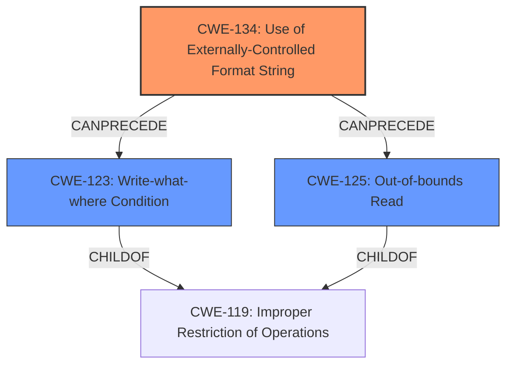

# Final Resolution for CVE-2022-35879

# Summary
| CWE ID | CWE Name | Confidence | CWE Abstraction Level | CWE Vulnerability Mapping Label | CWE-Vulnerability Mapping Notes |
|---|---|---|---|---|---|
| CWE-134 | Use of Externally-Controlled Format String | 0.95 | Base | Allowed | The primary weakness is **format string injection** via the `controlURL` XML tag. |
| CWE-123 | Write-what-where Condition | 0.6 | Base | Allowed | The **format string injection** can be leveraged for arbitrary writes to memory. |
| CWE-125 | Out-of-bounds Read | 0.5 | Base | Allowed | The **format string injection** can be leveraged to leak sensitive information. |

## Evidence and Confidence

*   **Confidence Score:** 0.8
*   **Evidence Strength:** MEDIUM

## Relationship Analysis
The primary **weakness** is CWE-134, which has no direct parent-child relationships. CWE-123 and CWE-125 are added as secondary **weaknesses**. CWE-123 is a child of CWE-119, and CWE-125 is also a child of CWE-119. The relationship between CWE-134 and CWE-123 is that the former can precede the latter, as a **format string vulnerability** can lead to arbitrary writes. The decision to select CWE-123 and CWE-125 was influenced by the critique, which suggested these as more accurate representations of the impacts of the **format string vulnerability**.

## Vulnerability Chain
The vulnerability chain starts with CWE-134 (**Use of Externally-Controlled Format String**), where the `controlURL` XML tag is used to pass data to the `log` function and then to `vsnprintf` without sanitization. This leads to CWE-123 (**Write-what-where Condition**) because the **format string vulnerability** allows for arbitrary writes to memory. It also leads to CWE-125 (**Out-of-bounds Read**) because the same vulnerability can be leveraged to leak sensitive information.

## Summary of Analysis
The initial analysis correctly identified CWE-134 as the primary **weakness**. The criticism highlighted that CWE-79 and CWE-119 were not the most appropriate secondary CWEs. The analysis is updated to remove CWE-79 and replace CWE-119 with CWE-123 and CWE-125, as suggested by the criticism.

The evidence for CWE-134 is strong, as stated in the initial analysis: "The vulnerability is a **format string injection** in the UPnP logging functionality. The `controlURL` XML tag is used to pass data to the `log` function, which in turn passes this data to `vsnprintf` without proper sanitization. This aligns precisely with CWE-134".

The decision to include CWE-123 and CWE-125 is based on the critique's suggestion that these are more accurate representations of the impacts of the **format string vulnerability**. The vulnerability description states that "A specially-crafted UPnP negotiation can lead to memory corruption, information disclosure, and denial of service." Memory corruption aligns with CWE-123, and information disclosure aligns with CWE-125.

The selected CWEs are at the optimal level of specificity. CWE-134 is a Base-level CWE, which is preferred for mapping to the root cause. CWE-123 and CWE-125 are also Base-level CWEs, providing a detailed view of the impacts of the vulnerability.