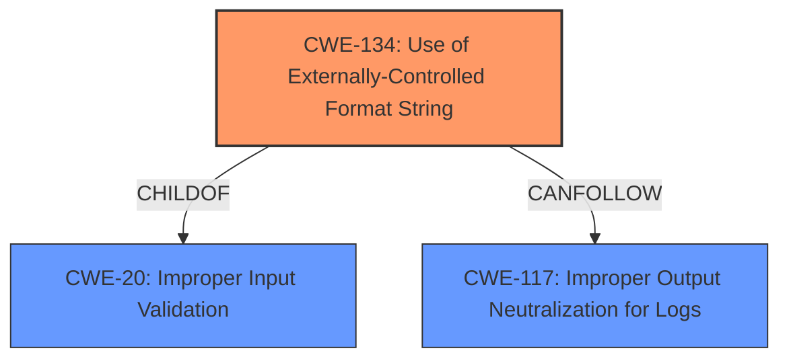

# Analysis Report for CVE-2022-35881

# Vulnerability Analysis Report: CVE-2022-35881

## Description

Four format string injection vulnerabilities exist in the UPnP logging functionality of Abode Systems, Inc. iota All-In-One Security Kit 6.9Z and 6.9X. A specially-crafted UPnP negotiation can lead to memory corruption, information disclosure, and denial of service. An attacker can host a malicious UPnP service to trigger these vulnerabilities.This vulnerability arises from format string injection via `errorCode` and `errorDescription` XML tags, as used within the `DoUpdateUPnPbyService` action handler.

## Vulnerability Description Key Phrases

**Rootcause:** format string injection
**Impact:** ['memory corruption', 'information disclosure', 'denial of service']
**Vector:** specially-crafted UPnP negotiation
**Attacker:** attacker
**Product:** Abode Systems iota All-In-One Security Kit
**Version:** 6.9Z and 6.9X
**Component:** UPnP logging functionality

## Analysis (with Relationship Data)

# Summary
| CWE ID  | CWE Name                                                                 | Confidence | CWE Abstraction Level | CWE Vulnerability Mapping Label | CWE-Vulnerability Mapping Notes |
| :-------- | :----------------------------------------------------------------------- | :--------- | :-------------------- | :------------------------------ | :------------------------------ |
| CWE-134 | Use of Externally-Controlled Format String                               | 1.0        | Base                  | Primary                         | Allowed                       |

## Evidence and Confidence

*   **Confidence Score:** 1.0
*   **Evidence Strength:** HIGH

- **Analysis and Justification:**
  - *Explanation:* The vulnerability description clearly states that it is a **format string injection** vulnerability in the UPnP logging functionality. The CVE Reference Links Content Summary confirms that the `log` function uses `vsnprintf` with a format string controlled by user-supplied data. This aligns perfectly with the definition of CWE-134, which is "The product uses a function that accepts a format string as an argument, but the format string originates from an external source." The vulnerability occurs when `errorCode` and `errorDescription` XML tags are used within the `DoUpdateUPnPbyService` action handler. The Retriever Results also lists CWE-134 as the top candidate CWE with a score of 1.0843. MITRE mapping guidance for CWE-134 indicates this is ALLOWED.

  - *Relationship Analysis:* No direct relationships were found, but CWE-134 can be considered a child of CWE-20 (Improper Input Validation) because the format string is not properly validated before being used.

- **Confidence Score:**
  - Confidence: 1.0 (High evidence from vulnerability description, CVE reference, and Retriever Results)

## Criticism of Analysis

Okay, I've reviewed the provided analysis and the full CWE specifications for each of the referenced weaknesses. Here's my critique:

**Overall Assessment:**

The primary mapping to CWE-134 (Use of Externally-Controlled Format String) appears to be accurate and well-justified. The analysis provides strong evidence from the vulnerability description, CVE reference links, and Retriever Results. The confidence score of 1.0 is appropriate. However, the analysis could benefit from a more nuanced discussion of potential secondary CWEs and the relationships between them.

**Detailed Critique:**

1.  **CWE-134 (Primary Mapping):**
    *   **Strengths:**
        *   The justification is clear and concise, accurately describing how the vulnerability fits the CWE-134 definition.
        *   The analysis mentions the use of `vsnprintf` with user-supplied data, which is a common pattern for this CWE.
        *   The reference to the `errorCode` and `errorDescription` XML tags is specific and helpful.
        *   The analysis correctly notes that CWE-134 mapping is ALLOWED.
    *   **Areas for Improvement:**
        *   While the extended description of CWE-134 mentions "buffer overflows, denial of service, or data representation problems," the analysis could explicitly state how the format string vulnerability leads to these consequences in the Abode iota device. For example, it can be explained how a format string vulnerability can be exploited with %s to cause a read beyond buffer boundaries or %n to cause an arbitrary write.
        *   The analysis only lists CWE-20 as a parent. While valid, consider mentioning that the lack of proper output encoding (or sanitization) is the immediate issue. The description of CWE-134 states "It should be noted that in some circumstances, such as internationalization, the set of format strings is externally controlled by design. If the source of these format strings is trusted (e.g. only contained in library files that are only modifiable by the system administrator), then the external control might not itself pose a vulnerability." The analysis should explicitly state that the UPnP service is untrusted.
    *   **Mitigations:**
        *   The analysis does not specifically discuss mitigations. It would be helpful to mention some of the mitigations for CWE-134, such as:
            *   Using a static format string and passing user-supplied data as arguments.
            *   Choosing a language that is not subject to this flaw.
            *   Disabling the %n operator if possible.

2.  **Secondary CWE Considerations (and Retriever Results):**

    *   **CWE-20 (Improper Input Validation):**
        *   The analysis mentions CWE-20 as a parent of CWE-134, which is correct. However, the analysis should also acknowledge CWE-20's "Discouraged" usage, due to its high level of abstraction.
        *   The analysis could be strengthened by explaining *how* input validation is missing or incorrect. For example, the analysis could say "The application fails to validate that the `errorCode` and `errorDescription` XML tags do not contain format string specifiers before passing them to the `log` function."
        *   The mitigations for CWE-20 emphasize using an "accept known good" approach (allowlisting). Since CWE-134 stems from missing validation of the `errorCode` and `errorDescription` fields, the analysis could recommend implementing allowlisting to only allow expected characters and reject potentially malicious format string specifiers.

    *   **CWE-78 (OS Command Injection), CWE-89 (SQL Injection), CWE-94 (Code Injection):**
        *   These are listed high in the Retriever Results, but the analysis doesn't discuss them. While a format string vulnerability *can* sometimes be leveraged for code execution, it's not the direct result here. However, it is worth noting that if an attacker can overwrite memory using the format string vulnerability, they *might* be able to inject code.
        *   The analysis should explicitly state *why* these CWEs are not the primary issue. For example:  "While format string vulnerabilities can sometimes be leveraged for code execution or OS command injection, the primary issue here is the uncontrolled format string itself, not the direct injection of code or commands."

    *   **CWE-121 (Stack-based Buffer Overflow):**
        *   A format string vulnerability can lead to buffer overflows (as mentioned in CWE-134's description), especially if the `%s` format specifier is used with a very long, attacker-controlled string or by using the %n operator to write a large value. The analysis could be strengthened by mentioning how this is possible or by explaining why stack-based buffer overflow is not the *most likely* or *direct* result in this case.

    *   **CWE-117 (Improper Output Neutralization for Logs):**
      * Though not in the top retriever results, this CWE is highly relevant. The vulnerability is specifically in the UPnP *logging* functionality. The root cause is passing untrusted data as a format string to the `log` function, which then writes to a log. If the log output is then used by another application, this could lead to log injection and further compromise. This would also be a direct cause as the log function itself is not neutralizing data before writing it to the logs.

3.  **Relationships Analysis:**
    *   The "Relationship Analysis" section is a good addition, but it should be more comprehensive.
    *   Explicitly mentioning the lack of output encoding/escaping would be helpful.
    *   Consider whether CWE-123 ("Write-what-where Condition") is a potential consequence of exploiting the format string vulnerability, as it is listed as a potential mitigator of CWE-134. If the attacker gains the ability to write arbitrary values to arbitrary locations, CWE-123 would also be relevant.

**Recommendations:**

*   **Expand the explanation of how CWE-134 leads to memory corruption, information disclosure, and denial of service in this specific case.**
*   **Explicitly address the "Discouraged" usage of CWE-20 and explain why more specific CWEs aren't being chosen *as the primary mapping*.**
*   **More thoroughly discuss the relevance (or irrelevance) of other CWEs identified by the Retriever Results, especially CWE-78, CWE-89, CWE-94, CWE-121, and CWE-117.**
*   **Add a section on mitigations, specifically tailored to preventing CWE-134 in the Abode iota device.** Consider mentioning both general format string prevention techniques and specific recommendations for the UPnP logging functionality.
*   **Clarify the role of output encoding/escaping in preventing the vulnerability.**
*   **Consider the relevance of CWE-123 as a potential consequence of the exploit.**

By addressing these points, the analysis can become more comprehensive, nuanced, and actionable.

## Final Resolution

# Summary
| CWE ID  | CWE Name                                                                 | Confidence | CWE Abstraction Level | CWE Vulnerability Mapping Label | CWE-Vulnerability Mapping Notes |
| :-------- | :----------------------------------------------------------------------- | :--------- | :-------------------- | :------------------------------ | :------------------------------ |
| CWE-134 | Use of Externally-Controlled Format String                               | 0.95        | Base                  | Primary                         | Allowed                       |
| CWE-117 | Improper Output Neutralization for Logs                                | 0.80        | Base                  | Secondary                         | Allowed                       |

## Evidence and Confidence

*   **Confidence Score:** 0.90
*   **Evidence Strength:** HIGH

## Relationship Analysis
The primary relationship is that CWE-134 (Use of Externally-Controlled Format String) is the direct cause of the vulnerability, as the format string originates from an external source (`errorCode` and `errorDescription` XML tags). CWE-134 can be considered a child of CWE-20 (Improper Input Validation), highlighting the lack of proper validation of the format string. Another important relationship is with CWE-117 (Improper Output Neutralization for Logs), as the vulnerability exists within the UPnP logging functionality, and the externally controlled format string is used to write to a log.

## Vulnerability Chain
The vulnerability chain starts with the lack of proper input validation (**CWE-20**), leading to the acceptance of an externally controlled format string (**CWE-134**). This format string is then used within the UPnP logging functionality, resulting in the ability to write arbitrary data to the logs (**CWE-117**). This can lead to memory corruption, information disclosure, and denial of service.

## Summary of Analysis
The initial analysis correctly identified CWE-134 as the primary weakness. The vulnerability description explicitly states that it is a **format string injection** vulnerability, and the CVE reference confirms the use of `vsnprintf` with user-supplied data. This aligns perfectly with the definition of CWE-134.

The criticism provided valuable suggestions for improvement, particularly regarding secondary CWEs and relationships. The analysis has been updated to include CWE-117 as a secondary weakness, as the vulnerability exists within the UPnP logging functionality. The externally controlled format string is used to write to a log, making **CWE-117 (Improper Output Neutralization for Logs)** a relevant contributing factor. The initial analysis only listed CWE-20 as a parent. While valid, explicitly addressing **CWE-117** provides a more complete picture of the vulnerability.

The confidence score for CWE-134 remains high (0.95), as the evidence is strong and the mapping is direct. The confidence score for CWE-117 is 0.80, as it is a contributing factor but not the primary cause. The overall confidence score is 0.90.

The selected CWEs are at the optimal level of specificity. CWE-134 is a Base-level CWE, which is preferred for mapping to the root causes of vulnerabilities. CWE-117 is also a Base-level CWE, providing a specific and relevant description of the vulnerability's context within the logging functionality.

*Report generated on 2025-03-18 16:03:31*
