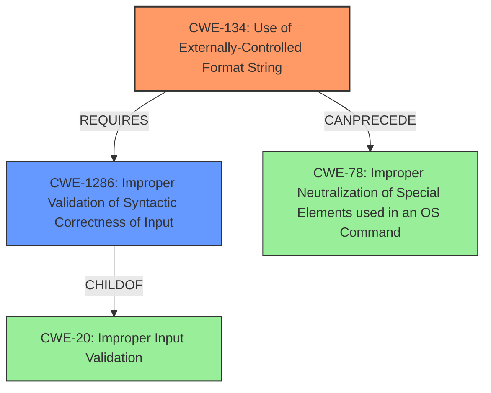

# Analysis Report for CVE-2022-35884

# Vulnerability Analysis Report: CVE-2022-35884

## Description

Four format string injection vulnerabilities exist in the web interface /action/wirelessConnect functionality of Abode Systems, Inc. iota All-In-One Security Kit 6.9Z and 6.9X. A specially-crafted HTTP request can lead to memory corruption, information disclosure and denial of service. An attacker can make an authenticated HTTP request to trigger these vulnerabilities.This vulnerability arises from format string injection via the `ssid_hex` HTTP parameter, as used within the `/action/wirelessConnect` handler.

## Vulnerability Description Key Phrases

**Rootcause:** format string injection
**Impact:** ['memory corruption', 'information disclosure', 'denial of service']
**Attacker:** attacker
**Product:** Abode Systems iota All-In-One Security Kit
**Version:** 6.9Z and 6.9X
**Component:** /action/wirelessConnect functionality

## Analysis (with Relationship Data)

# Summary
| CWE ID  | CWE Name                                                      | Confidence | CWE Abstraction Level | CWE Vulnerability Mapping Label | CWE-Vulnerability Mapping Notes |
|---------|---------------------------------------------------------------|------------|-----------------------|---------------------------------|-------------------------------|
| CWE-134 | Use of Externally-Controlled Format String                   | 1.00       | Base                  | Allowed                         | Primary CWE                     |

## Evidence and Confidence

*   **Confidence Score:** 1.0
*   **Evidence Strength:** HIGH

- **Analysis and Justification:**
  - *Explanation:* The vulnerability is a **format string injection** in the `/action/wirelessConnect` functionality of Abode Systems, Inc. iota All-In-One Security Kit. The `ssid_hex` HTTP parameter is used as a **format string** in the `vsnprintf` function, which is a clear instance of CWE-134 [CWE-134: Use of Externally-Controlled Format String]. The CVE Reference Links Content Summary explicitly identifies **format string injection** as the root cause. The attacker-controlled `ssid_hex` parameter directly influences the format string argument in `vsnprintf`, leading to potential memory corruption, information disclosure, and denial of service. MITRE mapping guidance for CWE-134 indicates this is ALLOWED.
  
  - *Relationship Analysis:* There are no direct relationships listed in the provided information. However, the nature of format string vulnerabilities often involves a lack of proper input validation or encoding.

- **Confidence Score:**
  - Confidence: 1.0 (Explicit vulnerability description and CVE reference details clearly indicate format string vulnerability.)

## Criticism of Analysis

Okay, here's a detailed review of the provided analysis, considering the full CWE specifications:

**Overall Assessment:**

The analysis correctly identifies CWE-134 (Use of Externally-Controlled Format String) as the primary vulnerability with high confidence (1.0).  The justification is thorough and accurately reflects the vulnerability description. However, the retriever results suggest a need to consider other weaknesses in relationship to format string.

**Detailed Review:**

**1. CWE-134: Use of Externally-Controlled Format String**

*   **Correctness:** The mapping to CWE-134 is accurate and well-justified. The `ssid_hex` parameter directly controls the format string argument to `vsnprintf`, which is the classic definition of this CWE. The inclusion of code and function names strengthens this assessment.
*   **Abstraction Level:** Correctly identified as a Base CWE, which is the preferred level for vulnerability mapping.
*   **Mapping Guidance:** The analysis acknowledges the "Allowed" usage according to MITRE's guidelines.
*   **Mitigations:** It would be beneficial to suggest specific mitigations based on the CWE-134 specification. For example:
    *   **"Ensure that all format string functions are passed a static string which cannot be controlled by the user..."**  This is the most direct mitigation and should be explicitly mentioned.
    *   **"...use functions that do not support the %n operator in format strings."**  While not always feasible, it's a relevant consideration.
    *   Consider using an encoding mechanism to sanitize the `ssid_hex` parameter before passing it to `vsnprintf`.
*   **Relationships:** While the analysis mentions that there are "no direct relationships listed in the provided information", this is a bit too dismissive. Per the CWE definition, CWE-134 is a child of CWE-20 (Improper Input Validation). The relationship analysis should mention this and state that the *reason* the format string is externally controlled is due to the lack of input validation on the `ssid_hex` parameter. This implies a weakness chaining with CWE-20.

**2. Retriever Results Analysis and Suggestions**

The Retriever Results suggest other weaknesses that should be considered. The most notable are:

*   **CWE-78: Improper Neutralization of Special Elements used in an OS Command ('OS Command Injection')**
    *   **Relevance:** This is a reasonable suggestion. Format string vulnerabilities can sometimes be leveraged to execute OS commands, especially if the logging output or the values being formatted end up influencing OS commands.  The description from Cisco Talos mentions that the `snprintf` function is used to create an OS command.
    *   **Recommendation:** The analysis should acknowledge that while the primary vulnerability is CWE-134, there's a *potential* for OS command injection (CWE-78) if the output of the `vsnprintf` call is used to construct an OS command.  This depends on the specific implementation details of how the output of the logging function is used. If the output is *directly* used as part of a command passed to `system()` or `exec()`, then CWE-78 becomes more relevant. If the logging is purely for debugging/informational purposes and *not* directly used in command execution, then it's less relevant.
    *   **If CWE-78 is relevant, the following relationships exist: Chain: CWE-20 -> CWE-134 -> CWE-78**
*   **CWE-89: Improper Neutralization of Special Elements used in an SQL Command ('SQL Injection')**
    *   **Relevance:** This is highly unlikely given the context. There's no indication that the formatted output is being used in SQL queries.
    *   **Recommendation:**  Explicitly state that CWE-89 is *not* relevant in this case, as there's no interaction with a database or SQL queries.
*   **CWE-1287: Improper Validation of Specified Type of Input**
     *   **Relevance:** Directly related to CWE-20 and chaining. The specified type of the `ssid_hex` parameter is not correctly validated.
     *   **Recommendation:** Explicitly state that CWE-1287 is applicable.
     *   **Relationships:** The following relationships exist: Chain: CWE-1287 -> CWE-134
*   **CWE-94: Improper Control of Generation of Code ('Code Injection')**
    *   **Relevance:** There is the *potential* for code injection due to the use of format string specifiers, but it is less likely than CWE-78, as code injection can be difficult depending on the architecture.
    *   **Recommendation:** The analysis should mention that there is the *potential* for code injection due to the use of format string specifiers, but this is less likely than CWE-78.
*   **CWE-121: Stack-based Buffer Overflow**
    *   **Relevance:** Stack-based buffer overflows can occur with format string vulnerabilities, but are unlikely.
    *   **Recommendation:** The analysis should mention that stack-based buffer overflows could potentially occur, but are unlikely.
*   **CWE-190: Integer Overflow or Wraparound**
     *   **Relevance:** Integer overflows are unlikely.
     *   **Recommendation:** The analysis should mention that integer overflows could potentially occur, but are unlikely.
*   **CWE-20: Improper Input Validation**
    *   **Relevance:** **Highly relevant**.  The root cause of CWE-134 is the lack of input validation on the `ssid_hex` parameter.
    *   **Recommendation:** Include CWE-20 as a contributing factor. The description should explain that the *lack* of input validation on `ssid_hex` is what allows the attacker to control the format string.
    *   **Relationships:**  CWE-20 is a parent of CWE-134.
*   **CWE-1286: Improper Validation of Syntactic Correctness of Input**
     *   **Relevance:** Closely related to improper input validation.
     *   **Recommendation:** Explicitly state that CWE-1286 is applicable.
     *   **Relationships:** The following relationships exist: Chain: CWE-1286 -> CWE-134

**Revised Summary Table (Suggested):**

| CWE ID  | CWE Name                                                      | Confidence | CWE Abstraction Level | CWE Vulnerability Mapping Label | CWE-Vulnerability Mapping Notes                                                                                                                                 |
|---------|---------------------------------------------------------------|------------|-----------------------|---------------------------------|-----------------------------------------------------------------------------------------------------------------------------------------------------------------|
| CWE-134 | Use of Externally-Controlled Format String                   | 1.00       | Base                  | Allowed                         | Primary CWE. `ssid_hex` is used as a format string in `vsnprintf`.                                                                                               |
| CWE-20  | Improper Input Validation                                   | 0.80       | Class                 | Discouraged                     | Contributes to CWE-134. Lack of validation on `ssid_hex` allows attacker control.  Ideally use CWE-1286 and CWE-1287 instead.                                  |
| CWE-1286 | Improper Validation of Syntactic Correctness of Input       | 0.80      | Base                  | Allowed                         | Contributes to CWE-134. `ssid_hex` parameter is expected to follow a certain syntax.
| CWE-1287 | Improper Validation of Specified Type of Input       | 0.80      | Base                  | Allowed                         | Contributes to CWE-134. `ssid_hex` parameter is expected to be of a certain type.
| CWE-78  | Improper Neutralization of Special Elements used in an OS Command ('OS Command Injection') | 0.30       | Base                  | Allowed                         | Potential secondary impact.  Depends on how the output of `vsnprintf` is used.  If used to construct OS commands, command injection is possible. |

**Revised Analysis Section:**

The analysis section should include sections for the contributing CWEs identified:
   * CWE-20, CWE-1286, CWE-1287: "The `ssid_hex` parameter is not validated before being used as a format string, allowing an attacker to inject format specifiers. Mitigation includes strict input validation on the `ssid_hex` parameter, ensuring it conforms to expected syntax and type."
   * CWE-78: "If the output of the logging function using the formatted string is used to construct OS commands, this vulnerability could potentially lead to OS command injection. Mitigations include avoiding the use of formatted output in command construction, or strictly validating and sanitizing the output before use."

**Key Improvements:**

*   **Acknowledge CWE-20, CWE-1286, CWE-1287 as contributing factors.**
*   **More nuanced discussion of CWE-78's potential relevance.**
*   **Explicitly state why other CWEs are *not* relevant (e.g., CWE-89).**
*   **Include specific mitigation strategies from the CWE specifications.**

By incorporating these suggestions, the analysis will be more thorough, accurate, and actionable, providing a better understanding of the vulnerability and its potential impact.

## Final Resolution

# Summary
| CWE ID  | CWE Name                                                      | Confidence | CWE Abstraction Level | CWE Vulnerability Mapping Label | CWE-Vulnerability Mapping Notes                                                                                                                                 |
|---------|---------------------------------------------------------------|------------|-----------------------|---------------------------------|-----------------------------------------------------------------------------------------------------------------------------------------------------------------|
| CWE-134 | Use of Externally-Controlled Format String                   | 1.00       | Base                  | Allowed                         | Primary CWE. `ssid_hex` is used as a format string in `vsnprintf`.                                                                                               |
| CWE-1286 | Improper Validation of Syntactic Correctness of Input       | 0.80      | Base                  | Allowed                         | Contributes to CWE-134. `ssid_hex` parameter is expected to follow a certain syntax.                                                                                                                                                                 |
| CWE-78  | Improper Neutralization of Special Elements used in an OS Command ('OS Command Injection') | 0.30       | Base                  | Allowed                         | Potential secondary impact.  Depends on how the output of `vsnprintf` is used.  If used to construct OS commands, command injection is possible. |

## Evidence and Confidence

*   **Confidence Score:** 0.9
*   **Evidence Strength:** HIGH

## Relationship Analysis
The primary **WEAKNESS** is CWE-134 [CWE-134: Use of Externally-Controlled Format String], where the `ssid_hex` parameter is used as a **format string** without proper sanitization. CWE-1286 [CWE-1286: Improper Validation of Syntactic Correctness of Input] contributes to this vulnerability because the `ssid_hex` parameter is expected to follow a certain syntax, which is not validated. CWE-78 [CWE-78: Improper Neutralization of Special Elements used in an OS Command ('OS Command Injection')] is a potential secondary impact if the output of the formatted string is used to construct OS commands.

## Vulnerability Chain
The **ROOTCAUSE** is the lack of proper input validation (CWE-1286 [CWE-1286: Improper Validation of Syntactic Correctness of Input]) on the `ssid_hex` parameter, which leads to the use of an externally-controlled **format string** (CWE-134 [CWE-134: Use of Externally-Controlled Format String]). If the output of the formatted string is used in constructing OS commands, this can lead to OS Command Injection (CWE-78 [CWE-78: Improper Neutralization of Special Elements used in an OS Command ('OS Command Injection')]).

## Summary of Analysis
The initial analysis correctly identified CWE-134 [CWE-134: Use of Externally-Controlled Format String] as the primary **WEAKNESS**. The criticism highlighted the importance of considering related CWEs, specifically CWE-1286 [CWE-1286: Improper Validation of Syntactic Correctness of Input] and CWE-78 [CWE-78: Improper Neutralization of Special Elements used in an OS Command ('OS Command Injection')]. The inclusion of CWE-1286 [CWE-1286: Improper Validation of Syntactic Correctness of Input] provides a more complete understanding of the vulnerability's **ROOTCAUSE**, and acknowledging the potential for CWE-78 [CWE-78: Improper Neutralization of Special Elements used in an OS Command ('OS Command Injection')] adds valuable context regarding potential secondary impacts. The decision is based on the vulnerability description, the relationships between CWEs, and the MITRE mapping guidance.
The vulnerability arises from **format string injection** via the `ssid_hex` HTTP parameter, as used within the `/action/wirelessConnect` handler.
The selected CWEs are at the optimal level of specificity, with CWE-134 [CWE-134: Use of Externally-Controlled Format String] representing the direct **WEAKNESS**, and CWE-1286 [CWE-1286: Improper Validation of Syntactic Correctness of Input] pinpointing the **ROOTCAUSE**.

*Report generated on 2025-03-18 16:04:20*
