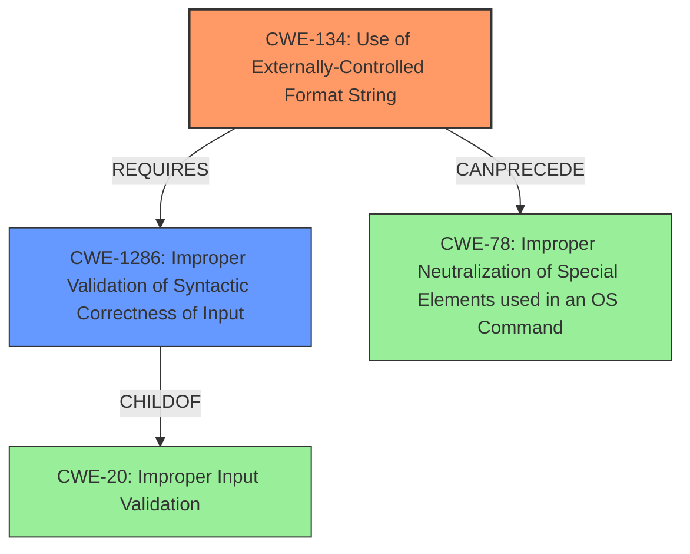

# Final Resolution for CVE-2022-35884

# Summary
| CWE ID  | CWE Name                                                      | Confidence | CWE Abstraction Level | CWE Vulnerability Mapping Label | CWE-Vulnerability Mapping Notes                                                                                                                                 |
|---------|---------------------------------------------------------------|------------|-----------------------|---------------------------------|-----------------------------------------------------------------------------------------------------------------------------------------------------------------|
| CWE-134 | Use of Externally-Controlled Format String                   | 1.00       | Base                  | Allowed                         | Primary CWE. `ssid_hex` is used as a format string in `vsnprintf`.                                                                                               |
| CWE-1286 | Improper Validation of Syntactic Correctness of Input       | 0.80      | Base                  | Allowed                         | Contributes to CWE-134. `ssid_hex` parameter is expected to follow a certain syntax.                                                                                                                                                                 |
| CWE-78  | Improper Neutralization of Special Elements used in an OS Command ('OS Command Injection') | 0.30       | Base                  | Allowed                         | Potential secondary impact.  Depends on how the output of `vsnprintf` is used.  If used to construct OS commands, command injection is possible. |

## Evidence and Confidence

*   **Confidence Score:** 0.9
*   **Evidence Strength:** HIGH

## Relationship Analysis
The primary **WEAKNESS** is CWE-134 [CWE-134: Use of Externally-Controlled Format String], where the `ssid_hex` parameter is used as a **format string** without proper sanitization. CWE-1286 [CWE-1286: Improper Validation of Syntactic Correctness of Input] contributes to this vulnerability because the `ssid_hex` parameter is expected to follow a certain syntax, which is not validated. CWE-78 [CWE-78: Improper Neutralization of Special Elements used in an OS Command ('OS Command Injection')] is a potential secondary impact if the output of the formatted string is used to construct OS commands.

## Vulnerability Chain
The **ROOTCAUSE** is the lack of proper input validation (CWE-1286 [CWE-1286: Improper Validation of Syntactic Correctness of Input]) on the `ssid_hex` parameter, which leads to the use of an externally-controlled **format string** (CWE-134 [CWE-134: Use of Externally-Controlled Format String]). If the output of the formatted string is used in constructing OS commands, this can lead to OS Command Injection (CWE-78 [CWE-78: Improper Neutralization of Special Elements used in an OS Command ('OS Command Injection')]).

## Summary of Analysis
The initial analysis correctly identified CWE-134 [CWE-134: Use of Externally-Controlled Format String] as the primary **WEAKNESS**. The criticism highlighted the importance of considering related CWEs, specifically CWE-1286 [CWE-1286: Improper Validation of Syntactic Correctness of Input] and CWE-78 [CWE-78: Improper Neutralization of Special Elements used in an OS Command ('OS Command Injection')]. The inclusion of CWE-1286 [CWE-1286: Improper Validation of Syntactic Correctness of Input] provides a more complete understanding of the vulnerability's **ROOTCAUSE**, and acknowledging the potential for CWE-78 [CWE-78: Improper Neutralization of Special Elements used in an OS Command ('OS Command Injection')] adds valuable context regarding potential secondary impacts. The decision is based on the vulnerability description, the relationships between CWEs, and the MITRE mapping guidance.
The vulnerability arises from **format string injection** via the `ssid_hex` HTTP parameter, as used within the `/action/wirelessConnect` handler.
The selected CWEs are at the optimal level of specificity, with CWE-134 [CWE-134: Use of Externally-Controlled Format String] representing the direct **WEAKNESS**, and CWE-1286 [CWE-1286: Improper Validation of Syntactic Correctness of Input] pinpointing the **ROOTCAUSE**.