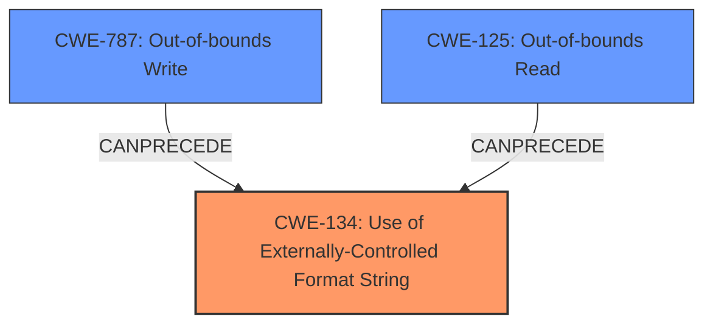

# Final Resolution for CVE-2022-35885

# Summary
| CWE ID | CWE Name | Confidence | CWE Abstraction Level | CWE Vulnerability Mapping Label | CWE-Vulnerability Mapping Notes |
|---|---|---|---|---|---|
| CWE-134 | Use of Externally-Controlled Format String | 1.0 | Base | Primary | Allowed |
| CWE-787 | Out-of-bounds Write | 0.7 | Base | Secondary | Allowed |
| CWE-125 | Out-of-bounds Read | 0.6 | Base | Secondary | Allowed |

## Evidence and Confidence

*   **Confidence Score:** 0.9
*   **Evidence Strength:** HIGH

## Relationship Analysis
The primary weakness is **CWE-134 (Use of Externally-Controlled Format String)**, which can **precede** both **CWE-787 (Out-of-bounds Write)** and **CWE-125 (Out-of-bounds Read)**, depending on the attacker's chosen exploit. The abstraction level of Base for all three CWEs allows for a specific and accurate representation of the vulnerability. The selection emphasizes the **rootcause** (format string injection) and potential immediate consequences (memory corruption via read or write).

## Vulnerability Chain
The vulnerability chain starts with the user-controlled input being passed to the `log` function as a format string argument (**CWE-134**). Depending on the format string provided by the attacker, this leads to either an out-of-bounds read (**CWE-125**) if `%x` or `%s` are used, or an out-of-bounds write (**CWE-787**) if `%n` is used. This results in memory corruption, information disclosure, or denial of service.

## Summary of Analysis
The initial analysis correctly identified **CWE-134 (Use of Externally-Controlled Format String)** as the primary weakness. The criticism highlighted that **CWE-787 (Out-of-bounds Write)** should be considered due to the Talos report mentioning arbitrary memory write. The criticism also correctly assessed that **CWE-78 (Improper Neutralization of Special Elements used in an OS Command ('OS Command Injection'))** is less relevant.

The decision to include **CWE-787 (Out-of-bounds Write)** as a secondary CWE is based on the vulnerability description noting memory corruption and the Talos report mentioning arbitrary memory write, thus making this a more likely outcome of the **CWE-134 (Use of Externally-Controlled Format String)**. **CWE-125 (Out-of-bounds Read)** remains as a secondary CWE because information disclosure is also mentioned in the vulnerability description. The format string vulnerability allows an attacker to either read from or write to arbitrary memory locations, so the inclusion of both **CWE-787 (Out-of-bounds Write)** and **CWE-125 (Out-of-bounds Read)** covers both exploitation possibilities.

The relationship analysis confirms that **CWE-134 (Use of Externally-Controlled Format String)** is the **rootcause**, with **CWE-787 (Out-of-bounds Write)** and **CWE-125 (Out-of-bounds Read)** being the direct consequences of exploiting this vulnerability. The selected CWEs are at the optimal level of specificity (Base) and provide a comprehensive understanding of the vulnerability.