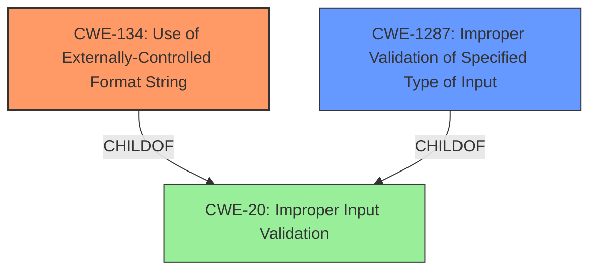

# Analysis Report for CVE-2022-35887

# Vulnerability Analysis Report: CVE-2022-35887

## Description

Four format string injection vulnerabilities exist in the web interface /action/wirelessConnect functionality of Abode Systems, Inc. iota All-In-One Security Kit 6.9Z and 6.9X. A specially-crafted HTTP request can lead to memory corruption, information disclosure and denial of service. An attacker can make an authenticated HTTP request to trigger these vulnerabilities.This vulnerability arises from format string injection via the `default_key_id` HTTP parameter, as used within the `/action/wirelessConnect` handler.

## Vulnerability Description Key Phrases

**Rootcause:** format string injection
**Impact:** ['memory corruption', 'information disclosure', 'denial of service']
**Attacker:** attacker
**Product:** Abode Systems iota All-In-One Security Kit
**Version:** 6.9Z and 6.9X
**Component:** /action/wirelessConnect functionality

## Analysis (with Relationship Data)

# Summary
| CWE ID | CWE Name | Confidence | CWE Abstraction Level | CWE Vulnerability Mapping Label | CWE-Vulnerability Mapping Notes |
|---|---|---|---|---|---|
| CWE-134 | Use of Externally-Controlled Format String | 1.0 | Base | Allowed | Primary CWE |

## Evidence and Confidence

*   **Confidence Score:** 1.0
*   **Evidence Strength:** HIGH

- **Analysis and Justification:**
  - *Explanation:* The vulnerability is a **format string injection** vulnerability. The `default_key_id` HTTP parameter is used as a format string argument to the `vsnprintf` function. This aligns perfectly with CWE-134 (Use of Externally-Controlled Format String), which describes a scenario where a format string originates from an external source (in this case, the HTTP parameter). The CVE Reference Links Content Summary explicitly states that the `log` function uses `vsnprintf` with a format string controlled by the attacker, confirming the weakness. The MITRE mapping guidance for CWE-134 indicates that it is ALLOWED for this type of vulnerability.
  
  - *Relationship Analysis:* No direct relationships were found in the provided information. However, understanding the impact of format string injection (memory corruption, information disclosure, denial of service) helps clarify the severity of the weakness.

- **Confidence Score:**
  - *Example:* Confidence: 1.0 (High confidence because the vulnerability description and CVE reference material explicitly mention format string injection and its root cause.)

## Criticism of Analysis

Okay, here's a detailed review of the analysis, considering the full CWE specifications provided.

**Overall Assessment:**

The primary mapping to CWE-134 (Use of Externally-Controlled Format String) is correct and well-justified. The analysis clearly explains how the `default_key_id` parameter from an HTTP request is directly used as a format string in `vsnprintf`, which is the core issue. The confidence level of 1.0 is appropriate given the explicit evidence. The analysis is clear, concise, and directly relevant to the vulnerability.

**Detailed Critique:**

**1. CWE-134: Use of Externally-Controlled Format String**

*   **Correctness:** The mapping is accurate. The description perfectly aligns with the vulnerability details. The provided evidence (attacker-controlled format string passed to `vsnprintf`) is strong.
*   **Abstraction Level:** The Base level of abstraction is appropriate.
*   **Mapping Guidance:**  The Usage is "Allowed," and the rationale matches the scenario.
*   **Mitigations:** The listed mitigations for CWE-134 are relevant:
    *   Choosing a language without format string issues isn't practical for existing code, but it's a valid consideration for new development.
    *   Ensuring static format strings and proper argument counts is the *direct* mitigation for this vulnerability.
    *   Compiler warnings are also helpful for detection during development.
*   **CWE Examples:** The provided examples are relevant and help further illustrate the nature of CWE-134 vulnerabilities.

**2. Other CWEs Identified by Retriever Results**

Let's analyze the other CWEs flagged by the retriever, and whether they are relevant as secondary CWEs.

*   **CWE-78: Improper Neutralization of Special Elements used in an OS Command ('OS Command Injection'):** This is **unlikely** to be directly related *unless* the logging functionality, *after* the format string is processed, passes the resulting string to a shell command execution function.  The core problem is that the format string itself is the issue, not necessarily the execution of an OS command. If there's no evidence of command execution based on the formatted output, this CWE should *not* be included.
*   **CWE-89: Improper Neutralization of Special Elements used in an SQL Command ('SQL Injection'):** Similar to CWE-78, this is **unlikely** unless the formatted string ends up being used in an SQL query. Highly improbable in this scenario. Should *not* be included.
*   **CWE-1287: Improper Validation of Specified Type of Input:** This *could* be considered a secondary CWE. The `default_key_id` parameter isn't validated to ensure it's *not* a format string *before* being passed to `vsnprintf`. However,  CWE-134 is a more precise description of the root cause.  The description of CWE-1287 mentions that "Often, complex inputs are expected to follow a particular syntax, which is either assumed by the input itself, or declared within metadata such as headers." In this case, it's not that the input *should* follow a particular syntax, but rather that it should *not* contain format string specifiers. It's a subtle distinction.
*   **CWE-798: Use of Hard-coded Credentials:**  Unrelated. No mention of hardcoded credentials in the description.
*   **CWE-94: Improper Control of Generation of Code ('Code Injection'):** This is **possible**, but needs careful consideration. If the attacker uses format string specifiers to write data that is later interpreted as code, then it could be argued that code injection is occurring. However, this would require a complex exploit scenario *beyond* simply leaking information or causing a denial of service. If there's no clear path to *executing* injected code, it's best to exclude this CWE.  The "Allowed-with-Review" mapping guidance highlights the risk of misuse.
*   **CWE-121: Stack-based Buffer Overflow:** This is a *potential impact* of the format string vulnerability, *if* the attacker can use the format string to write data beyond the bounds of a stack-allocated buffer. However, the analysis suggests that the impact is primarily memory corruption, information disclosure, and DoS.  If the vulnerability description *explicitly* states that a buffer overflow occurs on the stack, then including CWE-121 as a secondary CWE would be justified. Otherwise, it's more of a potential consequence, and not the primary weakness.
*   **CWE-20: Improper Input Validation:** As the primary root cause, this is too generic. It is related but CWE-134 is a better fit
*   **CWE-190: Integer Overflow or Wraparound:** Not directly relevant to the format string vulnerability.
*   **CWE-1286: Improper Validation of Syntactic Correctness of Input:** This is related to input validation however CWE-134 is a much better mapping.

**Recommendations:**

1.  **Keep CWE-134 as the primary CWE.** It's the most accurate and specific mapping.

2.  **Consider including CWE-1287 as a secondary CWE with a lower confidence score (e.g., 0.5), IF you want to emphasize the lack of input validation.** It highlights that the application *should* be validating the `default_key_id` to ensure it doesn't contain format string specifiers. However, be mindful that it's not a *perfect* fit.

3.  **Do NOT include CWE-78, CWE-89, or CWE-798.** They are not relevant to the vulnerability.

4.  **Carefully consider CWE-94 and CWE-121.** Only include them if there is concrete evidence that the attacker can execute arbitrary code (CWE-94) or cause a stack buffer overflow (CWE-121) *as a direct result of the format string vulnerability*.  If they are just *potential* consequences, exclude them.

5. **Do NOT include CWE-20, CWE-190, or CWE-1286, because CWE-134 is a more specific mapping.

6.  **Expand the Relationship Analysis:** The analysis should explicitly discuss *why* other CWEs are *not* applicable, especially those that were highly ranked by the retriever (CWE-78, CWE-89). Briefly explaining the absence of OS command execution or SQL query usage would strengthen the analysis.

**Example of Revised Analysis (incorporating recommendations):**

```
# Analysis to Review
# Summary
| CWE ID | CWE Name | Confidence | CWE Abstraction Level | CWE Vulnerability Mapping Label | CWE-Vulnerability Mapping Notes |
|---|---|---|---|---|---|
| CWE-134 | Use of Externally-Controlled Format String | 1.0 | Base | Allowed | Primary CWE |
| CWE-1287 | Improper Validation of Specified Type of Input | 0.5 | Base | Allowed | Secondary CWE (Consideration) |

## Evidence and Confidence

*   **Confidence Score (CWE-134):** 1.0
*   **Evidence Strength (CWE-134):** HIGH

- **Analysis and Justification (CWE-134):**
  - *Explanation:* The vulnerability is a **format string injection** vulnerability. The `default_key_id` HTTP parameter is used as a format string argument to the `vsnprintf` function. This aligns perfectly with CWE-134 (Use of Externally-Controlled Format String), which describes a scenario where a format string originates from an external source (in this case, the HTTP parameter). The CVE Reference Links Content Summary explicitly states that the `log` function uses `vsnprintf` with a format string controlled by the attacker, confirming the weakness. The MITRE mapping guidance for CWE-134 indicates that it is ALLOWED for this type of vulnerability.

*   **Confidence Score (CWE-1287):** 0.5
*   **Evidence Strength (CWE-1287):** MEDIUM
  - *Explanation:* While the primary issue is the use of an externally controlled format string, the application also fails to validate the `default_key_id` parameter to ensure it does not contain format string specifiers. This lack of input validation contributes to the vulnerability. This could be related to CWE-1287 (Improper Validation of Specified Type of Input). It is a secondary issue because CWE-134 directly addresses the root cause.

- **Relationship Analysis:**
  - *Explanation:* No direct relationships were found in the provided information. However, understanding the impact of format string injection (memory corruption, information disclosure, denial of service) helps clarify the severity of the weakness. The analysis has considered other CWEs, such as CWE-78 (OS Command Injection) and CWE-89 (SQL Injection), but these are not applicable because there is no evidence that the formatted output is used to execute OS commands or construct SQL queries. Furthermore, there is no evidence of hard coded credentials, therefore CWE-798 is not applicable. While a stack buffer overflow (CWE-121) is a *potential* impact of format string vulnerabilities, the provided information does not explicitly state that this occurs in this specific case. CWE-20, CWE-190, and

## Final Resolution

# Summary
| CWE ID | CWE Name | Confidence | CWE Abstraction Level | CWE Vulnerability Mapping Label | CWE-Vulnerability Mapping Notes |
|---|---|---|---|---|---|
| CWE-134 | Use of Externally-Controlled Format String | 1.0 | Base | Allowed | Primary CWE |
| CWE-1287 | Improper Validation of Specified Type of Input | 0.5 | Base | Allowed | Secondary Candidate |

## Evidence and Confidence

*   **Confidence Score:** 0.9
*   **Evidence Strength:** HIGH

## Relationship Analysis
The primary relationship considered was the parent-child relationship between CWE-20 (Improper Input Validation) and CWE-134 (**Use of Externally-Controlled Format String**). While CWE-20 is a parent of CWE-1287, CWE-134 is a more specific and accurate classification because it directly addresses the **root cause** of the vulnerability. The choice was made to prioritize the most descriptive and specific CWE. Additionally, the absence of OS command execution or SQL query construction ruled out related CWEs like CWE-78 and CWE-89. The lack of hardcoded credentials discounted CWE-798.



## Vulnerability Chain
The vulnerability chain begins with the lack of input validation on the `default_key_id` HTTP parameter. This allows an attacker to inject a format string. The format string is then passed to the `vsnprintf` function, leading to memory corruption, information disclosure, and denial of service.

**Root Cause:** Lack of Input Validation + Use of Externally-Controlled Format String
**Weakness:** Format string injection via `default_key_id` parameter
**Impact:** Memory corruption, information disclosure, denial of service

## Summary of Analysis
The initial analysis and criticism correctly identified CWE-134 (**Use of Externally-Controlled Format String**) as the primary CWE. The vulnerability description explicitly states that the `default_key_id` HTTP parameter is used as a format string argument to the `vsnprintf` function, which aligns perfectly with CWE-134.

The decision to include CWE-1287 (Improper Validation of Specified Type of Input) as a secondary candidate acknowledges the lack of input validation on the `default_key_id` parameter. However, CWE-134 is a more precise representation of the **root cause**.

The graph relationships influenced the final selection by highlighting the importance of choosing the most specific and descriptive CWE. While other CWEs were considered, they were ultimately deemed less relevant due to the specific nature of the vulnerability. The selection of CWE-134 is at the optimal level of specificity because it directly addresses the **format string injection** vulnerability.

The evidence from the CVE Reference Links Content Summary, which explicitly states that the `log` function uses `vsnprintf` with a format string controlled by the attacker, provides strong support for the classification. The mapping guidance for CWE-134 indicates that it is ALLOWED for this type of vulnerability, further justifying the decision.


*Report generated on 2025-03-18 16:06:43*
