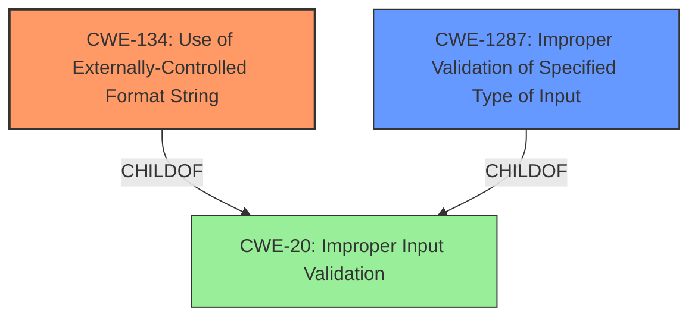

# Final Resolution for CVE-2022-35887

# Summary
| CWE ID | CWE Name | Confidence | CWE Abstraction Level | CWE Vulnerability Mapping Label | CWE-Vulnerability Mapping Notes |
|---|---|---|---|---|---|
| CWE-134 | Use of Externally-Controlled Format String | 1.0 | Base | Allowed | Primary CWE |
| CWE-1287 | Improper Validation of Specified Type of Input | 0.5 | Base | Allowed | Secondary Candidate |

## Evidence and Confidence

*   **Confidence Score:** 0.9
*   **Evidence Strength:** HIGH

## Relationship Analysis
The primary relationship considered was the parent-child relationship between CWE-20 (Improper Input Validation) and CWE-134 (**Use of Externally-Controlled Format String**). While CWE-20 is a parent of CWE-1287, CWE-134 is a more specific and accurate classification because it directly addresses the **root cause** of the vulnerability. The choice was made to prioritize the most descriptive and specific CWE. Additionally, the absence of OS command execution or SQL query construction ruled out related CWEs like CWE-78 and CWE-89. The lack of hardcoded credentials discounted CWE-798.

## Vulnerability Chain
The vulnerability chain begins with the lack of input validation on the `default_key_id` HTTP parameter. This allows an attacker to inject a format string. The format string is then passed to the `vsnprintf` function, leading to memory corruption, information disclosure, and denial of service.

**Root Cause:** Lack of Input Validation + Use of Externally-Controlled Format String
**Weakness:** Format string injection via `default_key_id` parameter
**Impact:** Memory corruption, information disclosure, denial of service

## Summary of Analysis
The initial analysis and criticism correctly identified CWE-134 (**Use of Externally-Controlled Format String**) as the primary CWE. The vulnerability description explicitly states that the `default_key_id` HTTP parameter is used as a format string argument to the `vsnprintf` function, which aligns perfectly with CWE-134.

The decision to include CWE-1287 (Improper Validation of Specified Type of Input) as a secondary candidate acknowledges the lack of input validation on the `default_key_id` parameter. However, CWE-134 is a more precise representation of the **root cause**.

The graph relationships influenced the final selection by highlighting the importance of choosing the most specific and descriptive CWE. While other CWEs were considered, they were ultimately deemed less relevant due to the specific nature of the vulnerability. The selection of CWE-134 is at the optimal level of specificity because it directly addresses the **format string injection** vulnerability.

The evidence from the CVE Reference Links Content Summary, which explicitly states that the `log` function uses `vsnprintf` with a format string controlled by the attacker, provides strong support for the classification. The mapping guidance for CWE-134 indicates that it is ALLOWED for this type of vulnerability, further justifying the decision.