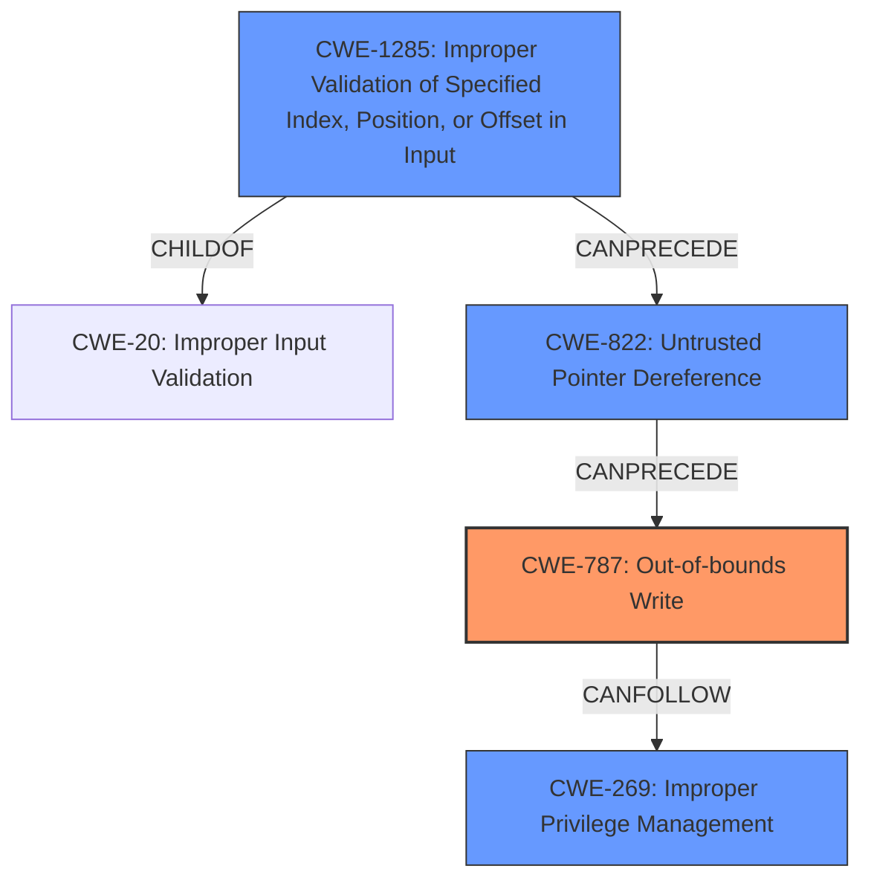

# Final Resolution for CVE-2022-35893

# Summary
| CWE ID | CWE Name | Confidence | CWE Abstraction Level | CWE Vulnerability Mapping Label | CWE-Vulnerability Mapping Notes |
|---|---|---|---|---|---|
| CWE-787 | Out-of-bounds Write | 0.95 | Base | Allowed | Primary CWE. The vulnerability allows writing data past the end or before the beginning of the intended buffer in SMM memory. |
| CWE-822 | Untrusted Pointer Dereference | 0.90 | Base | Allowed | Secondary Candidate. The vulnerability involves dereferencing an untrusted pointer, where the value of the pointer is attacker controlled, allowing writing to arbitrary memory locations. |
| CWE-1285 | Improper Validation of Specified Index, Position, or Offset in Input | 0.80 | Base | Allowed | Secondary Candidate. The vulnerability stems from a lack of input validation of the target address used in memory writes, enabling attackers to specify addresses within SMRAM. |
| CWE-269 | Improper Privilege Management | 0.50 | Base | Allowed | Secondary Candidate. Successful exploitation allows an attacker to escalate privileges to SMM. |

## Evidence and Confidence

*   **Confidence Score:** 0.92
*   **Evidence Strength:** HIGH

## Relationship Analysis
The analysis focused on hierarchical relationships (ChildOf, ParentOf) to ensure specificity, favoring Base-level CWEs like **CWE-787 (Out-of-bounds Write)**, **CWE-822 (Untrusted Pointer Dereference)**, and **CWE-1285 (Improper Validation of Specified Index, Position, or Offset in Input)**. Chain relationships were crucial in identifying the progression of the vulnerability, from improper input validation to untrusted pointer dereference, culminating in an out-of-bounds write. Abstraction levels guided the selection of the most granular and accurate CWEs.

## Vulnerability Chain
The vulnerability chain starts with **CWE-1285 (Improper Validation of Specified Index, Position, or Offset in Input)**, where the lack of input validation on the `addr` argument leads to **CWE-822 (Untrusted Pointer Dereference)**, as the attacker-controlled address is dereferenced. This then results in **CWE-787 (Out-of-bounds Write)**, allowing the attacker to write arbitrary data to SMRAM. The ultimate impact is **CWE-269 (Improper Privilege Management)**, as successful exploitation allows privilege escalation to SMM.

## Summary of Analysis
The analysis considered both the initial assessment and the criticism, leading to a refined conclusion. The assessment is primarily based on the provided evidence, with direct quotes and references to the vulnerability description. The graph relationships influenced the selection by highlighting the chain of causality and the importance of specificity. The selected CWEs are at the optimal level of specificity, providing a clear and accurate representation of the vulnerability.

The initial analysis correctly identified **CWE-787 (Out-of-bounds Write)** as a primary issue, supported by the vulnerability description's emphasis on writing to arbitrary memory locations within SMRAM. The criticism further refined this by recommending explicit mention of attacker control over the pointer value in **CWE-822 (Untrusted Pointer Dereference)**. This was incorporated to enhance the explanation.

**CWE-1285 (Improper Validation of Specified Index, Position, or Offset in Input)** was retained due to the fundamental lack of validation on the address argument. The criticism's suggestion to highlight the consequences of missing validation, specifically the ability to write to SMRAM, was integrated to strengthen the justification.

The addition of **CWE-269 (Improper Privilege Management)**, as suggested by the criticism, acknowledges the end goal of the attack: privilege escalation to SMM. While not a direct cause, it provides valuable context for understanding the impact and severity of the vulnerability.

The final decision is based on a comprehensive evaluation of content matching, relationship analysis, mapping guidance, mitigation considerations, and evidence from the vulnerability description. The selected CWEs accurately represent the root causes and consequences of the vulnerability, providing a clear and actionable analysis for remediation efforts.