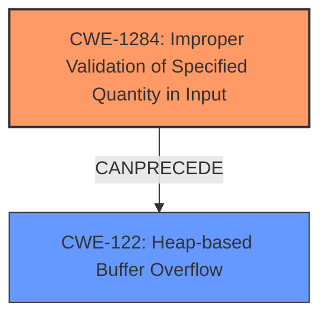

# Final Resolution for CVE-2022-35928

# Summary
| CWE ID | CWE Name | Confidence | CWE Abstraction Level | CWE Vulnerability Mapping Label | CWE-Vulnerability Mapping Notes |
|---|---|---|---|---|---|
| CWE-1284 | Improper Validation of Specified Quantity in Input | 0.95 | Base | Allowed | Primary CWE |
| CWE-122 | Heap-based Buffer Overflow | 0.85 | Variant | Allowed | Secondary CWE |

## Evidence and Confidence

*   **Confidence Score:** 0.90
*   **Evidence Strength:** HIGH

## Relationship Analysis
The primary relationship is that **CWE-1284 (Improper Validation of Specified Quantity in Input)** can directly lead to **CWE-122 (Heap-based Buffer Overflow)**. CWE-1284 represents the **ROOTCAUSE** of the vulnerability, while CWE-122 is the resulting impact. Both CWEs are at appropriate levels of abstraction (Base and Variant, respectively). The analysis considered the mapping guidance for both CWEs and determined that they are ALLOWED. The relationship analysis influenced the final selection by clarifying the cause-and-effect relationship between the missing input validation and the buffer overflow. The absence of length validation (**CWE-1284**) makes the heap overflow (**CWE-122**) possible.

## Vulnerability Chain
The vulnerability chain starts with the **ROOTCAUSE**, **CWE-1284 (Improper Validation of Specified Quantity in Input)**. The sequence proceeds as follows:
1.  The application receives a password from the command line.
2.  The application fails to validate the length of the password.
3.  The application allocates a fixed-size buffer on the heap.
4.  The application copies the password into the buffer without checking its length.
5.  If the password is longer than the buffer, a heap-based buffer overflow (**CWE-122**) occurs, overwriting adjacent memory.
6.  The overflow can lead to unpredictable behavior, including crashing the application or potentially allowing an attacker to execute arbitrary code.

## Summary of Analysis
The initial analysis and criticism both correctly identified **CWE-1284 (Improper Validation of Specified Quantity in Input)** as the primary **WEAKNESS** and **CWE-122 (Heap-based Buffer Overflow)** as the resulting vulnerability. The assessment is primarily based on the provided evidence, specifically the statement that "**Passwords lengths were not checked before being read**" leading to "**buffer overruns**". This statement directly aligns with the descriptions of both **CWE-1284** and **CWE-122**. The graph relationships further support this assessment by illustrating the cause-and-effect relationship between the missing input validation and the buffer overflow. The selected CWEs are at the optimal level of specificity because **CWE-1284** is a Base CWE that directly describes the missing input validation, and **CWE-122** is a Variant CWE that accurately describes the type of buffer overflow (heap-based). The decision is justified by the clear evidence in the vulnerability description, the relationship analysis, and the mapping guidance for both CWEs. The confidence score is high (0.90) due to the explicit mention of missing password length checks and the resulting buffer overflows.