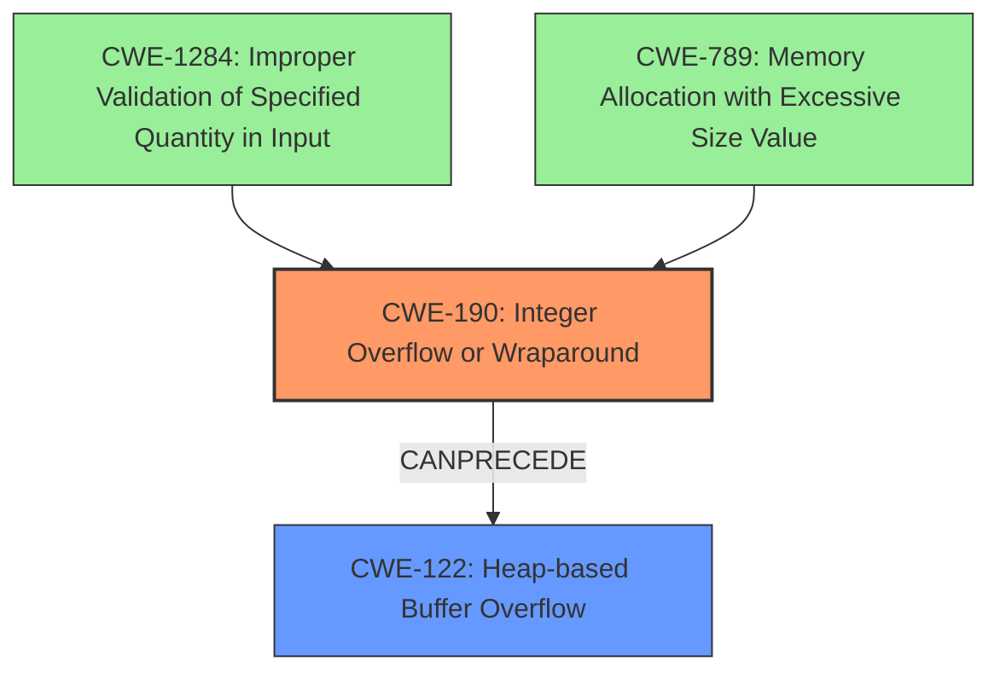

# Analysis Report for CVE-2022-35951

# Vulnerability Analysis Report: CVE-2022-35951

## Description

Redis is an in-memory database that persists on disk. Versions 7.0.0 and above, prior to 7.0.5 are vulnerable to an Integer Overflow. Executing an `XAUTOCLAIM` command on a stream key in a specific state, with a specially crafted `COUNT` argument may cause an integer overflow, a subsequent heap overflow, and potentially lead to remote code execution. This has been patched in Redis version 7.0.5. No known workarounds exist.

## Vulnerability Description Key Phrases

**Rootcause:** integer overflow
**Impact:** ['heap overflow', 'remote code execution']
**Vector:** executing XAUTOCLAIM command on stream key
**Product:** Redis
**Version:** 7.0.0 to 7.0.4
**Component:** stream key

## Analysis (with Relationship Data)

# Summary
| CWE ID | CWE Name | Confidence | CWE Abstraction Level | CWE Vulnerability Mapping Label | CWE-Vulnerability Mapping Notes |
|---|---|---|---|---|---|
| CWE-190 | Integer Overflow or Wraparound | 0.95 | Base | Allowed | Primary CWE. The vulnerability is caused by an integer overflow. |
| CWE-122 | Heap-based Buffer Overflow | 0.75 | Variant | Allowed | Secondary CWE. The integer overflow leads to a heap overflow. |

## Evidence and Confidence

*   **Confidence Score:** 0.85
*   **Evidence Strength:** HIGH

- **Analysis and Justification:**  
  - *Explanation:* The vulnerability description explicitly states that an **integer overflow** can occur when executing the `XAUTOCLAIM` command with a specially crafted `COUNT` argument, which aligns perfectly with CWE-190 (Integer Overflow or Wraparound). The **integer overflow** leads to a subsequent heap overflow, which is a buffer overflow occurring in the heap memory region. This secondary effect is captured by CWE-122 (Heap-based Buffer Overflow).
  
  - *Relationship Analysis:* CWE-190 is a base level weakness, which is a preferred level of abstraction. The retriever results also list CWE-190 as the top candidate. CWE-122 is a variant of CWE-119 (Improper Restriction of Operations within the Bounds of a Memory Buffer) and describes the specific location of the buffer overflow (heap). The description notes that the integer overflow leads to a heap overflow, indicating that CWE-190 *CanPrecede* CWE-122 in an attack chain.

- **Confidence Score:**  
  - Confidence: 0.95 (High evidence from technical description and CVE reference materials for CWE-190).
  - Confidence: 0.75 (Moderate evidence linking the integer overflow to a heap overflow for CWE-122).

---

## Criticism of Analysis

Okay, I've reviewed the provided analysis and the full CWE specifications for the listed weaknesses. Here's a critique of the analysis, focusing on the accuracy, completeness, and justification of the CWE mappings, as well as considering alternative mappings based on the provided CWE details.

**Overall Assessment:**

The analysis correctly identifies CWE-190 (Integer Overflow or Wraparound) as the primary root cause and CWE-122 (Heap-based Buffer Overflow) as a secondary effect. The reasoning provided is generally sound. However, there are some opportunities to refine the analysis and consider related CWEs that might provide a more complete picture of the vulnerability.

**Detailed Review:**

**1. CWE-190: Integer Overflow or Wraparound**

*   **Confidence:** Justified. The description explicitly states the occurrence of an integer overflow, making this a strong mapping.
*   **Abstraction Level:** Correct. CWE-190 is a Base-level CWE, which is preferred.
*   **Mapping Guidance:** The mapping adheres to the usage guidance for CWE-190.
*   **Potential Mitigations:** The analysis could benefit from mentioning specific mitigation strategies relevant to Redis and the `XAUTOCLAIM` command.
    *   *Example:*  Given the mitigations listed for CWE-190, Redis developers could implement stricter input validation on the `COUNT` argument to ensure it remains within acceptable bounds.  They could also explore using languages or libraries (like SafeInt in C++) that provide safer integer handling.
*   **Observed Examples:** The listed examples in the description include CVE-2021-43537 and CVE-2022-21668, both of which include CWE-190 in the chain and similar consequences. This further supports the accuracy of this mapping.

**2. CWE-122: Heap-based Buffer Overflow**

*   **Confidence:** Justified. The vulnerability description clearly indicates that the integer overflow leads to a heap overflow.
*   **Abstraction Level:** Correct. CWE-122 is a Variant-level CWE, which is preferred.
*   **Mapping Guidance:**  The mapping adheres to the usage guidance for CWE-122.
*   **Potential Mitigations:**  The analysis could benefit from mentioning specific mitigation strategies relevant to heap overflows in Redis.
    *   *Example:* Redis developers could implement memory safety checks, such as using AddressSanitizer (ASan) or MemorySanitizer (MSan) during development and testing, to detect heap overflows early.  They could also consider using safer memory allocation routines and validating the sizes of data being copied into heap-allocated buffers.
*   **Observed Examples:** The example CVEs listed for CWE-122 (such as CVE-2021-43537) show integer overflows leading to heap overflows.

**Opportunities for Refinement and Alternative CWEs:**

1.  **CWE-1284: Improper Validation of Specified Quantity in Input**
    *   **Rationale:** The vulnerability is triggered by a crafted `COUNT` argument. This suggests a failure to properly validate the *quantity* specified by this input. While CWE-190 describes *what* happened (integer overflow), CWE-1284 describes *why* it happened (improper validation).  This CWE provides context.
    *   **Mapping:** *Allowed*
    *   **Explanation:** The `COUNT` parameter to `XAUTOCLAIM` is a specified quantity. The system *should* have validated that this quantity was within a safe range before using it in calculations. The absence of this validation led to the overflow.
    *   **Mitigation:** Redis developers should implement strict input validation on the `COUNT` argument, ensuring it falls within a pre-defined range before being used in calculations.
2.  **CWE-789: Memory Allocation with Excessive Size Value**
    *   **Rationale:**  This CWE is related to the *result* of the integer overflow. While *less memory is allocated than expected*, the root cause of it is from specifying an excessively large `COUNT` value, leading to the overflow. This provides additional context to the overflow and resulting buffer overflow.
    *   **Mapping:** *Allowed*
    *   **Explanation:** Although the *intended* allocation size was corrupted by the overflow, the initial cause was providing a value that, while seemingly a 'number', led to memory allocation issues.
    *   **Mitigation:** This reinforces the need to validate the `COUNT` parameter, preventing excessively large sizes from even entering the calculation process. Setting resource limits for memory allocation could also mitigate the impact of a successful exploit.
3.  **CWE-680: Integer Overflow to Buffer Overflow** (Mentioned in retriever results, but not specifically addressed)
    *   **Rationale:** While the analysis correctly identifies CWE-190 and CWE-122 separately, CWE-680 is a *compound* CWE that explicitly describes the chain of events: Integer Overflow leading to a Buffer Overflow.
    *   **Mapping:** *Discouraged* (according to CWE specifications)
    *   **Explanation:** The CWE specifications suggest mapping to each weakness in the chain instead. While CWE-680 accurately represents the chain, it is better to map to the individual weaknesses, so it's good that the analysis does that.
4.  **CWE-682: Incorrect Calculation (Pillar)**
    *   **Rationale:** This *very* broad CWE describes the underlying issue: a calculation is wrong.  It's less useful than the specific CWEs, but technically correct.
    *   **Mapping:** *Discouraged* due to abstraction.
5.  **CWE-119: Improper Restriction of Operations within the Bounds of a Memory Buffer (Class)**
    *   **Rationale:** As the parent to CWE-122, it accurately captures the memory corruption.
    *   **Mapping:** *Discouraged* due to abstraction.
6.  **CWE-770: Allocation of Resources Without Limits or Throttling**
    *   **Rationale:** This CWE becomes relevant if the `XAUTOCLAIM` command, when exploited, can cause excessive memory allocation requests, potentially leading to a denial of service. In other words, if an attacker could repeatedly trigger the integer overflow and heap overflow, it could exhaust server resources. This depends on the context, so it's less certain.
    *   **Mapping:** *Possible*, but depends on exploit scenario.
    *   **Explanation:** An attacker repeatedly exploiting the vulnerability could trigger numerous memory allocation attempts, potentially exhausting available memory and causing a denial-of-service.
    *   **Mitigation:** Implement request rate limiting for the `XAUTOCLAIM` command or set limits on the number of concurrent `XAUTOCLAIM` requests allowed.

**Revised Summary Table:**

| CWE ID    | CWE Name                                          | Confidence | CWE Abstraction Level | CWE Vulnerability Mapping Label | CWE-Vulnerability Mapping Notes                                                                                                                                                                                                                   |
| :-------- | :------------------------------------------------ | :--------- | :---------------------- | :-------------------------------- | :------------------------------------------------------------------------------------------------------------------------------------------------------------------------------------------------------------------------------------------------ |
| CWE-190   | Integer Overflow or Wraparound                    | 0.95       | Base                    | Allowed                           | Primary CWE. The vulnerability is caused by an integer overflow.                                                                                                                                                                                   |
| CWE-122   | Heap-based Buffer Overflow                        | 0.75       | Variant                 | Allowed                           | Secondary CWE. The integer overflow leads to a heap overflow.                                                                                                                                                                                    |
| CWE-1284 | Improper Validation of Specified Quantity in Input | 0.60       | Base                  | Allowed                           | Contributory CWE. The `COUNT` parameter was not properly validated, leading to the integer overflow.                                                                                                                                               |
| CWE-789 | Memory Allocation with Excessive Size Value | 0.55       | Variant                 | Allowed                           | Contributory CWE. The `COUNT` parameter was excessively large, even if memory was not allocated, leading to the overflow.                                                                                                                                                                                    |

**Conclusion:**

The original analysis is a good starting point. By adding CWE-1284 and CWE-789, the analysis gains more context and shows the complete picture of a vulnerability and provides a more comprehensive set of mitigations.

## Final Resolution

# Summary
| CWE ID | CWE Name | Confidence | CWE Abstraction Level | CWE Vulnerability Mapping Label | CWE-Vulnerability Mapping Notes |
|---|---|---|---|---|---|
| CWE-190 | Integer Overflow or Wraparound | 0.95 | Base | Allowed | Primary CWE. The vulnerability is caused by an integer overflow. |
| CWE-122 | Heap-based Buffer Overflow | 0.75 | Variant | Allowed | Secondary CWE. The integer overflow leads to a heap overflow. |
| CWE-1284 | Improper Validation of Specified Quantity in Input | 0.60 | Base | Allowed | Contributing CWE. The `COUNT` parameter was not properly validated, leading to the **integer overflow**. |
| CWE-789 | Memory Allocation with Excessive Size Value | 0.55 | Variant | Allowed | Contributing CWE. The `COUNT` parameter was excessively large, leading to the **integer overflow**. |

## Evidence and Confidence

*   **Confidence Score:** 0.80
*   **Evidence Strength:** MEDIUM

## Relationship Analysis
The primary relationship identified is the chain where **CWE-190** *CanPrecede* **CWE-122**, accurately reflecting the vulnerability's progression. **CWE-1284** contributes by highlighting the lack of input validation on the `COUNT` parameter, which sets the stage for the overflow. **CWE-789** underscores the issue of using an excessively large size value, providing further context to the root cause. The abstraction levels (Base and Variant) are appropriately chosen for specificity.

## Vulnerability Chain
The vulnerability chain starts with the **improper validation** (**CWE-1284**) of the `COUNT` argument in the `XAUTOCLAIM` command. This leads to an **integer overflow** (**CWE-190**) due to a large size value (**CWE-789**). The overflow then results in a **heap-based buffer overflow** (**CWE-122**), potentially allowing for remote code execution.

Missing links: None

## Summary of Analysis
The initial analysis correctly identified **CWE-190** and **CWE-122**. The criticism offered valuable additions by including **CWE-1284** and **CWE-789**, which enhance the understanding of the root cause.

The vulnerability description explicitly states: "Executing an `XAUTOCLAIM` command on a stream key in a specific state, with a specially crafted `COUNT` argument may cause an integer overflow, a subsequent heap overflow, and potentially lead to remote code execution."

The graph relationships influenced the final selection by illustrating the chain of events from the **lack of validation** to the **integer overflow** and finally to the **heap overflow**. The inclusion of **CWE-1284** and **CWE-789** provides a more complete picture of the vulnerability's origins and contributing factors, while maintaining an appropriate level of specificity. The selected CWEs are at the optimal level of specificity because they accurately describe the technical weaknesses involved, without being overly broad or abstract.

*Report generated on 2025-03-18 16:10:08*
