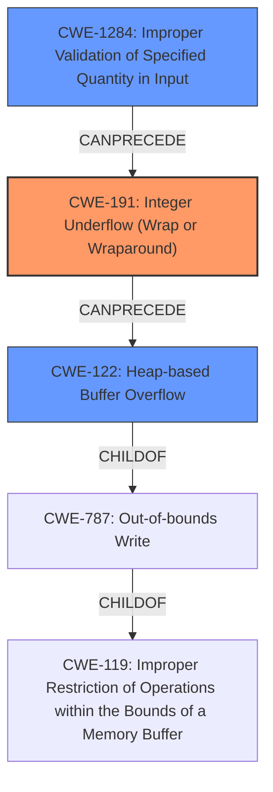

# Final Resolution for CVE-2022-36063

# Summary
| CWE ID | CWE Name | Confidence | CWE Abstraction Level | CWE Vulnerability Mapping Label | CWE-Vulnerability Mapping Notes |
|---|---|---|---|---|---|
| CWE-191 | Integer Underflow (Wrap or Wraparound) | 0.95 | Base | Allowed | Primary CWE. The vulnerability involves an integer underflow due to insufficient validation of the MAC address string descriptor length. |
| CWE-122 | Heap-based Buffer Overflow | 0.85 | Variant | Allowed | Secondary candidate. The integer underflow is followed by a heap-based buffer overflow in the `cdc_ecm -> ux_host_class_cdc_ecm_node_id` array. |
| CWE-1284 | Improper Validation of Specified Quantity in Input | 0.75 | Base | Allowed | Secondary candidate. The MAC address string descriptor length is not validated for unexpectedly small values. This leads to the integer underflow. |

## Evidence and Confidence

*   **Confidence Score:** 0.95
*   **Evidence Strength:** HIGH

## Relationship Analysis
The inclusion of CWE-1284 strengthens the analysis by highlighting the **ROOTCAUSE** of the vulnerability. The chain starts with CWE-1284 (Improper Validation of Specified Quantity in Input), which leads to CWE-191 (Integer Underflow), ultimately resulting in CWE-122 (Heap-based Buffer Overflow).

## Vulnerability Chain
The vulnerability chain starts with **CWE-1284 (Improper Validation of Specified Quantity in Input)**, where the MAC address string descriptor length is not properly validated. This leads to **CWE-191 (Integer Underflow)** when the length is set to 0 or 1. The integer underflow then results in **CWE-122 (Heap-based Buffer Overflow)** when copying data into the `cdc_ecm -> ux_host_class_cdc_ecm_node_id` array. The final impact is potential remote code execution or denial of service.

## Summary of Analysis
The analysis has been updated based on the criticism. The key addition is the inclusion of **CWE-1284 (Improper Validation of Specified Quantity in Input)**, which represents the **ROOTCAUSE** of the vulnerability. The vulnerability description states that "Setting mac address string descriptor length to a `0` or `1` allows an attacker to introduce an integer underflow". This highlights the lack of validation on the input length. The relationship analysis now clearly shows how CWE-1284 *CanPrecede* CWE-191, establishing the vulnerability chain. The chosen CWEs are at the optimal level of specificity, with CWE-191 as the primary weakness and CWE-122 and CWE-1284 as contributing factors.