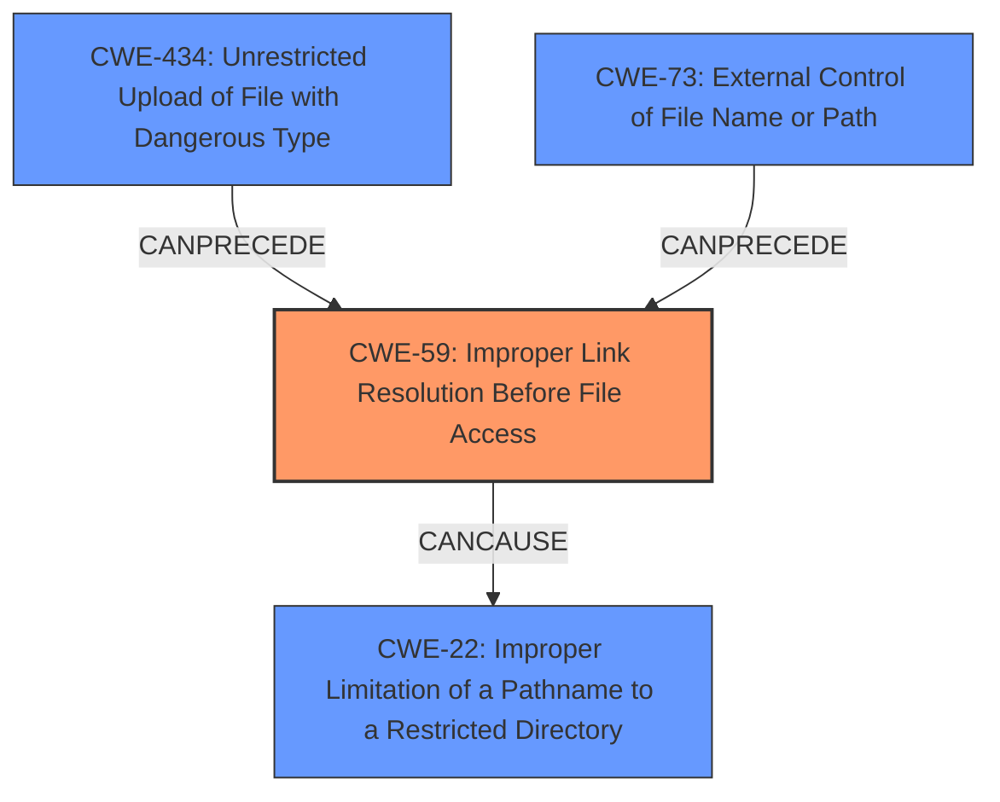

# Final Resolution for CVE-2022-3607

# Summary
| CWE ID | CWE Name | Confidence | CWE Abstraction Level | CWE Vulnerability Mapping Label | CWE-Vulnerability Mapping Notes |
|---|---|---|---|---|---|
| CWE-59 | Improper Link Resolution Before File Access ('Link Following') | 0.95 | Base | Allowed | Primary CWE |
| CWE-22 | Improper Limitation of a Pathname to a Restricted Directory ('Path Traversal') | 0.85 | Base | Allowed | Secondary Candidate |
| CWE-434 | Unrestricted Upload of File with Dangerous Type | 0.75 | Base | Allowed | Secondary Candidate |
| CWE-73 | External Control of File Name or Path | 0.70 | Base | Allowed | Secondary Candidate |

## Evidence and Confidence

*   **Confidence Score:** 0.95
*   **Evidence Strength:** HIGH

## Relationship Analysis
The primary CWE is CWE-59 (**CWE-59: Improper Link Resolution Before File Access ('Link Following')**), a Base level CWE that accurately reflects the root cause. The secondary CWEs contribute to the overall vulnerability. CWE-22 (**CWE-22: Improper Limitation of a Pathname to a Restricted Directory ('Path Traversal')**) captures the effect of the improper link resolution. CWE-434 (**CWE-434: Unrestricted Upload of File with Dangerous Type**) highlights the initial attack vector, and CWE-73 (**CWE-73: External Control of File Name or Path**) represents the attacker's ability to control file names within the uploaded archive.

## Vulnerability Chain
The vulnerability chain starts with the **unrestricted upload of a file with a dangerous type** (CWE-434), specifically a language pack containing malicious symbolic links. The attacker gains **external control of the file names** (CWE-73) within the archive, allowing them to create symbolic links that point to arbitrary files on the system. The application then **improperly resolves these links** (CWE-59), leading to **path traversal** (CWE-22) and potentially unauthorized file access.

## Summary of Analysis
The initial analysis and criticism are both strong and well-justified. The primary **WEAKNESS** is the **improper link resolution** (CWE-59), which is the direct cause of the vulnerability. The provided evidence clearly supports this classification, as the vulnerability description explicitly mentions the use of symbolic links to bypass intended restrictions. The fix implemented in the `_validate_archive_name` function, which checks if the path constructed by joining the archive entry name to the target path starts with the target directory, further reinforces this classification.

The graph relationships influenced the final selection by highlighting the causal chain of events. The upload of the malicious file (CWE-434) allows the attacker to control the file names (CWE-73), which then leads to the improper link resolution (CWE-59) and path traversal (CWE-22).

The selected CWEs are at the optimal level of specificity. CWE-59 is a Base level CWE that directly addresses the **root cause** of the vulnerability. While other CWEs, such as CWE-22, CWE-434, and CWE-73, are contributing factors, they are less specific and do not fully capture the essence of the vulnerability.

The retriever results also identified CWE-75 (**CWE-75: Failure to Sanitize Special Elements into a Different Plane (Special Element Injection)**) and similar CWEs. While relevant, these are broader and less precise than CWE-59, which focuses specifically on the **improper link resolution**.