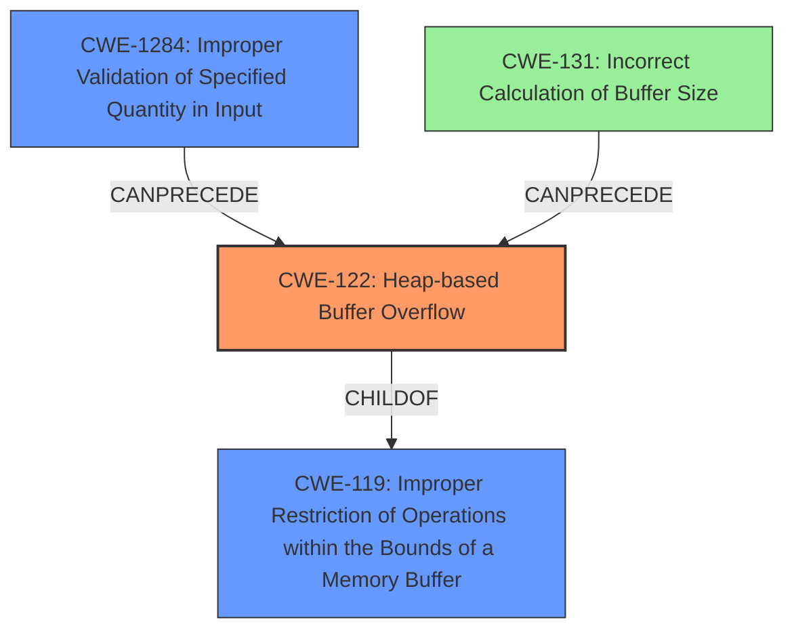

# Final Resolution for CVE-2022-36150

# Summary
| CWE ID | CWE Name | Confidence | CWE Abstraction Level | CWE Vulnerability Mapping Label | CWE-Vulnerability Mapping Notes |
|---|---|---|---|---|---|
| CWE-122 | Heap-based Buffer Overflow | 0.95 | Variant | Allowed | Primary CWE |
| CWE-1284 | Improper Validation of Specified Quantity in Input | 0.80 | Base | Allowed | Secondary Candidate |
| CWE-131 | Incorrect Calculation of Buffer Size | 0.65 | Base | Allowed | Tertiary Candidate |

## Evidence and Confidence

*   **Confidence Score:** 0.85
*   **Evidence Strength:** HIGH

## Relationship Analysis
The primary weakness is CWE-122 (Heap-based Buffer Overflow), a variant of CWE-119 (Improper Restriction of Operations within the Bounds of a Memory Buffer). The secondary candidate, CWE-1284 (Improper Validation of Specified Quantity in Input), can precede a heap overflow if an untrusted size is not validated. CWE-131 (Incorrect Calculation of Buffer Size) is also a possible contributor, as it can directly lead to an undersized buffer on the heap.

## Vulnerability Chain
The vulnerability chain starts with potentially **improper validation of a size parameter** (CWE-1284) or an **incorrect calculation of the buffer size** (CWE-131). This leads to a **heap-based buffer overflow** (CWE-122) when data is written beyond the allocated buffer's boundaries, causing the program to crash.

## Summary of Analysis
The initial analysis correctly identified CWE-122 as the primary issue given the evidence that there was a heap-based buffer overflow. The criticism suggested shifting the secondary candidate to CWE-1284, which is more aligned with the vulnerability description stating the vulnerability is triggered by a "large size value" provided in a file. This is because CWE-1284 is "The product receives input that is expected to specify a quantity (such as size or length), but it does not validate or incorrectly validates that the quantity has the required properties." I agree with the criticism and have adjusted the secondary candidate to CWE-1284.

*Evidence:*
"tifig v0.2.2 was discovered to contain a **heap-buffer overflow** via __asan_memmove at /asan/asan_interceptors_memintrinsics.cpp."

The graph relationships influenced the final selection by illustrating the chain of events leading to the overflow.

CWE-122 is at the optimal level of specificity, as it clearly describes the type of buffer overflow. CWE-1284 and CWE-131 provide additional context regarding the root cause, with CWE-1284 being more directly related to the input validation issue.