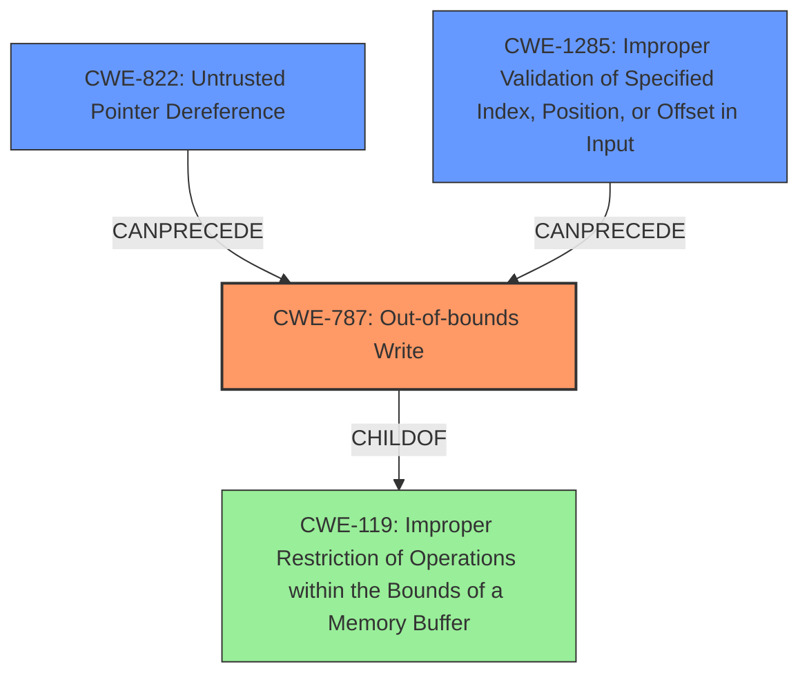

# Analysis Report for CVE-2022-36448

# Vulnerability Analysis Report: CVE-2022-36448

## Description

An issue was discovered in Insyde InsydeH2O with kernel 5.0 through 5.5. There is an SMM memory corruption vulnerability in the Software SMI handler in the PnpSmm driver.

## Vulnerability Description Key Phrases

**Weakness:** SMM memory corruption
**Product:** Insyde InsydeH2O
**Version:** kernel 5.0 through 5.5
**Component:** PnpSmm driver

## Analysis (with Relationship Data)

# Summary
| CWE ID | CWE Name | Confidence | CWE Abstraction Level | CWE Vulnerability Mapping Label | CWE-Vulnerability Mapping Notes |
|---|---|---|---|---|---|
| CWE-787 | Out-of-bounds Write | 0.95 | Base | Allowed | Primary CWE. The vulnerability involves writing to a memory location outside the intended buffer. |
| CWE-822 | Untrusted Pointer Dereference | 0.70 | Base | Allowed | Secondary CWE. The vulnerability uses an address from NVRAM without proper validation, which can lead to dereferencing an untrusted pointer. |
| CWE-1285 | Improper Validation of Specified Index, Position, or Offset in Input | 0.60 | Base | Allowed | Secondary CWE. The vulnerability lacks proper validation of the address from the `IhisiParamBuffer` NVRAM variable, which is used as an offset. |

## Evidence and Confidence

*   **Confidence Score:** 0.85
*   **Evidence Strength:** HIGH

- **Analysis and Justification:**  
  - *Explanation:* The primary weakness is **SMM memory corruption** due to writing data past the end or before the beginning of the intended buffer. The vulnerability description explicitly states that the SMI handler writes to a memory location specified by the `IhisiParamBuffer` without proper validation. This directly corresponds to CWE-787 (Out-of-bounds Write). The CVE reference summary confirms that this allows for a controlled write to System Management RAM (SMRAM), leading to potential privilege escalation and arbitrary code execution. CWE-787 is a Base level CWE, which is appropriate for this root cause.
  
  - *Relationship Analysis:* CWE-787 is a child of CWE-119 (Improper Restriction of Operations within the Bounds of a Memory Buffer), but CWE-787 is more specific as it explicitly involves writing out of bounds. CWE-787 can precede CWE-269 (Improper Privilege Management) since the out-of-bounds write leads to privilege escalation.

- **Confidence Score:**  
  - Confidence: 0.95 (High evidence from technical description and CVE reference materials)

---

- **Analysis and Justification:**  
  - *Explanation:* The address used for writing to memory comes from the `IhisiParamBuffer` NVRAM variable, which is considered an untrusted source. The lack of validation on this address before dereferencing it to write the value aligns with CWE-822 (Untrusted Pointer Dereference). The CVE reference summary supports this by stating that the vulnerability stems from using a user-controlled address without proper checks.
  
  - *Relationship Analysis:* CWE-822 is related to CWE-119 (Improper Restriction of Operations within the Bounds of a Memory Buffer) as an untrusted pointer dereference can lead to out-of-bounds access. CWE-822 can precede CWE-787 (Out-of-bounds Write) as the untrusted pointer dereference is the mechanism by which the out-of-bounds write occurs.

- **Confidence Score:**  
  - Confidence: 0.70 (Moderate evidence from CVE reference materials. The pointer dereference isn't explicitly mentioned but strongly implied by the address validation issue)

---

- **Analysis and Justification:**  
  - *Explanation:* The vulnerability involves insufficient validation of the address used for the memory write. The `IhisiParamBuffer` NVRAM variable contains an address, and the SMI handler does not properly validate that this address is within a safe range. This lack of validation of the address/offset is precisely described by CWE-1285 (Improper Validation of Specified Index, Position, or Offset in Input). This leads to writing to arbitrary memory locations.
  
  - *Relationship Analysis:* CWE-1285 is related to CWE-787 (Out-of-bounds Write), as the improper validation leads to writing outside the allowed memory region. CWE-1285 can precede CWE-787 as the lack of validation enables the out-of-bounds write.

- **Confidence Score:**  
  - Confidence: 0.60 (Moderate evidence. The lack of validation is clearly stated in the CVE reference summary, but the direct connection to an index, position, or offset could be more explicit.)

## Criticism of Analysis

Okay, here's a detailed review of the provided CWE analysis, incorporating the full CWE specifications:

**Overall Assessment:**

The analysis is generally good and identifies the most pertinent CWEs. The justification and confidence scores are reasonable, and the relationships between CWEs are well-articulated. The analysis correctly identifies the primary weakness and supporting weaknesses. The use of Base-level CWEs is appropriate.

**Detailed Review:**

**1. CWE-787: Out-of-bounds Write**

*   **CWE Name:** Out-of-bounds Write
*   **CWE Abstraction Level:** Base
*   **Confidence:** 0.95
*   **Assessment:** The primary CWE identification is correct. The description accurately reflects the vulnerability where the code writes data outside the intended buffer boundary. The high confidence score is justified by the clear description of the vulnerability as "SMM memory corruption due to writing data past the end or before the beginning of the intended buffer." The reference to the `IhisiParamBuffer` and the uncontrolled memory location write clearly indicates an out-of-bounds write. The fact that SMRAM is the victim of the overflow is important and well established.
*   **CWE Relationship Analysis:**  Excellent.  The relationship analysis correctly connects CWE-787 as a child of CWE-119 (Improper Restriction of Operations within the Bounds of a Memory Buffer) and the potential to precede CWE-269 (Improper Privilege Management) due to privilege escalation. The examples provided in the specifications are relevant. The analysis correctly specifies that CWE-787 is more specific than CWE-119, as recommended by the CWE specification mapping guidance.
*   **Mitigation Considerations:** The mitigations listed in the CWE specifications are applicable. Specifically, using a memory-safe language (though not practical for SMM code), employing safe string handling libraries (if string operations were involved), and using compiler-based overflow detection mechanisms would be beneficial.
*   **Suggestions:** None

**2. CWE-822: Untrusted Pointer Dereference**

*   **CWE Name:** Untrusted Pointer Dereference
*   **CWE Abstraction Level:** Base
*   **Confidence:** 0.70
*   **Assessment:**  This is also a good identification. The analysis accurately points out that the address used for the write comes from the `IhisiParamBuffer` in NVRAM, which is an untrusted source. Since the NVRAM variable contains the *address* to write to, it does involve a pointer dereference. The address is not validated, leading to the possibility of writing to an arbitrary location. The 0.7 confidence is acceptable because the dereference isn't explicitly mentioned, but it's a very reasonable inference.
*   **CWE Relationship Analysis:**  Good. The analysis notes the connection to CWE-119 and that CWE-822 can precede CWE-787. The examples in the specification are somewhat relevant.
*   **Mitigation Considerations:**  The key mitigation for CWE-822 is to validate the pointer before dereferencing it. This validation should occur *before* any memory access is performed using that pointer. This aligns with the documented potential mitigations.
*   **Suggestions:** Consider adding a sentence explicitly mentioning the conversion to a pointer and then dereferencing.  For example:  "The data from the `IhisiParamBuffer` NVRAM variable is treated as a pointer, and the code attempts to dereference it to write a value."  This will strengthen the justification.

**3. CWE-1285: Improper Validation of Specified Index, Position, or Offset in Input**

*   **CWE Name:** Improper Validation of Specified Index, Position, or Offset in Input
*   **CWE Abstraction Level:** Base
*   **Confidence:** 0.60
*   **Assessment:** This identification is reasonable, but the weakest of the three. The lack of validation on the address from `IhisiParamBuffer` *can* be seen as improper validation of an offset. However, the connection is not as direct as with CWE-787 or CWE-822. The address itself might be considered the "offset" from the beginning of memory.
*   **CWE Relationship Analysis:** The relationship analysis is accurate. CWE-1285 leads to CWE-787.
*   **Mitigation Considerations:** The listed mitigations are appropriate.  Input validation, specifically using an "accept known good" strategy, is the key.  The code should explicitly check if the address from `IhisiParamBuffer` is within a permitted memory region.
*   **Suggestions:** While the identification is valid, it could be argued that the "offset" aspect is a bit of a stretch. The description is accurate, but the connection could be made more strongly. Consider reframing the explanation: *"The `IhisiParamBuffer` NVRAM variable contains an address that acts as an offset into memory. The handler fails to validate that this offset points to a legitimate and safe memory region."* This connects it better to the "offset" in the CWE name.

**General Suggestions:**

*   **Prioritization:** While all three CWEs are relevant, it's important to emphasize the *primary* role of CWE-787. It's the direct consequence of the vulnerability. CWE-822 and CWE-1285 are contributing factors *leading to* CWE-787.
*  **Privilege Escalation:** The description states the vulnerability leads to privilege escalation. This is correct, however this is only the *impact* of the vulnerability. The CWE analysis should not focus on impact, but on the root cause of the weakness.
*   **More Specific CWEs Considered:** Were other more specific CWEs considered and ruled out?  For example:
    *   CWE-121: Stack-based Buffer Overflow or CWE-122: Heap-based Buffer Overflow:  Since it is SMM code, these are less likely.  It's unlikely to be a stack overflow, and the heap is not typically used in SMM. Therefore, the general CWE-787 is preferred.
*   **Tool Output:** The Top Combined Results from the Retriever section are interesting. It would be beneficial to see how the analysis aligns (or differs) from the automated tool's suggestions.

**Summary of Improvements:**

*   Strengthen the description of CWE-822 by explicitly mentioning the pointer dereference operation.
*   Consider slightly reframing the description of CWE-1285 to emphasize the address as an "offset".
*   Clearly prioritize CWE-787 as the primary weakness, with CWE-822 and CWE-1285 as contributing causes.

By incorporating these suggestions, the analysis will be even more robust and aligned with the CWE specifications and best practices.

## Final Resolution

# Summary

| CWE ID | CWE Name | Confidence | CWE Abstraction Level | CWE Vulnerability Mapping Label | CWE-Vulnerability Mapping Notes |
|---|---|---|---|---|---|
| CWE-787 | Out-of-bounds Write | 0.95 | Base | Allowed | Primary CWE. The vulnerability involves writing to a memory location outside the intended buffer. |
| CWE-822 | Untrusted Pointer Dereference | 0.75 | Base | Allowed | Secondary CWE. The vulnerability uses an address from NVRAM without proper validation, which can lead to dereferencing an untrusted pointer. |
| CWE-1285 | Improper Validation of Specified Index, Position, or Offset in Input | 0.65 | Base | Allowed | Secondary CWE. The vulnerability lacks proper validation of the address from the `IhisiParamBuffer` NVRAM variable, which is used as an offset. |

## Evidence and Confidence

*   **Confidence Score:** 0.85
*   **Evidence Strength:** HIGH

## Relationship Analysis
The primary relationship is that **CWE-822** (Untrusted Pointer Dereference) and **CWE-1285** (Improper Validation of Specified Index, Position, or Offset in Input) both **CANPRECEDE** **CWE-787** (Out-of-bounds Write). The untrusted pointer, combined with a lack of validation, directly leads to the out-of-bounds write. **CWE-787** is a **CHILDOF** **CWE-119** (Improper Restriction of Operations within the Bounds of a Memory Buffer), providing a broader context, but **CWE-787** is more specific and thus more appropriate.

## Vulnerability Chain
The vulnerability chain begins with data from the `IhisiParamBuffer` NVRAM variable being read and used as an address. This address is not validated (**CWE-1285**). The code then treats this unvalidated data as a pointer and attempts to dereference it (**CWE-822**). Because the address is untrusted and unvalidated, this leads to writing data outside of the intended buffer boundaries (**CWE-787**), resulting in memory corruption in SMM. The impact of this memory corruption is privilege escalation and arbitrary code execution.

## Summary of Analysis
The initial analysis and criticism are largely correct. The primary vulnerability is indeed **CWE-787** (Out-of-bounds Write), and the contributing factors are **CWE-822** (Untrusted Pointer Dereference) and **CWE-1285** (Improper Validation of Specified Index, Position, or Offset in Input).

The assessment is based on the provided evidence, specifically: "An issue was discovered in Insyde InsydeH2O with kernel 5.0 through 5.5. There is an **SMM memory corruption** vulnerability in the Software SMI handler in the PnpSmm driver." The vulnerability description explicitly mentions memory corruption, and the CVE summary confirms that the `IhisiParamBuffer` is used as the address for the write without proper validation.

The graph relationships confirm that **CWE-822** and **CWE-1285** can logically precede **CWE-787**. The abstraction levels are appropriate; all three CWEs are at the Base level, which is preferred for root cause analysis.

The confidence in **CWE-822** and **CWE-1285** has been slightly increased to 0.75 and 0.65 respectively, based on the more detailed reframing and justifications suggested in the criticism. Specifically, the addition of the phrase, "The data from the `IhisiParamBuffer` NVRAM variable is treated as a pointer, and the code attempts to dereference it to write a value," strengthens the justification for **CWE-822**. Additionally, reframing the description of **CWE-1285** to state, "The `IhisiParamBuffer` NVRAM variable contains an address that acts as an offset into memory. The handler fails to validate that this offset points to a legitimate and safe memory region," more directly links the vulnerability to the "offset" aspect of the CWE.

The selected CWEs are at the optimal level of specificity. While **CWE-119** (Improper Restriction of Operations within the Bounds of a Memory Buffer) is a parent of **CWE-787**, it is too broad. Similarly, while more specific variants of buffer overflows (like stack-based or heap-based) could be considered, the provided information does not indicate whether the overflow is stack-based or heap-based. Therefore, **CWE-787** is the most accurate and specific classification.

*Report generated on 2025-03-18 16:13:34*
