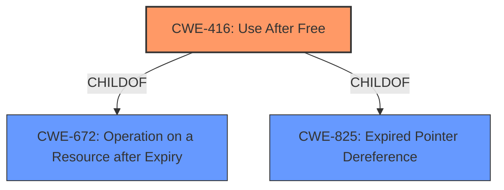

# Final Resolution for CVE-2022-3659

# Summary
| CWE ID | CWE Name | Confidence | CWE Abstraction Level | CWE Vulnerability Mapping Label | CWE-Vulnerability Mapping Notes |
|---|---|---|---|---|---|
| CWE-416 | Use After Free | 0.95 | Variant | Primary | Allowed |

## Evidence and Confidence

*   **Confidence Score:** 0.95
*   **Evidence Strength:** HIGH

## Relationship Analysis
The primary relationship influencing the decision is the direct match between the vulnerability description and the definition of CWE-416. CWE-416 is a variant of CWE-672 (Operation on a Resource after Expiry), and CWE-825 (Expired Pointer Dereference). While CWE-122 (Heap-based Buffer Overflow) can be a consequence of a UAF, it's not a guaranteed relationship. Therefore, I will classify CWE-416 as the Primary **WEAKNESS**. The Variant level is the preferred level of abstraction for this type of vulnerability.

## Vulnerability Chain
The vulnerability chain starts with the **ROOTCAUSE** of a use-after-free condition (CWE-416). This occurs when memory is freed, but a pointer to that memory is still used. The consequence of this can include information leakage, denial of service, and potentially arbitrary code execution. The vulnerability description indicates that a remote attacker can trigger this via specific UI interactions, which serves as the exploit trigger.

## Summary of Analysis
Based on the vulnerability description, "**use after free** in Accessibility in Google Chrome," the primary **WEAKNESS** is clearly CWE-416 (Use After Free). The explicit mention of "use after free" provides strong evidence.

The initial analysis correctly identified CWE-416 as the primary **WEAKNESS**. The criticism suggested removing CWE-122 (Heap-based Buffer Overflow) as a secondary **WEAKNESS** since it is only a potential consequence and not a direct part of the root cause. I agree with this assessment. The vulnerability description does not explicitly state that a buffer overflow occurred, only that **heap corruption** was possible. The graph relationships show that CWE-416 is a variant-level CWE, which is a preferred level of abstraction.

I am selecting CWE-416 as the optimal level of specificity because it directly addresses the root cause described in the vulnerability report.