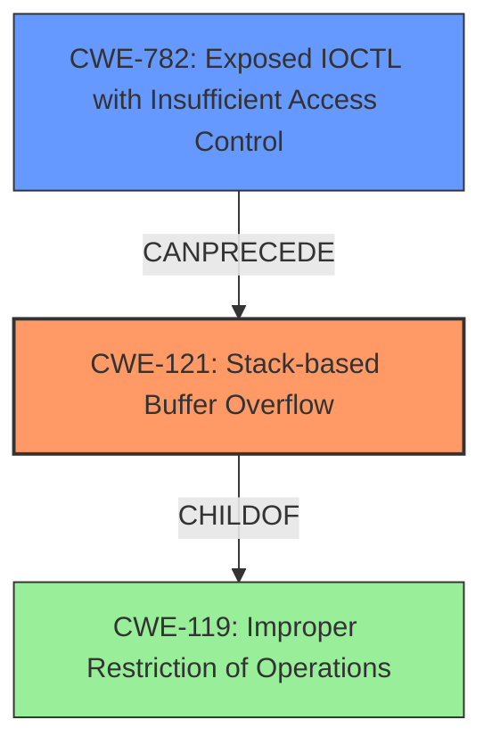

# Final Resolution for CVE-2022-37415

# Summary
| CWE ID | CWE Name | Confidence | CWE Abstraction Level | CWE Vulnerability Mapping Label | CWE-Vulnerability Mapping Notes |
|---|---|---|---|---|---|
| CWE-121 | Stack-based Buffer Overflow | 1.0 | Variant | Allowed | Primary CWE |
| CWE-782 | Exposed IOCTL with Insufficient Access Control | 0.6 | Variant | Allowed | Secondary Candidate. The exposed IOCTL allowed the overflow to be triggered. Insufficient access control of the IOCTL exacerbates the vulnerability. |

## Evidence and Confidence

*   **Confidence Score:** 0.9
*   **Evidence Strength:** HIGH

## Relationship Analysis
The primary CWE is CWE-121 (**Stack-based Buffer Overflow**), which is a variant of CWE-119 (**Improper Restriction of Operations within the Bounds of a Memory Buffer**). This parent-child relationship indicates that CWE-121 is a more specific case of the general buffer overflow issue described by CWE-119. The secondary CWE is CWE-782 (**Exposed IOCTL with Insufficient Access Control**), which is a weakness that can precede CWE-121 in a vulnerability chain. The IOCTL exposure, combined with a lack of validation, allows for the stack-based overflow to be triggered.



## Vulnerability Chain
The vulnerability chain starts with CWE-782 (**Exposed IOCTL with Insufficient Access Control**). The exposed IOCTL handler lacks proper access control, which allows an attacker to call it. Within the IOCTL handler, there is a **lack of input validation**, leading to CWE-121 (**Stack-based Buffer Overflow**). This overflow allows an attacker to overwrite the return address on the stack, potentially gaining control of the execution flow. The root cause is the combination of the exposed IOCTL and the missing input validation within its handler, leading to the stack-based buffer overflow and ultimately arbitrary code execution.

## Summary of Analysis
The initial analysis and criticism both agree that CWE-121 (**Stack-based Buffer Overflow**) is the most appropriate primary CWE due to the explicit mention of "stack-based buffer overflow" in the vulnerability description and CVE details. The analysis is strongly based on the provided evidence.
```
The vulnerability description explicitly states a "stack-based buffer overflow" via IOCTL 0x40002008 in the Uniwill SparkIO.sys driver 1.0. The CVE Reference Links Content Summary reinforces this by stating, "The driver has a stack-based buffer overflow vulnerability in the IOCTL handler for 0x40002008."
```

The graph relationships influenced the selection of CWE-782 (**Exposed IOCTL with Insufficient Access Control**) as a secondary CWE because it highlights how the vulnerability is triggered. The exposed IOCTL allows for a malicious actor to call the vulnerable code. Without it, the overflow would not be exploitable.

The selected CWEs are at the optimal level of specificity because CWE-121 is a variant-level CWE that accurately describes the type of buffer overflow, and CWE-782 clarifies the context in which it occurs.