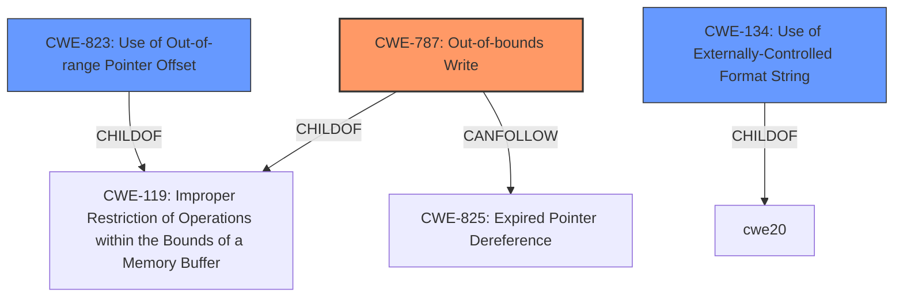

# Final Resolution for CVE-2022-37937

# Summary
| CWE ID | CWE Name | Confidence | CWE Abstraction Level | CWE Vulnerability Mapping Label | CWE-Vulnerability Mapping Notes |
|---|---|---|---|---|---|
| CWE-787 | Out-of-bounds Write | 0.6 | Base | Primary | Allowed |
| CWE-823 | Use of Out-of-range Pointer Offset | 0.3 | Base | Contributing | Allowed |
| CWE-134 | Use of Externally-Controlled Format String | 0.1 | Base | Alternative | Allowed |

## Evidence and Confidence

*   **Confidence Score:** 0.7
*   **Evidence Strength:** MEDIUM

## Relationship Analysis
The primary CWE is CWE-787 (**Out-of-bounds Write**). This has a parent-child relationship with CWE-119 (**Improper Restriction of Operations within the Bounds of a Memory Buffer**), indicating that it is a specific type of buffer overflow. The analysis also considers CWE-823 (**Use of Out-of-range Pointer Offset**) and CWE-134 (**Use of Externally-Controlled Format String**) as contributing or alternative factors. These relationships help to refine the classification by exploring different potential causes of memory corruption. The relationships between CWE-787 and other CWEs such as CWE-825 (**Expired Pointer Dereference**) as a CANFOLLOW relationship helps to understand potential exploit chains. The abstraction levels (all are Base) influenced the decision to select these specific CWEs.

## Vulnerability Chain
The vulnerability chain starts with a pre-authentication process that handles untrusted data. A flaw in this process, such as insufficient bounds checking (CWE-787), the use of an out-of-range pointer offset (CWE-823), or a format string vulnerability (CWE-134), can lead to memory corruption. This memory corruption could then be exploited to cause a denial-of-service, or potentially lead to further exploitation after authentication (e.g., through CWE-825 (**Expired Pointer Dereference**)). The initial **WEAKNESS** is in the handling of pre-authentication data, and the **ROOTCAUSE** could be one of the CWEs listed above.

## Summary of Analysis
The initial analysis correctly identified CWE-787 (**Out-of-bounds Write**) as a likely primary **WEAKNESS**, given the "Pre-auth memory corruption" description. However, the criticism raised valid points about exploring alternative and contributing factors.

The assessment is primarily based on the provided evidence and the CWE database. The vulnerability description mentions "Pre-auth memory corruption," which directly aligns with memory corruption caused by writing outside of buffer boundaries (CWE-787).
>"The vulnerability description indicates **Pre-auth memory corruption** in HPE Serviceguard. Based on the description, the most likely root cause is an out-of-bounds write (CWE-787)."

The graph relationships influenced the final selection by highlighting the connections between CWE-787 and related weaknesses, such as CWE-119 (**Improper Restriction of Operations within the Bounds of a Memory Buffer**), and potential follow-on vulnerabilities like CWE-825 (**Expired Pointer Dereference**). The inclusion of CWE-823 (**Use of Out-of-range Pointer Offset**) and CWE-134 (**Use of Externally-Controlled Format String**) as contributing/alternative factors provides a more complete picture of the potential causes of the vulnerability.

The selected CWEs are at the optimal level of specificity because they are base-level weaknesses that directly address the observed memory corruption. While more specific variant-level CWEs could exist, the available information does not allow for a more precise classification.