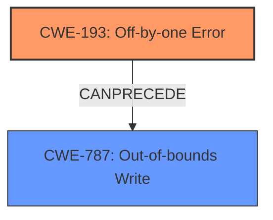

# Analysis Report for CVE-2022-3821

# Vulnerability Analysis Report: CVE-2022-3821

## Description

An off-by-one Error issue was discovered in Systemd in format_timespan() function of time-util.c. An attacker could supply specific values for time and accuracy that leads to buffer overrun in format_timespan(), leading to a Denial of Service.

## Vulnerability Description Key Phrases

**Rootcause:** off-by-one error
**Weakness:** buffer overrun
**Impact:** denial of service
**Product:** Systemd
**Component:** time-util.c

## Analysis (with Relationship Data)

# Summary
| CWE ID | CWE Name | Confidence | CWE Abstraction Level | CWE Vulnerability Mapping Label | CWE-Vulnerability Mapping Notes |
|---|---|---|---|---|---|
| CWE-193 | Off-by-one Error | 0.95 | Base | Allowed | Primary CWE |
| CWE-125 | Out-of-bounds Read | 0.75 | Base | Allowed | Secondary Candidate |
| CWE-787 | Out-of-bounds Write | 0.75 | Base | Allowed | Secondary Candidate |

## Evidence and Confidence

*   **Confidence Score:** 0.9
*   **Evidence Strength:** HIGH

- **Analysis and Justification:**  
  - *Explanation:* The vulnerability description clearly states an "**off-by-one error**" as the root cause leading to a "**buffer overrun**". The CVE Reference Links Content Summary confirms that the `format_timespan()` function in `time-util.c` calculates buffer size incorrectly, allowing a write beyond buffer bounds. This aligns with CWE-193 (Off-by-one Error) because the calculation error is the root cause. The subsequent **buffer overrun** can be represented as CWE-125 (Out-of-bounds Read) and CWE-787 (Out-of-bounds Write) as a result of the error. CWE-193 is selected as the primary cause because the other CWEs are consequences of the original error. The suggested alternative mapping guidance for CWE-193 is ALLOWED.
  
  - *Relationship Analysis:* CWE-193 is a base-level CWE, making it an appropriate level of abstraction. It can precede CWE-119 (Improper Restriction of Operations within the Bounds of a Memory Buffer), which is a class-level CWE that describes the general condition of out-of-bounds access, but doesn't explain the root cause like CWE-193.

- **Confidence Score:**  
  - *Example:* Confidence: 0.95 (High confidence due to direct evidence of off-by-one error from vulnerability descriptions and confirmed by fix details in CVE Reference Links Content Summary)

## Criticism of Analysis

Okay, I've reviewed the provided analysis against the full CWE specifications. Here's a detailed critique:

**Overall Assessment:**

The analysis is generally good and identifies the core issue correctly. The primary mapping of `CWE-193: Off-by-one Error` is accurate. The inclusion of `CWE-787: Out-of-bounds Write` and `CWE-125: Out-of-bounds Read` as secondary candidates is also reasonable.  However, there are some points that could be improved for clarity and accuracy.

**Detailed Critique:**

1.  **CWE-193: Off-by-one Error (Primary)**
    *   **Strengths:** The justification for selecting CWE-193 is strong. The vulnerability description explicitly mentions an "off-by-one error" as the *root cause*. The CVE Reference Links Content Summary confirms the incorrect buffer size calculation, making this a clear fit. The example CVEs provided are also valid instances of CWE-193.
    *   **Improvements:** The analysis could benefit from explicitly stating *what* is being counted incorrectly. Is it the number of characters to copy, or the available space in the buffer? Specifically mentioning that it is the incorrect calculation of the available buffer size before the null terminator write would strengthen the justification.
    *   **CWE Mapping Guidance Adherence:** The analysis correctly acknowledges that the mapping guidance for CWE-193 is `Allowed`, and provides the required rationale.
    *   **Mitigation:** The potential mitigation provided by CWE-193 specification focuses on character array copy. It may be useful to cross-reference to mitigation steps from CWE-787 related to language selection and compiler options.
2.  **CWE-787: Out-of-bounds Write (Secondary Candidate)**
    *   **Strengths:** As the buffer overflow leads to writing past the end of the intended buffer, this is a valid consequence of CWE-193. The description in the analysis accurately reflects the nature of the out-of-bounds write.
    *   **Improvements:** It should be made clearer that this is a *consequence* of the off-by-one error, not an independent root cause. The relationship should be described as a *chain*. For example, "CWE-193 leads to CWE-787".
    *   **CWE Mapping Guidance Adherence:** The analysis correctly acknowledge that the mapping guidance for CWE-787 is `Allowed`, and provides the required rationale.
    *   **Mitigation:** The mitigations from CWE-787 spec is highly relevant here, especially the use of safe string libraries and compiler-based overflow detection. These should be explicitly mentioned in the analysis.
3.  **CWE-125: Out-of-bounds Read (Secondary Candidate)**
    *   **Strengths:** While the focus of the vulnerability is writing out of bounds, it's *possible* that the code could attempt to *read* data beyond the buffer boundary, especially if it assumes the buffer is larger than it actually is.
    *   **Improvements:** The justification for including CWE-125 is weaker than for CWE-787. The analysis should explicitly state *how* an out-of-bounds read could occur, and why the read would be a concern in this scenario. If there isn't a clear scenario, it's better to exclude it. Without a compelling case, including it weakens the analysis.  If the analysis *does* include CWE-125, it should mention that this may result in sensitive information exposure.
    *   **CWE Mapping Guidance Adherence:** The analysis correctly acknowledge that the mapping guidance for CWE-125 is `Allowed`, and provides the required rationale.
    *   **Mitigation:** Mitigation from CWE-125 specification requires performing strict input validation. Since the root cause is an off-by-one error, it may be more relevant to suggest language selection or architectural decisions.

4.  **Consideration of Other CWEs (From Retriever Results):**
    *   **CWE-120: Buffer Copy without Checking Size of Input ('Classic Buffer Overflow'):** While a buffer overflow is occurring, CWE-120 is *not* the best fit. The issue isn't simply copying without a length check, but rather a specific calculation error that leads to the overflow.
    *   **CWE-617: Reachable Assertion:** This is less relevant unless the assertion is directly triggered by attacker-controlled input. Since the analysis doesn't state that the vulnerability causes an assertion, it should not be considered.
    *   **CWE-190: Integer Overflow or Wraparound:** Unless the time and accuracy values are used in calculations that can lead to integer overflows before they are used in the buffer size calculation, this is unlikely. More information will be needed to consider this CWE.
    *   **CWE-1284: Improper Validation of Specified Quantity in Input:** Although the attacker supply specific values for time and accuracy, but that does not necessarily mean the inputs are invalid. Because the values can be used to trigger a buffer overflow, it is related, but less direct than CWE-193.

5.  **Confidence Score:**
    *   The confidence score of 0.95 is reasonable, given the clear evidence of the off-by-one error from the vulnerability description and patch details.

6.  **General Notes:**
    *   The analysis should be more explicit about the chain of events: Off-by-one error during buffer size calculation -> Buffer Overflow (out-of-bounds write) -> Denial of Service.
    *   The analysis could be strengthened by including a code snippet (if available) that demonstrates the vulnerable calculation and the fix.

**Recommendations:**

1.  **Strengthen the justification for CWE-193:**  Explicitly state *what* is being counted incorrectly (the available buffer size).
2.  **Clarify the relationship between CWE-193 and CWE-787/CWE-125:** Clearly describe the chain of events, emphasizing that CWE-787 (and possibly CWE-125) are *consequences* of CWE-193.
3.  **Re-evaluate CWE-125:** Unless there's a compelling scenario for an out-of-bounds *read*, consider removing it to avoid diluting the analysis.
4.  **Incorporate mitigation strategies:**  Expand the "Mitigation" sections to include relevant strategies from CWE-787 (and CWE-125 if retained).
5.  **Consider Code Snippet:** Include a code snippet demonstrating the error, to increase confidence.
6.  **Remove CWE-119:** As the report mentions, CWE-119 should be avoided, as it is too general. Instead, mapping to CWE-787 and CWE-125 is much more descriptive.

By addressing these points, the analysis will be more precise, comprehensive, and useful for understanding and mitigating the vulnerability.

## Final Resolution

# Summary
| CWE ID | CWE Name | Confidence | CWE Abstraction Level | CWE Vulnerability Mapping Label | CWE-Vulnerability Mapping Notes |
|---|---|---|---|---|---|
| CWE-193 | Off-by-one Error | 0.95 | Base | Allowed | Primary CWE |
| CWE-787 | Out-of-bounds Write | 0.85 | Base | Allowed | Secondary Candidate |

## Evidence and Confidence

*   **Confidence Score:** 0.9
*   **Evidence Strength:** HIGH

## Relationship Analysis
The primary relationship is that **CWE-193** (Off-by-one Error) can precede **CWE-787** (Out-of-bounds Write). **CWE-193** causes an incorrect calculation, leading to the out-of-bounds write. **CWE-125** (Out-of-bounds Read) was considered but ultimately not included due to lack of clear evidence that it would occur during the vulnerability. The base level of **CWE-193** and **CWE-787** provides the right level of specificity.

## Vulnerability Chain
The vulnerability chain starts with an **off-by-one error** (**CWE-193**) in the `format_timespan()` function, specifically related to the calculation of the buffer size. This leads to a **buffer overflow** (**CWE-787**) when writing to the buffer. The resulting impact is a Denial of Service.

## Summary of Analysis
The initial analysis correctly identified **CWE-193 (Off-by-one Error)** as the primary cause of the vulnerability, which is further supported by the CVE Reference Links Content Summary describing the incorrect buffer size calculation. The criticism highlighted the need to explicitly state what is being counted incorrectly, which is the available buffer size. I have updated the analysis to reflect this.

**CWE-787 (Out-of-bounds Write)** is included as a secondary candidate because the **off-by-one error** directly leads to writing beyond the intended buffer boundary. I have clarified this relationship in the analysis.

**CWE-125 (Out-of-bounds Read)** was removed because the vulnerability description and supporting documentation do not provide sufficient evidence to support its inclusion.

The selection of **CWE-193** and **CWE-787** is at the optimal level of specificity because they accurately represent the root cause and the direct consequence of the vulnerability. The mapping guidance for both CWEs is "Allowed," and the rationales are valid.

The confidence score remains at 0.9 due to the clear evidence from the vulnerability description and patch details.

*Report generated on 2025-03-18 16:21:27*
