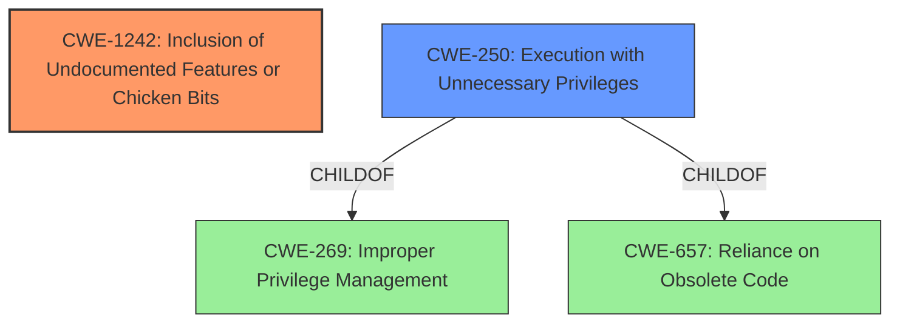

# Final Resolution for CVE-2022-38372

# Summary
| CWE ID  | CWE Name                                                       | Confidence | CWE Abstraction Level | CWE Vulnerability Mapping Label | CWE-Vulnerability Mapping Notes                                                                                                                                    |
| :-------- | :------------------------------------------------------------- | :--------- | :-------------------- | :------------------------------ | :----------------------------------------------------------------------------------------------------------------------------------------------------------------- |
| CWE-1242 | Inclusion of Undocumented Features or Chicken Bits            | 1.0        | Base                  | Allowed                         | Primary CWE. Mitigations include disabling undocumented features in production and documenting all interfaces.                                                        |
| CWE-250  | Execution with Unnecessary Privileges                          | 0.7        | Base                  | Allowed                         | Secondary Candidate. Captures the elevated privileges with which the undocumented command is executed. Mitigations include using the least privilege principle. |

## Evidence and Confidence

*   **Confidence Score:** 0.9
*   **Evidence Strength:** HIGH

## Relationship Analysis
The primary CWE is CWE-1242, which is a base-level CWE. It does not have any direct relationships but captures the root cause of the vulnerability. CWE-250, also a base-level CWE, is related as a consequence of the undocumented feature being executed with elevated privileges. It's a child of CWE-269 (Improper Privilege Management) and CWE-657 (Reliance on Obsolete Code), indicating that the unnecessary privileges could stem from improper management or reliance on outdated code practices.

## Vulnerability Chain
The vulnerability chain starts with the **inclusion of undocumented features [CWE-1242]**. This leads to the **execution of an undocumented command with unnecessary privileges [CWE-250]**, ultimately resulting in a local, privileged user obtaining a root shell on the device. The missing link, which is implicitly stated, is that the undocumented command gives direct access to root privileges without proper checks.

## Summary of Analysis
The initial analysis and criticism provided a strong foundation for identifying the appropriate CWEs. The primary CWE, **CWE-1242**, is well-justified by the vulnerability description, which explicitly mentions the "undocumented command". The secondary CWE, **CWE-250**, captures the aspect of the undocumented command being executed with elevated privileges.

The relationship analysis confirms that **CWE-1242** is the root cause, while **CWE-250** is a consequence. The criticism correctly pointed out that the justification for **CWE-250** could be strengthened by focusing on the execution of the command itself with elevated privileges, rather than just the result of obtaining a root shell. I agree with the suggestion to consider **CWE-306** (Missing Authentication for Critical Function). However, since the vulnerability requires a "local, privileged user," **CWE-306** is not as applicable as **CWE-250**, because an authentication bypass isn't exactly applicable to an already authenticated user.

The selected CWEs are at the optimal level of specificity. Both are base-level CWEs that directly map to the root cause and consequences of the vulnerability. The evidence from the vulnerability description strongly supports this classification: "A **hidden functionality vulnerability [CWE-1242]** in FortiTester CLI...may allow a local, privileged user to obtain a root shell on the device via an undocumented command."

I am increasing the confidence score for **CWE-250** to 0.7 because, upon closer examination and as noted in the criticism, the *undocumented command* is *itself* executed with elevated privileges (root in this case). This more directly aligns with the **CWE-250** description: *"The product performs an operation at a privilege level that is higher than the minimum level required..."*.