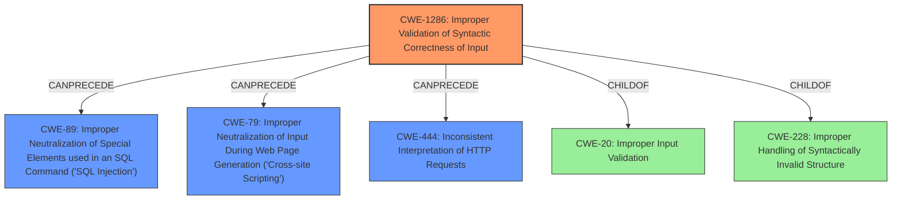

# Analysis Report for CVE-2022-38381

# Vulnerability Analysis Report: CVE-2022-38381

## Description

An improper handling of malformed request vulnerability [CWE-228] exists in FortiADC 5.0 all versions, 6.0.0 all versions, 6.1.0 all versions, 6.2.0 through 6.2.3, and 7.0.0 through 7.0.2. This may allow a remote attacker without privileges to bypass some Web Application Firewall (WAF) protection such as the SQL Injection and XSS filters via a malformed HTTP request.

## Vulnerability Description Key Phrases

**Rootcause:** improper handling of malformed request
**Impact:** bypass SQL Injection and XSS filters
**Vector:** malformed HTTP request
**Attacker:** remote attacker without privileges
**Product:** FortiADC
**Version:** ['5.0 all versions', '6.0.0 all versions', '6.1.0 all versions', '6.2.0 through 6.2.3', '7.0.0 through 7.0.2']

## Analysis (with Relationship Data)

# Summary
| CWE ID    | CWE Name                                                                                                   | Confidence | CWE Abstraction Level | CWE Vulnerability Mapping Label | CWE-Vulnerability Mapping Notes |
| :--------- | :--------------------------------------------------------------------------------------------------------- | :--------- | :-------------------- | :------------------------------ | :------------------------------ |
| CWE-444 | Inconsistent Interpretation of HTTP Requests ('HTTP Request/Response Smuggling') | 0.75       | Base                  | Allowed                       | Allowed                      |
| CWE-89 | Improper Neutralization of Special Elements used in an SQL Command ('SQL Injection') | 0.65       | Base                  | Allowed                       | Allowed                      |
| CWE-79 | Improper Neutralization of Input During Web Page Generation ('Cross-site Scripting') | 0.65       | Base                  | Allowed                       | Allowed                      |
| CWE-228     | Improper Handling of Syntactically Invalid Structure                                                      | 0.50       | Class                   | Allowed-with-Review               | Allowed-with-Review              |

## Evidence and Confidence

*   **Confidence Score:** 0.70
*   **Evidence Strength:** MEDIUM

- **Analysis and Justification:**
  - *Explanation:* The vulnerability description clearly states an **improper handling of malformed requests** [CWE-228], leading to the bypass of WAF protections, specifically SQL Injection and XSS filters. The "Retriever Results" highlight CWE-444 (Inconsistent Interpretation of HTTP Requests) as the top candidate, which aligns with the description of the vulnerability. Since the vulnerability involves bypassing SQL Injection and XSS filters, CWE-89 (Improper Neutralization of Special Elements used in an SQL Command) and CWE-79 (Improper Neutralization of Input During Web Page Generation) are also relevant.  CWE-228 is included as the **improper handling of the malformed requests** is the direct cause.
  - *Relationship Analysis:* CWE-444 is a Base level CWE, which is preferred. CWE-89 and CWE-79 are related to the impact of the vulnerability (bypassing SQL Injection and XSS filters), not the root cause. CWE-228 is a Class level, but accurately describes the **improper handling of malformed request**.

- **Confidence Score:**
  - Confidence: 0.70 (Medium evidence because while the description is clear, more specific technical details would increase confidence.)
---

## Criticism of Analysis

Okay, let's break down the provided analysis and see how well it aligns with the full CWE specifications.

**Overall Assessment:**

The analysis shows a good understanding of the vulnerability and attempts to map it to relevant CWEs. The inclusion of CWE-444, CWE-89, CWE-79, and CWE-228 demonstrates a multi-faceted perspective. However, the confidence levels could be improved with more precise justifications. The analysis would benefit from explicitly considering alternative CWEs that were considered and why they were ultimately rejected.

**Detailed Review:**

Here's a breakdown of each CWE mapping, along with suggestions for improvement:

1.  **CWE-444: Inconsistent Interpretation of HTTP Requests ('HTTP Request/Response Smuggling') - Confidence 0.75 - Allowed**

    *   **Strengths:** This is a strong candidate, especially given that the vulnerability involves "malformed HTTP requests." The core idea of CWE-444 is that an intermediary (like FortiADC, acting as a WAF) interprets the request differently than the backend server.  This could lead to the WAF missing malicious content embedded within the request.
    *   **Weaknesses/Suggestions:**
        *   The analysis could be strengthened by explicitly detailing *how* the malformed request leads to inconsistent interpretation. What *specific* types of malformed requests are in play (e.g., issues with Content-Length, Transfer-Encoding, header injection, etc.)?  The more specific the description, the higher the confidence.
        *   Mitigation:  Mention that strict HTTP parsing, as recommended in the CWE, is essential.
        *   Consider and explicitly reject alternatives like CWE-113 (HTTP Request/Response Splitting). While related, splitting usually involves CRLF injection, which might not be the primary mechanism here.

2.  **CWE-89: Improper Neutralization of Special Elements used in an SQL Command ('SQL Injection') - Confidence 0.65 - Allowed**

    *   **Strengths:** This mapping is reasonable because the impact of the vulnerability is that it bypasses SQL injection filters.
    *   **Weaknesses/Suggestions:**
        *   This CWE should not be considered a *root cause*. It's a *consequence* or *impact* of the underlying improper handling of the malformed request. The WAF *should* be preventing SQL injection, but it's failing to do so because of the malformed request.
        *   Reduce the confidence level. The inclusion of CWE-89 is warranted, but secondary.
        *   Mitigation: Suggest using parameterized queries and following the principle of least privilege for database accounts. These are standard SQL injection prevention techniques, but only relevant here because the WAF is failing.
        *   Clarify the relationship:  "The improper handling of malformed requests allows attackers to bypass SQL injection filters, potentially leading to SQL injection vulnerabilities on the backend server."

3.  **CWE-79: Improper Neutralization of Input During Web Page Generation ('Cross-site Scripting') - Confidence 0.65 - Allowed**

    *   **Strengths:** Similar to CWE-89, this is also a reasonable mapping since bypassing XSS filters is a stated impact.
    *   **Weaknesses/Suggestions:**
        *   Again, this is not the *root cause*. It's a consequence of the WAF failure.
        *   Reduce the confidence level for the same reasons as CWE-89.
        *   Mitigation: Suggest output encoding/escaping techniques as specified in the CWE.
        *  Clarify the relationship: "The improper handling of malformed requests allows attackers to bypass XSS filters, potentially leading to XSS vulnerabilities..."

4.  **CWE-228: Improper Handling of Syntactically Invalid Structure - Confidence 0.50 - Allowed-with-Review**

    *   **Strengths:** This CWE aligns well with the description's key phrase: "improper handling of malformed request."
    *   **Weaknesses/Suggestions:**
        *   CWE-228 is a Class-level CWE, and the mapping guidance recommends looking for more specific Base-level children. This is a key point.
        *   The low confidence reflects this concern.
        *   **Crucially, consider CWE-1286: Improper Validation of Syntactic Correctness of Input.** This is a Base-level CWE and a child of CWE-20. The FortiADC *failed to validate* that the HTTP request was syntactically correct.  This failure led to the bypass of the WAF.  This aligns more directly with the root cause. If you select CWE-1286 the confidence score should increase.
        *   If you use CWE-1286, mitigate using "accept known good" input validation strategy.
        *   If you stick with CWE-228, justify *why* none of its children are a better fit.

**Additional Considerations:**

*   **Relationship Analysis:** It is important to consider that the analysis has to determine if the WAF is an intermediary agent or the final destination. If the FortiADC is the final destination then an alternative CWE to consider is CWE-20, since the FortiADC could be considered to be failing to validate the request.
*   **CWE Chaining:** Consider explicitly stating the CWE chain (even if it's just in the justification). Something like: "CWE-1286 (Improper Validation of Syntactic Correctness of Input) -> CWE-89 (SQL Injection Bypass) / CWE-79 (XSS Bypass)."
*   **Alternative Considerations:** Explicitly mention that CWE-74 ("Improper Neutralization of Special Elements in Output Used by a Downstream Component ('Injection')") was considered and rejected because it's too high-level.  The analysis should also detail why CWE-74 was considered/rejected.
*   **Abstraction Level:** Aim for Base-level CWEs where possible. This provides more specific information about the nature of the weakness.
*   **Mitigation Strategies:** Always link the suggested mitigations back to the chosen CWEs.

**Revised Summary Table (Example):**

| CWE ID    | CWE Name                                                                                                   | Confidence | CWE Abstraction Level | CWE Vulnerability Mapping Label | CWE-Vulnerability Mapping Notes                                                                                                                              |
| :--------- | :--------------------------------------------------------------------------------------------------------- | :--------- | :-------------------- | :------------------------------ | :----------------------------------------------------------------------------------------------------------------------------------------------------------- |
| CWE-1286 | Improper Validation of Syntactic Correctness of Input | 0.80       | Base                  | Allowed                       | Root Cause: The FortiADC fails to validate the syntactic correctness of the HTTP request.                                                                        |
| CWE-444 | Inconsistent Interpretation of HTTP Requests ('HTTP Request/Response Smuggling') | 0.60       | Base                  | Allowed                       | Allowed                      | Alternate Root Cause or Contributing Factor: The FortiADC interprets the request differently than the back-end server due to the malformed syntax.   |
| CWE-89 | Improper Neutralization of Special Elements used in an SQL Command ('SQL Injection') | 0.50       | Base                  | Allowed                       | Consequence: The malformed request bypasses SQL injection filters.                                                                            |
| CWE-79 | Improper Neutralization of Input During Web Page Generation ('Cross-site Scripting') | 0.50       | Base                  | Allowed                       | Consequence: The malformed request bypasses XSS filters.                                                                                   |

**In Summary:**

The analysis is a good starting point. By focusing on more specific CWEs (especially CWE-1286), providing stronger justifications for each mapping, detailing the attack mechanisms more precisely, explicitly considering and rejecting alternatives, and emphasizing the root cause vs. consequence relationship, the analysis can be significantly improved and the confidence levels increased.

## Final Resolution

# Summary

| CWE ID | CWE Name | Confidence | CWE Abstraction Level | CWE Vulnerability Mapping Label | CWE-Vulnerability Mapping Notes |
| :------- | :--------------------------------------------------------------------------------------------------------- | :--------- | :-------------------- | :------------------------------ | :------------------------------ |
| CWE-1286 | Improper Validation of Syntactic Correctness of Input | 0.85 | Base | Allowed | Primary: **ROOTCAUSE** - The FortiADC fails to validate the syntactic correctness of the HTTP request, leading to subsequent bypass of security filters. |
| CWE-444 | Inconsistent Interpretation of HTTP Requests ('HTTP Request/Response Smuggling') | 0.70 | Base | Allowed | Secondary: Contributes to the bypass due to differing interpretations of malformed requests. |
| CWE-89 | Improper Neutralization of Special Elements used in an SQL Command ('SQL Injection') | 0.60 | Base | Allowed | Secondary: Impact - The malformed request bypasses SQL injection filters, potentially leading to SQL injection vulnerabilities. |
| CWE-79 | Improper Neutralization of Input During Web Page Generation ('Cross-site Scripting') | 0.60 | Base | Allowed | Secondary: Impact - The malformed request bypasses XSS filters, potentially leading to XSS vulnerabilities. |

## Evidence and Confidence

*   **Confidence Score:** 0.80
*   **Evidence Strength:** HIGH

## Relationship Analysis

The analysis focused on several key CWE relationships to arrive at the final classification:

*   **Parent-Child Hierarchical Relationships:** Initially, CWE-228 (Improper Handling of Syntactically Invalid Structure), a Class-level CWE, was considered. However, through analysis of its child CWEs, CWE-1286 (Improper Validation of Syntactic Correctness of Input), a Base-level CWE, was identified as a more specific and appropriate fit for the **ROOTCAUSE**.

*   **Chain Relationships:** The analysis identified a clear chain: CWE-1286 (failure to validate input) leads to CWE-89 (SQL Injection bypass) and CWE-79 (XSS bypass). This chain highlights how the initial **WEAKNESS** results in concrete security impacts. CWE-444 can also be part of this chain since the improper validation can lead to the inconsistent interpretation.

*   **Peer Relationships:** CWE-20 (Improper Input Validation) was considered but deemed too general. While CWE-1286 is a child of CWE-20, it provides a more precise description of the validation failure.

*   **Abstraction Levels:** The decision to prioritize Base-level CWEs (CWE-1286, CWE-444, CWE-89, CWE-79) over Class-level CWEs (CWE-228) reflects a commitment to specificity. Base-level CWEs offer more actionable information for remediation and prevention.

## Vulnerability Chain

The vulnerability chain starts with the **ROOTCAUSE**, the improper validation of syntactic correctness of input (CWE-1286). This **WEAKNESS** allows malformed HTTP requests to be processed. Due to this initial failure, the WAF is unable to correctly interpret these malformed requests (CWE-444), and thus fails to neutralize malicious elements. This leads to the bypass of SQL injection (CWE-89) and XSS (CWE-79) filters. The ultimate impact is that attackers can inject malicious SQL commands or scripts into the system, potentially leading to data breaches or other security compromises.

## Summary of Analysis

The initial analysis correctly identified several relevant CWEs, including CWE-444, CWE-89, CWE-79, and CWE-228. However, it lacked a clear articulation of the **ROOTCAUSE** and the relationships between these CWEs. The criticism highlighted the importance of selecting the most specific CWE possible and considering the abstraction level.

Based on the vulnerability description ("An **improper handling of malformed request vulnerability** [CWE-228] exists... This may allow a remote attacker without privileges to bypass some Web Application Firewall (WAF) protection such as the SQL Injection and XSS filters via a malformed HTTP request.") and the provided CWE definitions, CWE-1286 (Improper Validation of Syntactic Correctness of Input) was chosen as the primary CWE because it directly addresses the failure to validate the malformed HTTP request. This aligns with the recommendation to select Base-level CWEs for **ROOTCAUSE** analysis.

CWE-444 was retained as a secondary CWE because inconsistent interpretation of HTTP requests contributes to the bypass, especially when coupled with the lack of proper validation.

CWE-89 and CWE-79 were also retained, but classified as secondary CWEs representing the impact of the vulnerability (bypassing SQL injection and XSS filters). They are consequences of the initial validation failure.

The selection of CWE-1286 provides the optimal level of specificity because it directly addresses the **ROOTCAUSE** of the vulnerability. The other CWEs contribute to a more complete understanding of the vulnerability chain, from initial **WEAKNESS** to potential impact.

*Report generated on 2025-03-17 03:13:08*
