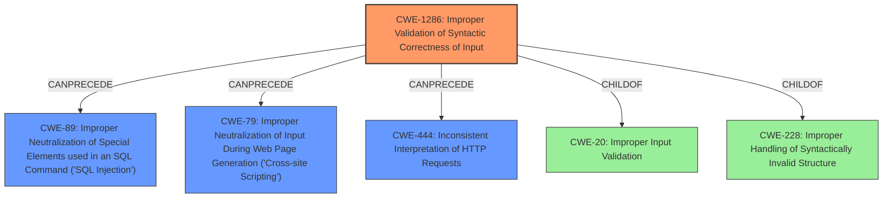

# Final Resolution for CVE-2022-38381

# Summary

| CWE ID | CWE Name | Confidence | CWE Abstraction Level | CWE Vulnerability Mapping Label | CWE-Vulnerability Mapping Notes |
| :------- | :--------------------------------------------------------------------------------------------------------- | :--------- | :-------------------- | :------------------------------ | :------------------------------ |
| CWE-1286 | Improper Validation of Syntactic Correctness of Input | 0.85 | Base | Allowed | Primary: **ROOTCAUSE** - The FortiADC fails to validate the syntactic correctness of the HTTP request, leading to subsequent bypass of security filters. |
| CWE-444 | Inconsistent Interpretation of HTTP Requests ('HTTP Request/Response Smuggling') | 0.70 | Base | Allowed | Secondary: Contributes to the bypass due to differing interpretations of malformed requests. |
| CWE-89 | Improper Neutralization of Special Elements used in an SQL Command ('SQL Injection') | 0.60 | Base | Allowed | Secondary: Impact - The malformed request bypasses SQL injection filters, potentially leading to SQL injection vulnerabilities. |
| CWE-79 | Improper Neutralization of Input During Web Page Generation ('Cross-site Scripting') | 0.60 | Base | Allowed | Secondary: Impact - The malformed request bypasses XSS filters, potentially leading to XSS vulnerabilities. |

## Evidence and Confidence

*   **Confidence Score:** 0.80
*   **Evidence Strength:** HIGH

## Relationship Analysis

The analysis focused on several key CWE relationships to arrive at the final classification:

*   **Parent-Child Hierarchical Relationships:** Initially, CWE-228 (Improper Handling of Syntactically Invalid Structure), a Class-level CWE, was considered. However, through analysis of its child CWEs, CWE-1286 (Improper Validation of Syntactic Correctness of Input), a Base-level CWE, was identified as a more specific and appropriate fit for the **ROOTCAUSE**.

*   **Chain Relationships:** The analysis identified a clear chain: CWE-1286 (failure to validate input) leads to CWE-89 (SQL Injection bypass) and CWE-79 (XSS bypass). This chain highlights how the initial **WEAKNESS** results in concrete security impacts. CWE-444 can also be part of this chain since the improper validation can lead to the inconsistent interpretation.

*   **Peer Relationships:** CWE-20 (Improper Input Validation) was considered but deemed too general. While CWE-1286 is a child of CWE-20, it provides a more precise description of the validation failure.

*   **Abstraction Levels:** The decision to prioritize Base-level CWEs (CWE-1286, CWE-444, CWE-89, CWE-79) over Class-level CWEs (CWE-228) reflects a commitment to specificity. Base-level CWEs offer more actionable information for remediation and prevention.

## Vulnerability Chain

The vulnerability chain starts with the **ROOTCAUSE**, the improper validation of syntactic correctness of input (CWE-1286). This **WEAKNESS** allows malformed HTTP requests to be processed. Due to this initial failure, the WAF is unable to correctly interpret these malformed requests (CWE-444), and thus fails to neutralize malicious elements. This leads to the bypass of SQL injection (CWE-89) and XSS (CWE-79) filters. The ultimate impact is that attackers can inject malicious SQL commands or scripts into the system, potentially leading to data breaches or other security compromises.

## Summary of Analysis

The initial analysis correctly identified several relevant CWEs, including CWE-444, CWE-89, CWE-79, and CWE-228. However, it lacked a clear articulation of the **ROOTCAUSE** and the relationships between these CWEs. The criticism highlighted the importance of selecting the most specific CWE possible and considering the abstraction level.

Based on the vulnerability description ("An **improper handling of malformed request vulnerability** [CWE-228] exists... This may allow a remote attacker without privileges to bypass some Web Application Firewall (WAF) protection such as the SQL Injection and XSS filters via a malformed HTTP request.") and the provided CWE definitions, CWE-1286 (Improper Validation of Syntactic Correctness of Input) was chosen as the primary CWE because it directly addresses the failure to validate the malformed HTTP request. This aligns with the recommendation to select Base-level CWEs for **ROOTCAUSE** analysis.

CWE-444 was retained as a secondary CWE because inconsistent interpretation of HTTP requests contributes to the bypass, especially when coupled with the lack of proper validation.

CWE-89 and CWE-79 were also retained, but classified as secondary CWEs representing the impact of the vulnerability (bypassing SQL injection and XSS filters). They are consequences of the initial validation failure.

The selection of CWE-1286 provides the optimal level of specificity because it directly addresses the **ROOTCAUSE** of the vulnerability. The other CWEs contribute to a more complete understanding of the vulnerability chain, from initial **WEAKNESS** to potential impact.