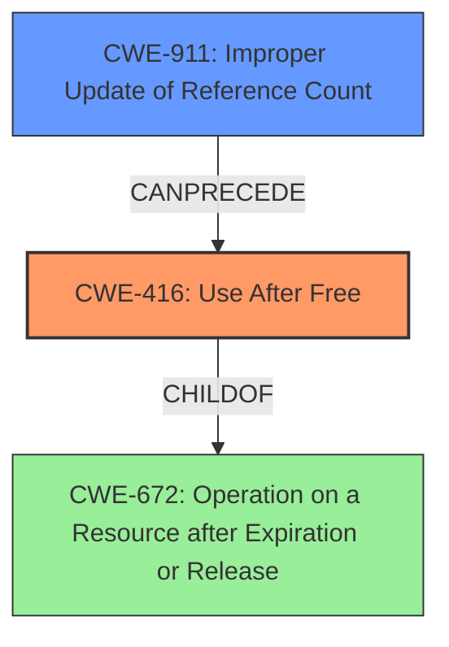

# Final Resolution for CVE-2022-3886

# Summary
| CWE ID | CWE Name | Confidence | CWE Abstraction Level | CWE Vulnerability Mapping Label | CWE-Vulnerability Mapping Notes |
|---|---|---|---|---|---|
| **CWE-416** | **Use After Free** | 1.0 | Variant | Primary | Allowed |
| **CWE-911** | **Improper Update of Reference Count** | 0.6 | Base | Secondary | Allowed |

## Evidence and Confidence

*   **Confidence Score:** 0.9
*   **Evidence Strength:** MEDIUM

## Relationship Analysis
The primary relationship influencing the decision is the potential for **CWE-911 (Improper Update of Reference Count)** to *cause* **CWE-416 (Use After Free)**. While the initial analysis focused solely on the **Use After Free** condition, the critique highlighted the importance of identifying the root cause. If the Speech Recognition component uses reference counting, an improper update could lead to premature freeing of memory, resulting in the **CWE-416 (Use After Free)**. **CWE-416** is a variant of **CWE-672 (Operation on a Resource after Expiration or Release)**.

## Vulnerability Chain
The vulnerability chain starts with a potential **ROOTCAUSE** of **CWE-911 (Improper Update of Reference Count)**, which then leads to the **WEAKNESS** of **CWE-416 (Use After Free)**. The consequence is that a remote attacker can potentially exploit heap corruption via a crafted HTML page, as stated in the vulnerability description. A missing link is the confirmation that the Speech Recognition component utilizes reference counting for memory management.

## Summary of Analysis
The initial analysis correctly identified **CWE-416 (Use After Free)** as the primary **WEAKNESS**. The criticism suggested exploring potential root causes, particularly **CWE-911 (Improper Update of Reference Count)**, if reference counting is used. The evidence provided in the vulnerability description is: "Use after free in Speech Recognition in Google Chrome prior to 107.0.5304.106 allowed a remote attacker to potentially exploit heap corruption via a crafted HTML page."

The graph relationships influenced the final selection by highlighting the potential chain of events, from **ROOTCAUSE** to **WEAKNESS**. The selection of **CWE-416 (Use After Free)** remains the most appropriate primary classification due to the explicit mention of "use after free" in the vulnerability description. However, based on the critique, **CWE-911 (Improper Update of Reference Count)** is included as a secondary classification with a slightly lower confidence score (0.6) due to the missing confirmation of reference counting usage. If there was explicit information about reference counting, the confidence score would be higher.

The selected CWEs are at the optimal level of specificity. **CWE-416 (Use After Free)** is a Variant, and **CWE-911 (Improper Update of Reference Count)** is a Base CWE, both preferred levels of abstraction.