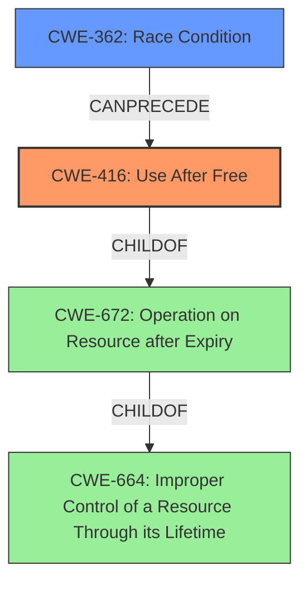

# Final Resolution for CVE-2022-3887

# Summary
| CWE ID | CWE Name | Confidence | CWE Abstraction Level | CWE Vulnerability Mapping Label | CWE-Vulnerability Mapping Notes |
|---|---|---|---|---|---|
| **CWE-416** | **Use After Free** | 1.0 | Variant | Primary | Allowed |
| CWE-362 | Race Condition Enabling Use After Free | 0.3 | Class | Secondary Candidate | Allowed-with-Review |

## Evidence and Confidence

*   **Confidence Score:** 0.9
*   **Evidence Strength:** MEDIUM

## Relationship Analysis
The primary weakness is **CWE-416 (Use After Free)**, a Variant-level CWE, which accurately reflects the vulnerability description. The analysis considered the parent classes of **CWE-416**, namely **CWE-672 (Operation on Resource after Expiry)** and **CWE-664 (Improper Control of a Resource Through its Lifetime)**, but correctly identified **CWE-416** as the most specific and appropriate classification.

The suggestion to explore preceding CWEs that could contribute to the use-after-free condition is valid. A race condition (**CWE-362**) could indeed lead to a use-after-free if a resource is freed by one thread while another thread is still accessing it. Therefore, **CWE-362** is included as a secondary candidate, with a lower confidence score due to the lack of explicit mention of a race condition in the initial vulnerability description.

## Vulnerability Chain
The vulnerability chain starts with a potential race condition (**CWE-362**) where a shared resource is accessed by multiple threads concurrently. This leads to a scenario where one thread frees the resource while another thread is still attempting to use it, resulting in a **use-after-free** vulnerability (**CWE-416**). The impact is potential heap corruption and arbitrary code execution due to accessing freed memory.

## Summary of Analysis
The initial analysis correctly identified **CWE-416 (Use After Free)** as the primary weakness based on the explicit mention of "use-after-free" in the vulnerability description and CVE reference materials. The criticism raised a valid point about exploring potential preceding CWEs.

The graph relationships influenced the decision by highlighting the potential for a race condition (**CWE-362**) to precede the **use-after-free** condition (**CWE-416**). While the initial vulnerability description does not explicitly mention a race condition, it is a plausible contributing factor, and therefore **CWE-362** is included as a secondary candidate.

The selected CWEs are at the optimal level of specificity. **CWE-416** is a Variant-level CWE that directly addresses the **use-after-free** vulnerability. **CWE-362** is a Class-level CWE that represents the potential race condition, which is a more general weakness.

Evidence: "Use after free in Web Workers in Google Chrome prior to 107.0.5304.106 allowed a remote attacker to potentially exploit heap corruption via a crafted HTML page." This directly states the vulnerability is a **use after free**, thus pointing to **CWE-416**.