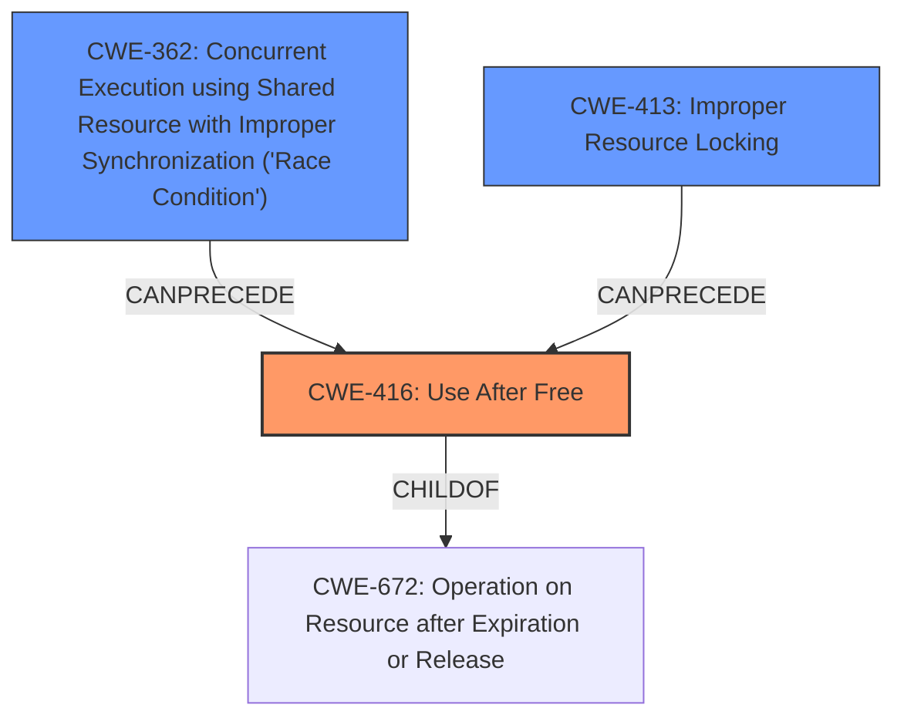

# Final Resolution for CVE-2022-3888

# Summary
| CWE ID | CWE Name | Confidence | CWE Abstraction Level | CWE Vulnerability Mapping Label | CWE-Vulnerability Mapping Notes |
|---|---|---|---|---|---|
| CWE-416 | Use After Free | 1.0 | Variant | Primary CWE | Allowed |
| CWE-362 | Concurrent Execution using Shared Resource with Improper Synchronization ('Race Condition') | 0.3 | Class | Secondary Candidate | Allowed-with-Review |
| CWE-413 | Improper Resource Locking | 0.2 | Base | Secondary Candidate | Allowed |

## Evidence and Confidence

*   **Confidence Score:** 0.9
*   **Evidence Strength:** MEDIUM

## Relationship Analysis
The primary weakness is **CWE-416 (Use After Free)**, a Variant-level CWE that directly matches the vulnerability description. While **CWE-416 (Use After Free)** does not have direct relationships, it *can* be caused by concurrency issues such as **CWE-362 (Concurrent Execution using Shared Resource with Improper Synchronization ('Race Condition'))** or improper resource locking **CWE-413 (Improper Resource Locking)**. These are considered as secondary contributing factors, though there is no direct evidence for them. The abstraction levels influenced the choice of **CWE-416 (Use After Free)** as it is a more specific Variant compared to the broader Class and Base level CWEs.

## Vulnerability Chain
The vulnerability chain starts with a memory management error. Specifically:
1.  A resource is allocated.
2.  The resource is freed.
3.  The freed resource is then accessed again.

This **use-after-free** (**CWE-416 (Use After Free)**) leads to heap corruption, as stated in the vulnerability description. The potential contributing factors might involve concurrency issues (**CWE-362 (Concurrent Execution using Shared Resource with Improper Synchronization ('Race Condition'))**) or improper resource locking (**CWE-413 (Improper Resource Locking)**), but the initial description doesn't explicitly state these.

## Summary of Analysis
The initial analysis correctly identifies **CWE-416 (Use After Free)** as the primary **WEAKNESS**. The vulnerability description explicitly states "Use after free" as the root cause, making the selection of **CWE-416 (Use After Free)** highly justified.

The criticism provided is accurate and helpful. It highlights the importance of considering potential contributing factors and consequences. While the initial description doesn't explicitly state concurrency or locking issues, it's reasonable to consider them as possible underlying causes. Therefore, I've added **CWE-362 (Concurrent Execution using Shared Resource with Improper Synchronization ('Race Condition'))** and **CWE-413 (Improper Resource Locking)** as secondary candidates with lower confidence scores.

The graph relationships influenced the decision by highlighting how concurrency and locking issues can lead to **use-after-free** conditions. The selection of **CWE-416 (Use After Free)** is at the optimal level of specificity because it directly describes the vulnerability, while the secondary CWEs represent potential contributing factors that may or may not be present in this specific case.

The final assessment is based on the provided evidence, primarily the vulnerability description stating "**Use after free**". The MITRE mapping guidance for **CWE-416 (Use After Free)** indicates that it's ALLOWED. The confidence score is slightly reduced to 0.9 to acknowledge the possibility of underlying causes that are not explicitly stated in the vulnerability description.