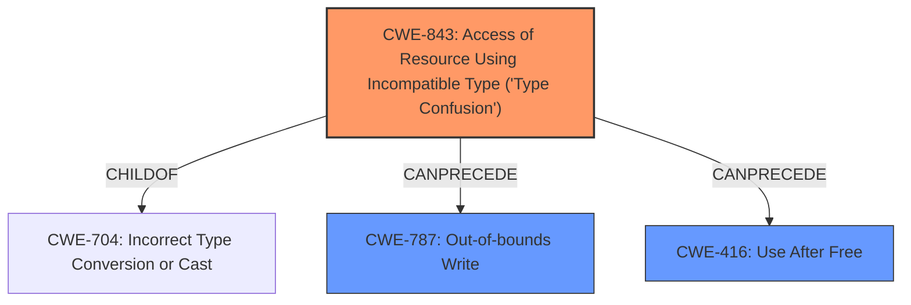

# Final Resolution for CVE-2022-3889

# Summary
| CWE ID | CWE Name | Confidence | CWE Abstraction Level | CWE Vulnerability Mapping Label | CWE-Vulnerability Mapping Notes |
|---|---|---|---|---|---|
| CWE-843 | Access of Resource Using Incompatible Type ('Type Confusion') | 0.95 | Base | Allowed | Primary CWE. Direct match with **root cause**. |
| CWE-787 | Out-of-bounds Write | 0.7 | Base | Allowed | Secondary Candidate. Plausible consequence if **type confusion** leads to writing data outside the intended bounds of a buffer. |
| CWE-416 | Use After Free | 0.6 | Variant | Allowed | Secondary Candidate. Plausible consequence if **type confusion** leads to incorrect memory management. |

## Evidence and Confidence

*   **Confidence Score:** 0.9
*   **Evidence Strength:** HIGH

## Relationship Analysis
The primary relationship influencing the decision is the parent-child relationship between CWE-704 (Class) and CWE-843 (Base). CWE-843 is a child of CWE-704 and is a more specific fit because the vulnerability description explicitly uses the term "type confusion". The chain relationship is that **type confusion** (CWE-843) can lead to memory corruption such as an out-of-bounds write (CWE-787) or a use-after-free condition (CWE-416). The abstraction levels were considered to select the most specific and relevant CWEs.

## Vulnerability Chain
The vulnerability chain starts with **type confusion** (CWE-843) in the V8 JavaScript engine. This **type confusion** can then lead to memory corruption, specifically either an out-of-bounds write (CWE-787), or incorrect memory management which results in a use-after-free condition (CWE-416). The ultimate impact is heap corruption, which allows for remote code execution.

## Summary of Analysis
The initial analysis correctly identified CWE-843 as the primary CWE due to the explicit mention of "**type confusion**" in the vulnerability description: "Type confusion in V8 in Google Chrome...". The criticism suggested considering other potential consequences of **type confusion**, such as CWE-787 (Out-of-bounds Write).

The decision to include CWE-787 as a secondary candidate alongside CWE-416 is based on the possibility that the **type confusion** could directly lead to writing data outside the intended bounds of a buffer. While CWE-416 is a plausible consequence, CWE-787 represents a more direct form of memory corruption. Both are retained as secondary candidates because the specific details of how the heap corruption occurs are not available in the provided vulnerability description.

CWE-843 is selected as the primary CWE because it directly reflects the **root cause** mentioned in the vulnerability description. It is at the Base level of abstraction, providing a good level of detail. CWE-787 and CWE-416 are included as secondary candidates because they are plausible consequences of the **type confusion**, but the evidence is not strong enough to definitively confirm their presence. These selections provide the optimal level of specificity based on the available evidence.