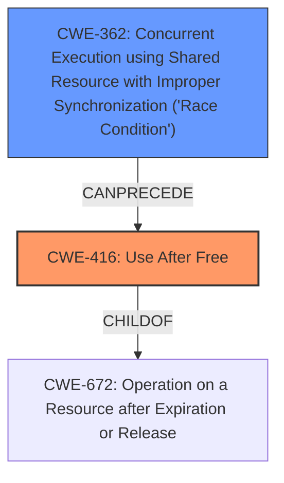

# Analysis Report for CVE-2022-39134

# Vulnerability Analysis Report: CVE-2022-39134

## Description

In audio driver, there is a use after free due to a race condition. This could lead to local denial of service in kernel.

## Vulnerability Description Key Phrases

**Rootcause:** race condition
**Weakness:** use after free
**Impact:** denial of service
**Component:** audio driver

## Analysis (with Relationship Data)

# Summary
| CWE ID | CWE Name | Confidence | CWE Abstraction Level | CWE Vulnerability Mapping Label | CWE-Vulnerability Mapping Notes |
|---|---|---|---|---|---|
| CWE-416 | Use After Free | 0.9 | Variant | Allowed | Primary CWE |
| CWE-362 | Concurrent Execution using Shared Resource with Improper Synchronization ('Race Condition') | 0.7 | Class | Allowed-with-Review | Secondary Candidate CWE |

## Evidence and Confidence

*   **Confidence Score:** 0.8
*   **Evidence Strength:** MEDIUM

- **Analysis and Justification:**  
  - *Explanation:* The vulnerability description explicitly states a "**use after free** due to a **race condition**" in the audio driver. CWE-416 (Use After Free) directly addresses the scenario where memory is reused or referenced after it has been freed. The description also mentions a "**race condition**", indicating concurrent access issues, which are broader and can lead to use-after-free. Therefore, CWE-416 is the primary and most specific weakness. CWE-362 (Concurrent Execution using Shared Resource with Improper Synchronization ('Race Condition')) is selected as a secondary CWE, because it describes a **race condition**, which is the root cause of the **use-after-free**. The CVE Reference Links Content Summary is unavailable. The MITRE mapping guidance for CWE-416 states that it is ALLOWED at the Variant level of abstraction. The MITRE mapping guidance for CWE-362 states that it is ALLOWED-WITH-REVIEW because it's a Class and might have more appropriate Base-level children. In this case, no children of CWE-362 are a better fit.

  - *Relationship Analysis:* CWE-416 is a Variant, a child of CWE-672 (Operation on Resource after Expiry). CWE-362 is a Class, a parent of CWE-364 (Signal Handler Race Condition), CWE-366 (Race Condition within a Thread), and CWE-367 (Time-of-check Time-of-use (TOCTOU) Race Condition). The relationship analysis reveals CWE-362 is the broader class of concurrency issues leading to the more specific CWE-416.

- **Confidence Score:**
  - Confidence: 0.8 (Moderate evidence from the vulnerability description, further details would increase the confidence)

## Criticism of Analysis

Okay, here's a detailed review of the provided CWE analysis, considering the full CWE specifications and mapping guidance.

**Overall Assessment:**

The analysis is generally sound. The primary CWE mapping to CWE-416 (Use After Free) is accurate and well-justified, given the vulnerability description. The secondary CWE mapping to CWE-362 (Concurrent Execution using Shared Resource with Improper Synchronization ('Race Condition')) is also reasonable for capturing the root cause.  The confidence level of 0.8 is appropriate given the limited information.

**Detailed Review:**

*   **CWE-416: Use After Free (Primary)**
    *   **Correctness:** The selection of CWE-416 is spot on. The vulnerability description directly states "use after free."
    *   **Abstraction Level:** The analysis correctly notes that CWE-416 is a Variant, which is the preferred level of abstraction for mapping root causes.
    *   **Mapping Guidance:** The analysis follows the mapping guidance, which says "Carefully read both the name and description to ensure that this mapping is an appropriate fit." The analysis does this explicitly.
    *   **Confidence:** A confidence of 0.9 would be more appropriate than 0.8, given that 'use after free' is literally part of the description.
    *   **Relationships**:  The relationship analysis should also mention the `CanFollow` to CWE-362, since the description includes "race condition".
    *   **Examples:** The provided examples are helpful in showing common scenarios that lead to CWE-416. The CVE examples provided in the analysis and the complete CWE specification are relevant and support the classification.
    *   **Mitigations:** The potential mitigations listed in the CWE specification, such as language selection (using a language with automatic memory management) and setting pointers to NULL after freeing, are relevant and applicable.

*   **CWE-362: Concurrent Execution using Shared Resource with Improper Synchronization ('Race Condition') (Secondary)**
    *   **Correctness:**  Selecting CWE-362 as a secondary CWE is also correct because it represents the root cause as described. The description includes the phrase "race condition" which is also the common term for CWE-362.
    *   **Abstraction Level:** The analysis acknowledges that CWE-362 is a Class and that more specific Base-level children might be more appropriate. It correctly states that no children of CWE-362 are a better fit. While a child CWE might conceptually fit better, the information provided in the description is not specific enough to determine which one.
    *   **Mapping Guidance:** The analysis follows the "Allowed-with-Review" mapping guidance by considering more specific children of CWE-362, but determining that none fit better.
    *   **Confidence:** The 0.7 confidence is good, reflecting that it's a slightly less direct mapping than CWE-416.
    *   **Relationships:** The analysis includes the parent-child relationships, which is helpful for understanding the context of the CWE.
    *   **Examples:** The CVE examples for CWE-362 support this classification and show how race conditions can manifest in real-world vulnerabilities.
    *   **Mitigations:** The mitigations suggested in the CWE specification, such as using synchronization primitives, are appropriate for addressing the root cause.

*   **Alternative CWE Considerations (From Top Combined Results):**
    *   **CWE-364 (Signal Handler Race Condition):** While race conditions can occur in signal handlers, there's no specific mention of signal handlers in the vulnerability description. Therefore, it's less appropriate than CWE-362.
    *   **CWE-366 (Race Condition within a Thread):**  Again, a reasonable candidate, but the description doesn't limit the race condition to within a single thread, making CWE-362 a better fit.
    *   **CWE-367 (Time-of-check Time-of-use (TOCTOU) Race Condition):**  TOCTOU is a specific type of race condition, but the provided information doesn't indicate a TOCTOU vulnerability. There's no explicit mention of a check followed by a use.
    *   **CWE-415 (Double Free):** While a consequence of memory corruption, a double-free is not directly indicated from the vulnerability description. Therefore, CWE-416 is a more appropriate weakness.
    *  **CWE-911 (Improper Update of Reference Count)** The description does not indicate the use of reference counting for memory management.
    *  **CWE-908 (Use of Uninitialized Resource)** The description does not indicate that an uninitialized resource is being used.
    *   **CWE-368 (Context Switching Race Condition):** This is less relevant since there's no evidence of context switching being a factor.
    *   **CWE-667 (Improper Locking):** While improper locking *could* lead to a race condition, the provided details do not suggest that the race condition is caused by bad locking, so the more general `CWE-362` is preferred.

**Suggestions for Improvement:**

*   **Increase Confidence Score:** Given the explicit mention of "use after free," consider increasing the confidence score for CWE-416 to 0.9.
*   **Expand Relationship Analysis:** When discussing CWE-416, mention the `CanFollow` to CWE-362 as a direct relationship to the race condition.
*   **Document the thought process further:** Briefly explain why other CWEs from the retriever results were considered and ruled out. This will give the analysis more context and demonstrate a thorough approach.

**In summary, the analysis is well-reasoned and accurate. The suggestions above are minor refinements that could further strengthen the analysis.**

## Final Resolution

# Summary
| CWE ID | CWE Name | Confidence | CWE Abstraction Level | CWE Vulnerability Mapping Label | CWE-Vulnerability Mapping Notes |
|---|---|---|---|---|---|
| CWE-416 | Use After Free | 0.9 | Variant | Allowed | Primary CWE |
| CWE-362 | Concurrent Execution using Shared Resource with Improper Synchronization ('Race Condition') | 0.7 | Class | Allowed-with-Review | Secondary Candidate CWE |

## Evidence and Confidence

*   **Confidence Score:** 0.85
*   **Evidence Strength:** MEDIUM

## Relationship Analysis
The primary weakness is **CWE-416 (Use After Free)**, a Variant of **CWE-672 (Operation on a Resource after Expiration or Release)**. This means it's a specific type of resource operation error. The secondary weakness, **CWE-362 (Concurrent Execution using Shared Resource with Improper Synchronization ('Race Condition'))**, is a Class that describes the general problem of concurrent access leading to issues. **CWE-362** can `CanPrecede` **CWE-416**, as the race condition can cause the use-after-free. Alternative classifications like **CWE-364 (Signal Handler Race Condition)**, **CWE-366 (Race Condition within a Thread)**, and **CWE-367 (Time-of-check Time-of-use (TOCTOU) Race Condition)** were considered but deemed less appropriate because the description does not provide enough information to specify the type of race condition. Abstraction levels influenced the choice to use **CWE-416** at the Variant level and **CWE-362** at the Class level due to the specificity of the vulnerability description.

## Vulnerability Chain
The vulnerability chain starts with a **ROOTCAUSE** in concurrent code execution, specifically **CWE-362 (Concurrent Execution using Shared Resource with Improper Synchronization ('Race Condition'))**. This leads to a situation where memory is freed while another thread still holds a pointer to it. Subsequently, that thread attempts to use the freed memory, resulting in **CWE-416 (Use After Free)**. The final impact is a local denial of service in the kernel.

## Summary of Analysis
The initial analysis correctly identified **CWE-416 (Use After Free)** as the primary weakness and **CWE-362 (Concurrent Execution using Shared Resource with Improper Synchronization ('Race Condition'))** as a contributing factor. The vulnerability description explicitly mentions "use after free due to a race condition," providing direct evidence for both weaknesses. The graph relationships confirm that **CWE-362** can lead to **CWE-416**. The decision to use **CWE-416** at the Variant level reflects its specific nature, while **CWE-362** remains at the Class level due to the lack of specific details about the race condition. The assessment is primarily based on the provided evidence, and the confidence score reflects the strength of that evidence. The criticism correctly suggests increasing the confidence score for **CWE-416** to 0.9, considering the explicit mention of "use after free." The final selection of CWEs is at the optimal level of specificity, balancing the need for accuracy with the available information.

*Report generated on 2025-03-18 16:29:38*
