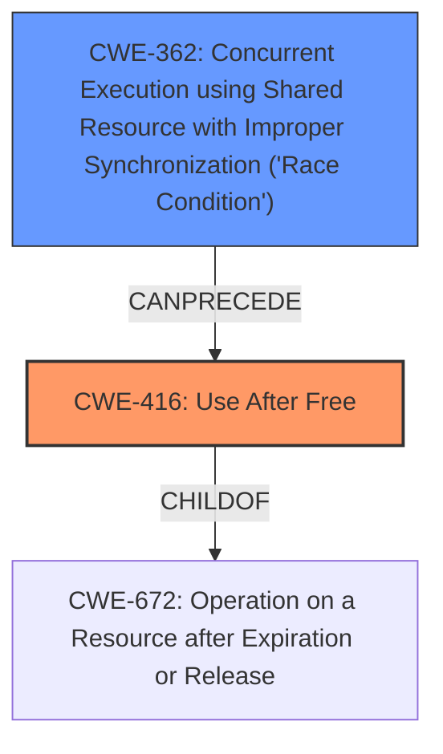

# Final Resolution for CVE-2022-39134

# Summary
| CWE ID | CWE Name | Confidence | CWE Abstraction Level | CWE Vulnerability Mapping Label | CWE-Vulnerability Mapping Notes |
|---|---|---|---|---|---|
| CWE-416 | Use After Free | 0.9 | Variant | Allowed | Primary CWE |
| CWE-362 | Concurrent Execution using Shared Resource with Improper Synchronization ('Race Condition') | 0.7 | Class | Allowed-with-Review | Secondary Candidate CWE |

## Evidence and Confidence

*   **Confidence Score:** 0.85
*   **Evidence Strength:** MEDIUM

## Relationship Analysis
The primary weakness is **CWE-416 (Use After Free)**, a Variant of **CWE-672 (Operation on a Resource after Expiration or Release)**. This means it's a specific type of resource operation error. The secondary weakness, **CWE-362 (Concurrent Execution using Shared Resource with Improper Synchronization ('Race Condition'))**, is a Class that describes the general problem of concurrent access leading to issues. **CWE-362** can `CanPrecede` **CWE-416**, as the race condition can cause the use-after-free. Alternative classifications like **CWE-364 (Signal Handler Race Condition)**, **CWE-366 (Race Condition within a Thread)**, and **CWE-367 (Time-of-check Time-of-use (TOCTOU) Race Condition)** were considered but deemed less appropriate because the description does not provide enough information to specify the type of race condition. Abstraction levels influenced the choice to use **CWE-416** at the Variant level and **CWE-362** at the Class level due to the specificity of the vulnerability description.

## Vulnerability Chain
The vulnerability chain starts with a **ROOTCAUSE** in concurrent code execution, specifically **CWE-362 (Concurrent Execution using Shared Resource with Improper Synchronization ('Race Condition'))**. This leads to a situation where memory is freed while another thread still holds a pointer to it. Subsequently, that thread attempts to use the freed memory, resulting in **CWE-416 (Use After Free)**. The final impact is a local denial of service in the kernel.

## Summary of Analysis
The initial analysis correctly identified **CWE-416 (Use After Free)** as the primary weakness and **CWE-362 (Concurrent Execution using Shared Resource with Improper Synchronization ('Race Condition'))** as a contributing factor. The vulnerability description explicitly mentions "use after free due to a race condition," providing direct evidence for both weaknesses. The graph relationships confirm that **CWE-362** can lead to **CWE-416**. The decision to use **CWE-416** at the Variant level reflects its specific nature, while **CWE-362** remains at the Class level due to the lack of specific details about the race condition. The assessment is primarily based on the provided evidence, and the confidence score reflects the strength of that evidence. The criticism correctly suggests increasing the confidence score for **CWE-416** to 0.9, considering the explicit mention of "use after free." The final selection of CWEs is at the optimal level of specificity, balancing the need for accuracy with the available information.