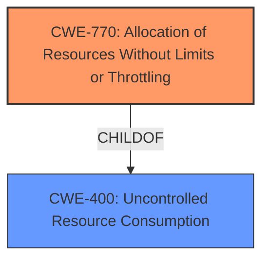

# Final Resolution for CVE-2022-39190

# Summary
| CWE ID | CWE Name | Confidence | CWE Abstraction Level | CWE Vulnerability Mapping Label | CWE-Vulnerability Mapping Notes |
|---|---|---|---|---|---|
| **CWE-770** | Allocation of Resources Without Limits or Throttling | 0.85 | Base | Allowed | Primary CWE |
| **CWE-400** | Uncontrolled Resource Consumption | 0.6 | Class | Discouraged | Secondary Candidate |

## Evidence and Confidence

*   **Confidence Score:** 0.8
*   **Evidence Strength:** MEDIUM

## Relationship Analysis
The primary CWE, **CWE-770 (Allocation of Resources Without Limits or Throttling)**, is a base-level CWE that is a child of **CWE-400 (Uncontrolled Resource Consumption)**. The decision to select **CWE-770** over **CWE-400** was influenced by the vulnerability description, which specifically mentions an issue related to binding to an already bound chain. This suggests an allocation problem more specifically than general resource consumption.

## Vulnerability Chain
The vulnerability chain starts with the **root cause**, which is the **lack of limits on resource allocation** when binding to a chain. This leads to **CWE-770 (Allocation of Resources Without Limits or Throttling)**, allowing an attacker to repeatedly bind to already bound chains. The consequence is a denial-of-service because resources are exhausted.

## Summary of Analysis
The initial analysis correctly identified **CWE-770 (Allocation of Resources Without Limits or Throttling)** as a potential root cause. The criticism raised valid points about considering alternative CWEs and providing a more detailed justification.

The vulnerability description, *"A denial of service can occur upon binding to an already bound chain,"* strongly suggests a resource allocation issue. While other CWEs like **CWE-400 (Uncontrolled Resource Consumption)** could be considered, **CWE-770** is more specific as it relates directly to the allocation of resources without proper limits.

The following points provide a clear justification for the decision:

*   **Content Matching:** The description aligns with the concept of uncontrolled allocation when binding to already bound chains.
*   **Relationship Analysis:** **CWE-770** is a child of **CWE-400**, indicating a more specific type of resource consumption.
*   **Mapping Guidance:** MITRE mapping guidance allows for **CWE-770** at the Base level.
*   **Mitigation Analysis:** Mitigations for **CWE-770** include specifying limits on capabilities and designing throttling mechanisms, which directly address the described vulnerability.

Addressing the criticism, **CWE-400** was considered, but **CWE-770** is preferable because the problem is specifically related to allocation, not general resource consumption. While **CWE-410 (Insufficient Resource Pool)** could be a contributing factor, the primary issue is the lack of allocation control. **CWE-362 (Race Condition)** and **CWE-665 (Improper Initialization)** are less likely given the provided information, as the core problem is the uncontrolled allocation of the "bound chain" resource.

Therefore, **CWE-770 (Allocation of Resources Without Limits or Throttling)** is the most appropriate primary CWE, reflecting the optimal level of specificity based on the available evidence.