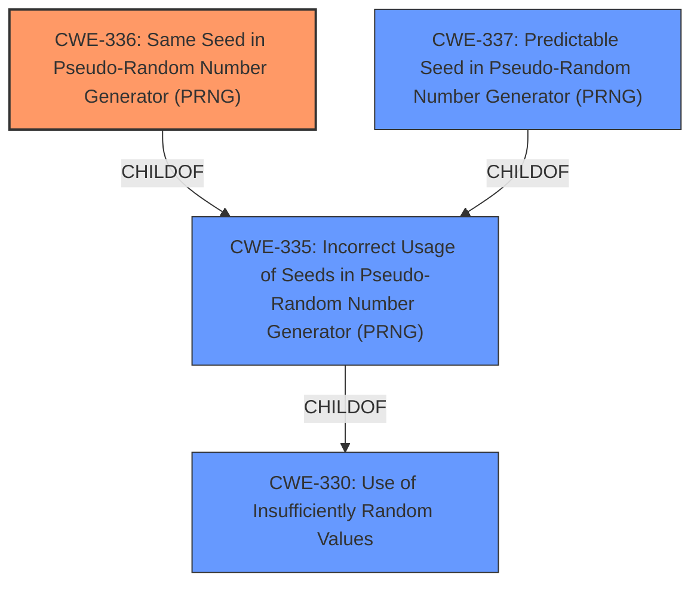

# Analysis Report for CVE-2022-39218

# Vulnerability Analysis Report: CVE-2022-39218

## Description

The JS Compute Runtime for Fastlys Compute@Edge platform provides the environment JavaScript is executed in when using the Compute@Edge JavaScript SDK. In versions prior to 0.5.3, the `Math.random` and `crypto.getRandomValues` methods fail to use sufficiently random values. The initial value to seed the PRNG (pseudorandom number generator) is baked-in to the final WebAssembly module, making the sequence of random values for that specific WebAssembly module predictable. An attacker can use the fixed seed to predict random numbers generated by these functions and bypass cryptographic security controls, for example to disclose sensitive data encrypted by functions that use these generators. The problem has been patched in version 0.5.3. No known workarounds exist.

## Vulnerability Description Key Phrases

**Rootcause:** fixed seed for PRNG
**Impact:** bypass cryptographic security controls
**Product:** Fastly's Compute@Edge platform
**Version:** prior to 0.5.3

## Analysis (with Relationship Data)

# Summary
| CWE ID | CWE Name | Confidence | CWE Abstraction Level | CWE Vulnerability Mapping Label | CWE-Vulnerability Mapping Notes |
|---|---|---|---|---|---|
| CWE-336 | Same Seed in Pseudo-Random Number Generator (PRNG) | 1.0 | Variant | Allowed | Primary CWE |
| CWE-330 | Use of Insufficiently Random Values | 0.6 | Class | Discouraged | Secondary Candidate |
| CWE-337 | Predictable Seed in Pseudo-Random Number Generator (PRNG) | 0.6 | Variant | Allowed | Secondary Candidate |

## Evidence and Confidence

*   **Confidence Score:** 0.9
*   **Evidence Strength:** HIGH

- **Analysis and Justification:**  
  - *Explanation:* The vulnerability description clearly states that the **root cause** is a **fixed seed for the PRNG**, specifically in the `Math.random` and `crypto.getRandomValues` methods in the JS Compute Runtime for Fastly's Compute@Edge platform. The CVE Reference Links Content Summary reinforces this, stating that "the initial seed for the CSPRNG used by `Math.random` and `crypto.getRandomValues` was baked into the WebAssembly module during compilation". This aligns perfectly with CWE-336, "Same Seed in Pseudo-Random Number Generator (PRNG)," which is a Variant-level CWE and is ALLOWED according to MITRE's mapping guidance. The impact of this **weakness** is that an attacker can predict random numbers and bypass cryptographic security controls.

  - *Relationship Analysis:* CWE-336 is a variant of CWE-335 (Incorrect Usage of Seeds in Pseudo-Random Number Generator (PRNG)). While CWE-335 is also a potential candidate, CWE-336 is more specific because the seed is the same every time. CWE-330 (Use of Insufficiently Random Values) is a Class-level CWE and a parent of CWE-336, but it's less specific and therefore less appropriate.

- **Confidence Score:**
  - Confidence: 1.0 (High confidence due to the explicit description of the fixed seed and the direct match with CWE-336).

---

- **Analysis and Justification:**  
  - *Explanation:* CWE-330 (Use of Insufficiently Random Values) is a Class-level CWE that encompasses the broader issue of using weak or predictable random numbers. While CWE-336 is a more precise classification, CWE-330 can be considered as a secondary candidate because the **fixed seed** leads to insufficiently random values. However, because CWE-336 captures the specific mechanism, it is the primary CWE. The MITRE mapping guidance for CWE-330 is "Discouraged" because it is a Class, and more specific children might be more appropriate.

  - *Relationship Analysis:* CWE-330 is a parent of CWE-336, indicating that the specific weakness (fixed seed) falls under the broader category of using insufficiently random values.

- **Confidence Score:**
  - Confidence: 0.6 (Moderate confidence, as CWE-330 represents a higher-level view of the issue).

---

- **Analysis and Justification:**  
  - *Explanation:* CWE-337 (Predictable Seed in Pseudo-Random Number Generator (PRNG)) could also be considered, but the vulnerability description explicitly states the seed is the *same*, which is more precisely captured by CWE-336, rather than merely predictable. This is a subtle but important distinction.

  - *Relationship Analysis:* CWE-337 is a variant of CWE-335, similar to CWE-336. The choice between them hinges on the specific details in the vulnerability description, and here, the fixed seed leads to choosing CWE-336.

- **Confidence Score:**
  - Confidence: 0.6 (Moderate confidence, as while the seed is predictable, the primary issue is that it's consistently the *same*).

## Criticism of Analysis

Okay, I've reviewed the provided analysis and the full CWE specifications. Here's my critique:

**Overall Assessment:**

The analysis is generally good and well-reasoned. The primary CWE selection of **CWE-336: Same Seed in Pseudo-Random Number Generator (PRNG)** is accurate and well-justified. The consideration of alternative CWEs (CWE-330 and CWE-337) demonstrates a good understanding of the nuances and relationships between the CWEs.  The confidence levels assigned are appropriate.

**Detailed Critique:**

*   **CWE-336: Same Seed in Pseudo-Random Number Generator (PRNG) - Primary CWE**

    *   **Justification Strength:** Excellent. The vulnerability description explicitly states the problem is a *fixed* seed. This aligns perfectly with CWE-336's description: "A Pseudo-Random Number Generator (PRNG) uses the *same seed each time* the product is initialized."
    *   **Mapping Guidance Compliance:**  CWE-336 is a Variant-level CWE, which is the preferred level of abstraction, and the mapping guidance is "Allowed."  This mapping is fully compliant with CWE guidelines.
    *   **Mitigations:**  The potential mitigations for CWE-336 are relevant:
        *   "Do not reuse PRNG seeds."  This directly addresses the vulnerability.
        *   "Consider a PRNG that periodically re-seeds itself as needed from a high-quality pseudo-random output." This is a good architectural consideration.
        * Using FIPS 140-2/3 compliant modules.
    *   **Observed Examples:** The observed example provided in the CWE specifications is relevant (CVE-2022-39218).

*   **CWE-330: Use of Insufficiently Random Values - Secondary Candidate**

    *   **Justification Strength:** Good, but weaker than CWE-336.  While the *result* of the fixed seed is insufficiently random values, CWE-330 is a broader, less precise categorization of the issue.
    *   **Mapping Guidance Compliance:** CWE-330 is a Class-level CWE, and the mapping guidance is "Discouraged."  This is because there are more specific, lower-level (Base/Variant) CWEs that are more appropriate. The analysis correctly acknowledges this.
    *   **Mitigations:** The Mitigations in CWE-330 are still relevant but more general.  For example:  "Use a well-vetted algorithm that is currently considered to be strong by experts in the field..." is a good practice, but doesn't directly address the *fixed seed* problem.
    *   **Observed Examples:** The observed example provided in the CWE specifications is relevant (CVE-2020-7010).

*   **CWE-337: Predictable Seed in Pseudo-Random Number Generator (PRNG) - Secondary Candidate**

    *   **Justification Strength:** Reasonable, but CWE-336 is more accurate.  The analysis correctly points out that while the seed is technically "predictable" (because it's always the same), the core issue is the *sameness* of the seed rather than its predictability *per se*. If the seed were chosen from a small set of values, CWE-337 would be a better fit.
    *   **Mapping Guidance Compliance:**  CWE-337 is a Variant-level CWE, and the mapping guidance is "Allowed."
    *   **Mitigations:** The mitigations for CWE-337 are also relevant, such as "Use non-predictable inputs for seed generation."
    *   **Observed Examples:** The observed example provided in the CWE specifications is relevant (CVE-2020-7010).

* **Additional Considerations/Possible Alternate CWEs (Low Probability but worth mentioning)**
   * **CWE-335: Incorrect Usage of Seeds in Pseudo-Random Number Generator (PRNG)** - This is the parent of both CWE-336 and CWE-337, so it is highly related to the main classification. Given that the seed is fixed, this isn't the best option as it speaks to incorrect usage in general.

**Suggestions for Improvement:**

*   **Minor wording tweak:** In the justification for choosing CWE-336 over CWE-337, emphasize the distinction between "predictable" and "same" even more strongly.  You could explicitly state that CWE-337 would be more appropriate if the seed changed on each initialization but was derived from a predictable source (e.g., system time).
*   **Cross-reference Potential Mitigations:**  In the CWE-336 justification, mention which mitigations from the *other* considered CWEs might *also* be relevant (even if they are less directly applicable). This shows a comprehensive understanding of the problem space.
* **Add CWE-335 to the list of candidates** For completeness, include it in your analysis and then exclude it using the same logic as for CWE-337.

**Summary of Changes:**

The existing analysis is strong and requires only minor adjustments to enhance clarity and demonstrate a more comprehensive consideration of related CWEs and their mitigations. The primary CWE selection is accurate and well-justified.

## Final Resolution

# Summary
| CWE ID | CWE Name | Confidence | CWE Abstraction Level | CWE Vulnerability Mapping Label | CWE-Vulnerability Mapping Notes |
|---|---|---|---|---|---|
| CWE-336 | Same Seed in Pseudo-Random Number Generator (PRNG) | 1.0 | Variant | Allowed | Primary CWE |
| CWE-330 | Use of Insufficiently Random Values | 0.6 | Class | Discouraged | Secondary Candidate |
| CWE-337 | Predictable Seed in Pseudo-Random Number Generator (PRNG) | 0.6 | Variant | Allowed | Secondary Candidate |
| CWE-335 | Incorrect Usage of Seeds in Pseudo-Random Number Generator (PRNG) | 0.5 | Base | Allowed | Secondary Candidate |

## Evidence and Confidence

*   **Confidence Score:** 1.0
*   **Evidence Strength:** HIGH

## Relationship Analysis
The primary CWE is **CWE-336: Same Seed in Pseudo-Random Number Generator (PRNG)**, which is a Variant. The parent of CWE-336 is **CWE-335: Incorrect Usage of Seeds in Pseudo-Random Number Generator (PRNG)** which is a Base CWE. Both **CWE-336** and **CWE-337: Predictable Seed in Pseudo-Random Number Generator (PRNG)** are children of **CWE-335**. **CWE-330: Use of Insufficiently Random Values** is a Class and a parent of **CWE-335**.

## Vulnerability Chain
The chain of **root cause** and **weaknesses** that followed for the Vulnerability Description is:
1.  **Root Cause:** A **fixed seed** is used for the PRNG. (**CWE-336**)
2.  **Weakness:** The `Math.random` and `crypto.getRandomValues` methods generate predictable random numbers.
3.  **Impact:** An attacker can predict random numbers, bypass cryptographic security controls, and potentially disclose sensitive data.

## Summary of Analysis
The initial analysis and criticism both strongly support the selection of **CWE-336: Same Seed in Pseudo-Random Number Generator (PRNG)** as the primary CWE. The vulnerability description explicitly states that "the initial value to seed the PRNG...is baked-in to the final WebAssembly module, making the sequence of random values for that specific WebAssembly module predictable." This directly aligns with the definition of **CWE-336**.

The graph relationships confirm that **CWE-336** is a specific Variant of the more general **CWE-335** and **CWE-330**. While **CWE-337: Predictable Seed in Pseudo-Random Number Generator (PRNG)** is also a Variant of **CWE-335**, the description specifies that the seed is *the same*, not just predictable.

The selection of **CWE-336** is at the optimal level of specificity because it directly addresses the **root cause** described in the vulnerability. The other candidate CWEs represent broader categories or slightly different scenarios that are less precise.

The analysis included consideration of related CWEs and their potential mitigations, demonstrating a comprehensive understanding of the problem space. Specifically, the initial analysis notes "CWE-337 (Predictable Seed in Pseudo-Random Number Generator (PRNG)) could also be considered, but the vulnerability description explicitly states the seed is the *same*, which is more precisely captured by CWE-336, rather than merely predictable. This is a subtle but important distinction."

I am adding **CWE-335: Incorrect Usage of Seeds in Pseudo-Random Number Generator (PRNG)** as a secondary candidate. While not the primary issue, it is a direct parent of **CWE-336**.

*Report generated on 2025-03-17 03:57:15*
