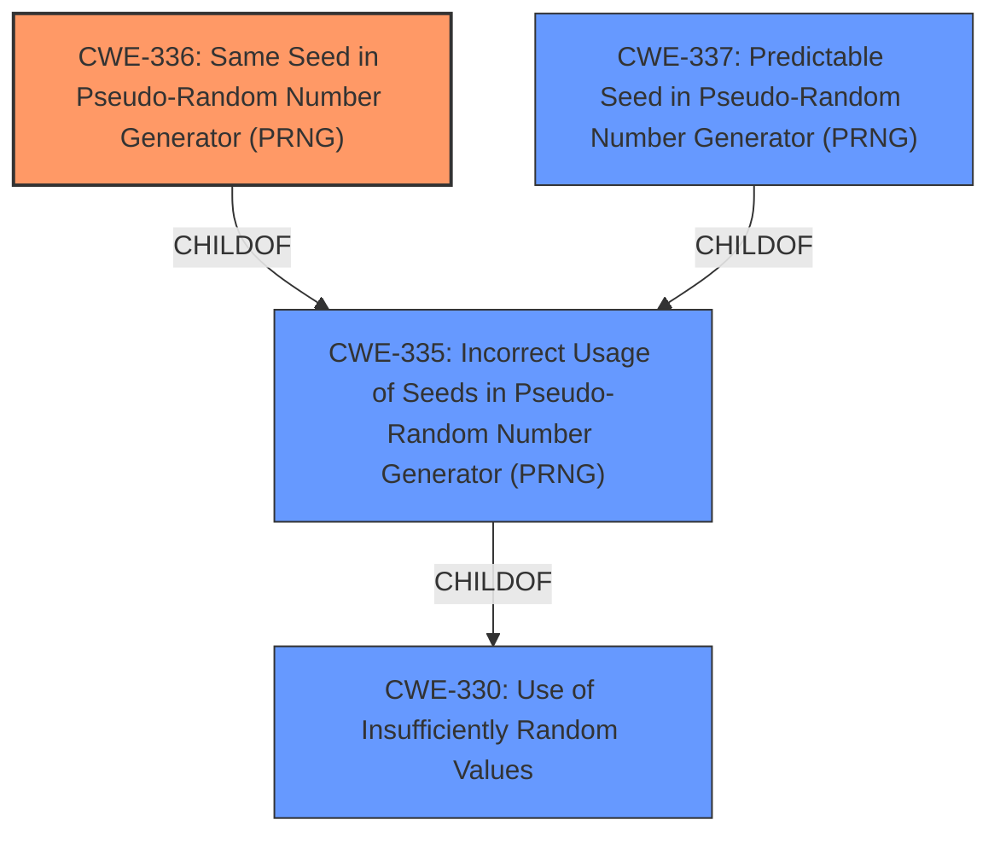

# Final Resolution for CVE-2022-39218

# Summary
| CWE ID | CWE Name | Confidence | CWE Abstraction Level | CWE Vulnerability Mapping Label | CWE-Vulnerability Mapping Notes |
|---|---|---|---|---|---|
| CWE-336 | Same Seed in Pseudo-Random Number Generator (PRNG) | 1.0 | Variant | Allowed | Primary CWE |
| CWE-330 | Use of Insufficiently Random Values | 0.6 | Class | Discouraged | Secondary Candidate |
| CWE-337 | Predictable Seed in Pseudo-Random Number Generator (PRNG) | 0.6 | Variant | Allowed | Secondary Candidate |
| CWE-335 | Incorrect Usage of Seeds in Pseudo-Random Number Generator (PRNG) | 0.5 | Base | Allowed | Secondary Candidate |

## Evidence and Confidence

*   **Confidence Score:** 1.0
*   **Evidence Strength:** HIGH

## Relationship Analysis
The primary CWE is **CWE-336: Same Seed in Pseudo-Random Number Generator (PRNG)**, which is a Variant. The parent of CWE-336 is **CWE-335: Incorrect Usage of Seeds in Pseudo-Random Number Generator (PRNG)** which is a Base CWE. Both **CWE-336** and **CWE-337: Predictable Seed in Pseudo-Random Number Generator (PRNG)** are children of **CWE-335**. **CWE-330: Use of Insufficiently Random Values** is a Class and a parent of **CWE-335**.

## Vulnerability Chain
The chain of **root cause** and **weaknesses** that followed for the Vulnerability Description is:
1.  **Root Cause:** A **fixed seed** is used for the PRNG. (**CWE-336**)
2.  **Weakness:** The `Math.random` and `crypto.getRandomValues` methods generate predictable random numbers.
3.  **Impact:** An attacker can predict random numbers, bypass cryptographic security controls, and potentially disclose sensitive data.

## Summary of Analysis
The initial analysis and criticism both strongly support the selection of **CWE-336: Same Seed in Pseudo-Random Number Generator (PRNG)** as the primary CWE. The vulnerability description explicitly states that "the initial value to seed the PRNG...is baked-in to the final WebAssembly module, making the sequence of random values for that specific WebAssembly module predictable." This directly aligns with the definition of **CWE-336**.

The graph relationships confirm that **CWE-336** is a specific Variant of the more general **CWE-335** and **CWE-330**. While **CWE-337: Predictable Seed in Pseudo-Random Number Generator (PRNG)** is also a Variant of **CWE-335**, the description specifies that the seed is *the same*, not just predictable.

The selection of **CWE-336** is at the optimal level of specificity because it directly addresses the **root cause** described in the vulnerability. The other candidate CWEs represent broader categories or slightly different scenarios that are less precise.

The analysis included consideration of related CWEs and their potential mitigations, demonstrating a comprehensive understanding of the problem space. Specifically, the initial analysis notes "CWE-337 (Predictable Seed in Pseudo-Random Number Generator (PRNG)) could also be considered, but the vulnerability description explicitly states the seed is the *same*, which is more precisely captured by CWE-336, rather than merely predictable. This is a subtle but important distinction."

I am adding **CWE-335: Incorrect Usage of Seeds in Pseudo-Random Number Generator (PRNG)** as a secondary candidate. While not the primary issue, it is a direct parent of **CWE-336**.