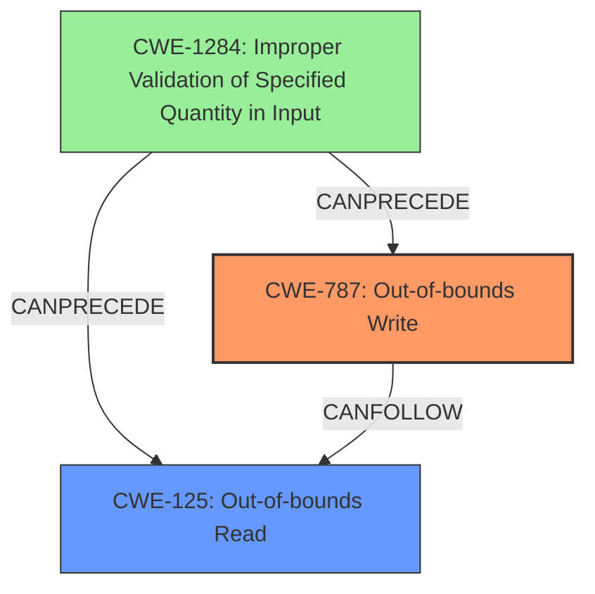

# Final Resolution for CVE-2022-39274

# Summary
| CWE ID | CWE Name | Confidence | CWE Abstraction Level | CWE Vulnerability Mapping Label | CWE-Vulnerability Mapping Notes |
|---|---|---|---|---|---|
| CWE-787 | Out-of-bounds Write | 0.95 | Base | Allowed | The vulnerability involves writing data past the end of the intended buffer, which directly matches CWE-787. This is the primary impact. |
| CWE-125 | Out-of-bounds Read | 0.95 | Base | Allowed | The vulnerability involves reading data past the end of the intended buffer, which directly matches CWE-125. This is a secondary impact. |
| CWE-1284 | Improper Validation of Specified Quantity in Input | 0.85 | Base | Allowed | The vulnerability stems from **improper size validation** of incoming radio frames, which leads to CWE-125 and CWE-787. This is the **root cause**. |

## Evidence and Confidence

*   **Confidence Score:** 0.95
*   **Evidence Strength:** HIGH

## Relationship Analysis
The analysis focuses on a clear vulnerability chain: **improper input validation** leading to **out-of-bounds access**. CWE-1284 is the **root cause**, while CWE-787 and CWE-125 are the direct consequences. The parent-child relationships are not directly relevant here, as all selected CWEs are at the Base level. The peer relationships of other CWEs in the retriever results (e.g., CWE-190, CWE-193) are considered, but deemed less relevant due to the explicit mention of **out-of-bounds read/write** and **improper size validation**.

## Vulnerability Chain
The vulnerability chain starts with the **improper validation** of the size of incoming radio frames (CWE-1284). This allows an attacker to send a frame with an invalid size, leading to an **out-of-bounds write** (CWE-787) when the data is copied using `memcpy`. An empty payload also leads to an **out-of-bounds read** (CWE-125). The **out-of-bounds write** can corrupt a large part of the data section, leading to a denial of service or potentially allowing the attacker to gain control over the execution.

The sequence is:
1.  CWE-1284: The product does not validate the size of the incoming radio frame.
2.  CWE-787: Due to the **improper validation**, a crafted frame with size -1 results in a 65280-byte **out-of-bounds memcopy**.
3.  CWE-125: An empty payload leads to a 1-byte **out-of-bounds read**.

## Summary of Analysis
The initial analysis correctly identifies CWE-125, CWE-787, and CWE-1284 as the relevant CWEs. The criticism provides valuable suggestions for improvement, particularly regarding mitigation tie-ins and explicit chaining considerations.

The assessment is primarily based on the provided evidence from the vulnerability description: "Improper size validation of the incoming radio frames can lead to an 65280-byte out-of-bounds write" and "An empty payload leads to a 1-byte out-of-bounds read of user controlled content". This directly supports the selection of CWE-1284, CWE-787 and CWE-125.

The graph relationships further solidify the classification. CWE-1284 **CanPrecede** CWE-787 and CWE-125, indicating that the **improper validation** is a prerequisite for the **out-of-bounds** access.

The selected CWEs are at the optimal level of specificity. CWE-125 and CWE-787 directly describe the **out-of-bounds** read and write operations, while CWE-1284 captures the **root cause** of the vulnerability. Higher-level CWEs like CWE-119 (Improper Restriction of Operations within the Bounds of a Memory Buffer) would be too generic and would not provide sufficient information about the specific nature of the vulnerability.