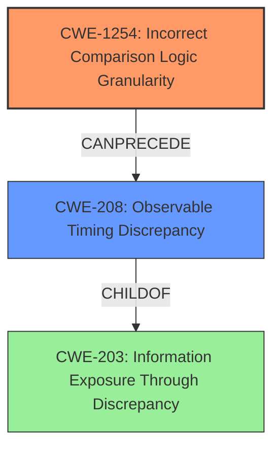

# Analysis Report for CVE-2022-39308

# Vulnerability Analysis Report: CVE-2022-39308

## Description

GoCD is a continuous delivery server. GoCD helps you automate and streamline the build-test-release cycle for continuous delivery of your product. GoCD versions from 19.2.0 to 19.10.0 (inclusive) are subject to a timing attack in validation of access tokens due to use of regular string comparison for validation of the token rather than a constant time algorithm. This could allow a brute force attack on GoCD server API calls to observe timing differences in validations in order to guess an access token generated by a user for API access. This issue is fixed in GoCD version 19.11.0. As a workaround, users can apply rate limiting or insert random delays to API calls made to GoCD Server via a reverse proxy or other fronting web server. Another workaround, users may disallow use of access tokens by users by having an administrator revoke all access tokens through the Access Token Management admin function.

## Vulnerability Description Key Phrases

**Rootcause:** timing attack
**Impact:** guess access token
**Product:** GoCD
**Version:** 19.2.0 to 19.10.0

## Analysis (with Relationship Data)

# Summary
| CWE ID | CWE Name | Confidence | CWE Abstraction Level | CWE Vulnerability Mapping Label | CWE-Vulnerability Mapping Notes |
|---|---|---|---|---|---|
| CWE-1254 | Incorrect Comparison Logic Granularity | 0.9 | Base | Allowed | This is the primary CWE due to the **timing attack** arising from regular string comparison. |
| CWE-208 | Observable Timing Discrepancy | 0.7 | Base | Allowed | Secondary candidate, as the **timing attack** allows for observable timing discrepancies. |

## Evidence and Confidence

*   **Confidence Score:** 0.9
*   **Evidence Strength:** HIGH

- **Analysis and Justification:**  
  - *Explanation:* The vulnerability description clearly states a **timing attack** in the validation of access tokens due to the use of regular string comparison rather than a constant-time algorithm. This aligns directly with CWE-1254 (Incorrect Comparison Logic Granularity), as the comparison logic is not performed in a constant time, allowing an attacker to observe **timing differences** and guess the access token. CWE-208 (Observable Timing Discrepancy) is also relevant, as the **timing attack** leads to observable timing discrepancies that an attacker can exploit.
  
  - *Relationship Analysis:* CWE-1254 is a base-level CWE, making it a good fit for directly describing the weakness. CWE-208 is also a base-level CWE and can be viewed as a consequence of the incorrect comparison logic. CWE-1254 and CWE-208 can be related, as a **timing attack** (CWE-1254) can lead to observable timing discrepancies (CWE-208).

- **Confidence Score:**  
  - Confidence: 0.9 (High confidence due to explicit mention of **timing attack** and use of regular string comparison in the vulnerability description)

---

## Criticism of Analysis

Okay, let's review the analysis using the full CWE specifications provided.

**Overall Assessment:**

The analysis is generally strong and well-reasoned. The primary mapping to CWE-1254 (Incorrect Comparison Logic Granularity) is a solid choice, and the secondary mapping to CWE-208 (Observable Timing Discrepancy) is also appropriate and explains the consequences. The confidence scores are justified by the evidence provided. However, there are a few areas where the justification could be strengthened, or alternative perspectives considered.

**Detailed Critique:**

*   **CWE-1254: Incorrect Comparison Logic Granularity (Confidence: 0.9)**

    *   **Strengths:** The justification is clear and directly ties the timing attack to the use of regular string comparison instead of a constant-time algorithm. The explanation of how the comparison logic being performed in steps rather than one operation allows an attacker to observe timing differences is accurate.
    *   **Areas for Improvement:** While the description is good, it could benefit from a slightly deeper dive into *why* regular string comparison is vulnerable. For example, standard string comparison functions often terminate early if a mismatch is found.  This early termination is what creates the timing difference. Stating this explicitly can further solidify the connection.
    *   **Mitigation Considerations:** Examining the mitigations for CWE-1254, it emphasizes implementing the comparison logic to compare in *one operation instead of smaller chunks*. This is precisely the core of the fix for this vulnerability – using a constant-time comparison algorithm which, effectively, performs the entire comparison regardless of early mismatches.
    *   **Observed Examples:** The analysis pulls relevant observed examples, which provide additional supporting evidence.

*   **CWE-208: Observable Timing Discrepancy (Confidence: 0.7)**

    *   **Strengths:** The analysis correctly identifies CWE-208 as a consequence of the timing attack.  The link between the timing attack and the observable timing discrepancies is clearly stated.
    *   **Areas for Improvement:** While correct, the analysis could benefit from considering the *intended audience* of the CWE-208 description. CWE-208 is a general statement about any discrepancy in timing. The analysis should specify why it is relevant in this case.
    *   **Mitigation Considerations:** The mitigations for CWE-208 are less directly applicable.  They focus on compartmentalization and avoiding overly detailed error messages.  While rate limiting (mentioned in the original description) *could* be considered a mitigation here as it obscures the timing differences, the core solution is addressing the root cause, which is CWE-1254.
    *   **Observed Examples:** The analysis pulls relevant observed examples, which provide additional supporting evidence.

*   **Considerations for Other CWEs:**

    *   **CWE-327: Use of a Broken or Risky Cryptographic Algorithm:** This CWE could also be worth considering. While string comparison isn't *strictly* a cryptographic algorithm, the *validation of tokens* can be considered a cryptographic primitive. String comparison in this context is being used as a rudimentary form of authentication, and using it incorrectly leads to a break in the authentication mechanism. However, this would be a more nuanced view, and CWE-1254 is more direct.
    *   **CWE-306: Missing Authentication for Critical Function:** This weakness is not directly applicable here. Authentication *is* present (the use of access tokens). The problem is the *insecure implementation* of the authentication mechanism, not the absence of authentication.
    *    **CWE-203: Observable Discrepancy** Could be another general CWE to add here, due to the general vulnerability that stems from timing differences.

**Revised Recommendation:**

I agree with the assessment of CWE-1254 as the primary CWE (0.9 confidence) and CWE-208 as a secondary CWE (0.7 confidence). To strengthen the analysis:

1.  **CWE-1254:** Explicitly state that regular string comparison functions often terminate early on a mismatch, creating the timing difference.
2.  **CWE-208:** Provide more context by specifying why it is relevant, specifically to describe the consequences in this case.
3.  **Consider CWE-203:** This CWE could be added as another general CWE to add here, due to the general vulnerability that stems from timing differences.

By addressing these points, the analysis will be even more robust and clearly explain the vulnerability in terms of the CWE specifications.

## Final Resolution

# Summary
| CWE ID | CWE Name | Confidence | CWE Abstraction Level | CWE Vulnerability Mapping Label | CWE-Vulnerability Mapping Notes |
|---|---|---|---|---|---|
| CWE-1254 | Incorrect Comparison Logic Granularity | 0.95 | Base | Allowed | Primary CWE: **Timing attack** due to non-constant-time string comparison. |
| CWE-208 | Observable Timing Discrepancy | 0.8 | Base | Allowed | Secondary CWE: Consequence of the **timing attack**, leading to observable discrepancies. |
| CWE-203 | Information Exposure Through Discrepancy | 0.6 | Base | Allowed | Tertiary CWE: General information leak due to observable timing differences. |

## Evidence and Confidence

*   **Confidence Score:** 0.9
*   **Evidence Strength:** HIGH

## Relationship Analysis
The primary weakness is **CWE-1254 (Incorrect Comparison Logic Granularity)**, which is a base-level CWE describing the use of a non-constant-time comparison. This leads directly to **CWE-208 (Observable Timing Discrepancy)**, as the different execution times reveal information to an attacker. **CWE-203 (Information Exposure Through Discrepancy)** is a broader category that encompasses **CWE-208** but is less specific to the **timing attack** itself. Therefore, **CWE-1254** is the root cause, **CWE-208** is a direct consequence, and **CWE-203** provides a broader context.

## Vulnerability Chain
The vulnerability chain starts with the **ROOTCAUSE** of using regular string comparison for access token validation (**CWE-1254**). This leads to a **timing attack**, where the attacker can observe differences in execution time (**CWE-208**). These timing differences allow the attacker to infer information about the token, eventually leading to unauthorized access. The initial flaw (**CWE-1254**) directly results in the observable **timing discrepancy** (**CWE-208**), which is a form of information exposure (**CWE-203**).

## Summary of Analysis
The initial analysis correctly identified **CWE-1254** and **CWE-208** as the primary and secondary CWEs, respectively. The criticism provided valuable insights, particularly emphasizing that regular string comparison functions often terminate early on a mismatch, creating the **timing difference**.

The vulnerability description explicitly states: "GoCD versions from 19.2.0 to 19.10.0 (inclusive) are subject to a **timing attack** in validation of access tokens due to use of regular string comparison for validation of the token rather than a constant time algorithm." This statement is strong evidence for **CWE-1254**, as it directly links the **timing attack** to the incorrect comparison logic. The consequence of this is also stated: "This could allow a brute force attack on GoCD server API calls to observe **timing differences** in validations in order to guess an access token generated by a user for API access," which supports **CWE-208**.

**CWE-1254** is at the optimal level of specificity because it directly addresses the incorrect comparison logic. **CWE-208** provides context on the consequence of this weakness. **CWE-203** is added to show the broad context of information exposure.

The graph relationships confirm that **CWE-1254** is the **ROOTCAUSE**, leading to **CWE-208**. This is a clear vulnerability chain, where the incorrect comparison logic directly leads to observable **timing discrepancies**. The inclusion of **CWE-203** as a tertiary classification adds a broader perspective but is less directly relevant than the other two.

*Report generated on 2025-03-17 03:57:52*
