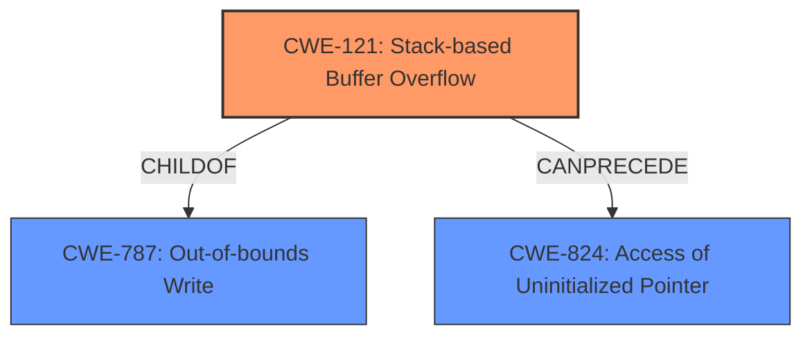

# Final Resolution for CVE-2022-39803

# Summary 
| CWE ID | CWE Name | Confidence | CWE Abstraction Level | CWE Vulnerability Mapping Label | CWE-Vulnerability Mapping Notes |
|---|---|---|---|---|---|
| CWE-121 | Stack-based Buffer Overflow | 0.95 | Variant | Allowed | Primary CWE |
| CWE-824 | Access of Uninitialized Pointer | 0.60 | Base | Allowed | Secondary Candidate CWE |
| CWE-787 | Out-of-bounds Write | 0.55 | Base | Allowed | Secondary Candidate CWE |

## Evidence and Confidence

*   **Confidence Score:** 0.90
*   **Evidence Strength:** HIGH

## Relationship Analysis
The primary relationship is that CWE-121 (Stack-based Buffer Overflow) is a variant of CWE-787 (Out-of-bounds Write), making CWE-121 more specific and appropriate given the vulnerability description. CWE-824 (Access of Uninitialized Pointer) is added as a secondary candidate since memory corruption due to stack-based buffer overflows could lead to the use of uninitialized pointers.

## Vulnerability Chain
The vulnerability chain starts with the processing of a manipulated file. This leads to a **CWE-121 (Stack-based Buffer Overflow)**, where data is written beyond the boundaries of a buffer allocated on the stack. This can then lead to **CWE-824 (Access of Uninitialized Pointer)** if the overflow corrupts pointer values on the stack, causing the program to use uninitialized memory. The final impact is potential remote code execution.

## Summary of Analysis
The initial analysis and criticism are both well-reasoned. The primary CWE, CWE-121, is strongly supported by the vulnerability description's explicit mention of a "stack-based overflow." The analysis correctly identifies that CWE-121 is a variant of CWE-787, making it a more specific and preferred choice. The inclusion of CWE-824 as a secondary candidate is plausible, as a stack-based overflow can potentially corrupt pointer values, leading to the use of uninitialized memory. The adjustments to the confidence scores for CWE-824 and CWE-787 are appropriate, reflecting the less direct evidence for these weaknesses.

The graph relationships influenced the final selection by highlighting the parent-child relationship between CWE-121 and CWE-787, emphasizing the importance of choosing the most specific CWE. The potential chain relationship between CWE-121 and CWE-824 further supports the inclusion of CWE-824 as a secondary candidate.

The selected CWEs are at the optimal level of specificity. CWE-121 is a Variant CWE that directly matches the vulnerability description, while CWE-824 and CWE-787 represent potential consequences or more general forms of the weakness.

Evidence:
"Due to lack of proper memory management, when a victim opens a manipulated ACIS Part and Assembly (.sat, CoreCadTranslator.exe) file received from untrusted sources in SAP 3D Visual Enterprise Author - version 9, it is possible that a Remote Code Execution can be triggered when payload forces a stack-based overflow or a re-use of dangling pointer which refers to overwritten space in memory."