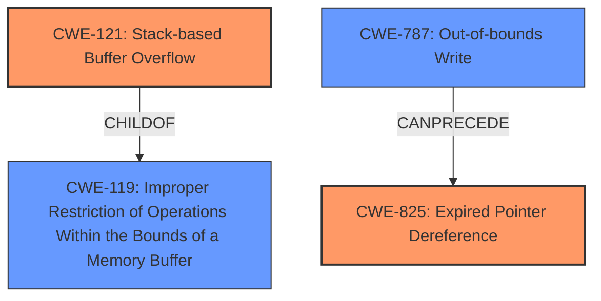

# Analysis Report for CVE-2022-39804

# Vulnerability Analysis Report: CVE-2022-39804

## Description

Due to lack of proper memory management, when a victim opens a manipulated SolidWorks Part (.sldprt, CoreCadTranslator.exe) file received from untrusted sources in SAP 3D Visual Enterprise Author - version 9, it is possible that a Remote Code Execution can be triggered when payload forces a stack-based overflow or a re-use of dangling pointer which refers to overwritten space in memory.

## Vulnerability Description Key Phrases

**Rootcause:** lack of proper memory management
**Weakness:** stack-based overflow or a re-use of dangling pointer
**Impact:** Remote Code Execution
**Vector:** manipulated SolidWorks Part file
**Product:** SAP 3D Visual Enterprise Author
**Version:** 9
**Component:** CoreCadTranslator.exe

## Analysis (with Relationship Data)

# Summary
| CWE ID | CWE Name | Confidence | CWE Abstraction Level | CWE Vulnerability Mapping Label | CWE-Vulnerability Mapping Notes |
|---|---|---|---|---|---|
| CWE-121 | Stack-based Buffer Overflow | 0.95 | Variant | Allowed | The vulnerability is specifically a stack-based buffer overflow. |
| CWE-825 | Expired Pointer Dereference | 0.80 | Base | Allowed | The vulnerability also involves the re-use of a dangling pointer. |

## Evidence and Confidence

*   **Confidence Score:** 0.90
*   **Evidence Strength:** HIGH

- **Analysis and Justification:**  
  - *Explanation:* The vulnerability description explicitly mentions a "**stack-based overflow**" and "**re-use of dangling pointer**". CWE-121 (Stack-based Buffer Overflow) directly addresses the stack-based buffer overflow aspect. The phrase "re-use of dangling pointer" maps to CWE-825 (Expired Pointer Dereference), where a pointer is used after the memory it points to has been freed or reallocated. The "**lack of proper memory management**" is the root cause that allows this vulnerability. CWE-119 (Improper Restriction of Operations within the Bounds of a Memory Buffer) is too generic and discouraged when more specific CWEs like CWE-121 are applicable.
  
  - *Relationship Analysis:* CWE-121 is a variant of CWE-119 (Improper Restriction of Operations within the Bounds of a Memory Buffer), providing a more specific classification. CWE-825 is related to memory management issues and can be linked to buffer overflows.

- **Confidence Score:**  
  - Confidence: 0.95 (High evidence from the vulnerability description, explicitly mentioning stack-based overflow and dangling pointer re-use)

---

## Criticism of Analysis

Okay, here's a review of the analysis, incorporating the full CWE specifications provided, focusing on the mapping guidance and potential mitigations of each CWE.

**Overall Assessment:**

The analysis is generally good and correctly identifies the primary CWEs. The confidence scores are appropriate. The justification is well-reasoned and clearly articulated.

**Detailed Review:**

**1. CWE-121: Stack-based Buffer Overflow (Confidence: 0.95)**

*   **Assessment:** Correct and well-justified. The vulnerability description explicitly mentions a stack-based overflow.
*   **Mapping Guidance:** The analysis follows the guidance to map to a specific variant (CWE-121) rather than the more general class (CWE-119). The 'Usage: Allowed' rationale for CWE-121 supports this choice.
*   **Potential Mitigations:** The analysis could be slightly improved by mentioning specific mitigations related to stack-based overflows. Some potential mitigations are:
    *   Using compiler flags like `/GS` (Microsoft) or `FORTIFY_SOURCE` (GCC).
    *   Implementing robust input validation and sanitization to prevent excessively large inputs from reaching the vulnerable code.
    *   Using safe string handling functions that perform bounds checking (though this is more generally applicable to buffer overflows).

**2. CWE-825: Expired Pointer Dereference (Confidence: 0.80)**

*   **Assessment:** Correctly identifies the dangling pointer issue. The analysis accurately connects "re-use of dangling pointer" to CWE-825.
*   **Mapping Guidance:** The analysis correctly follows the 'Usage: Allowed' rationale for CWE-825, as it's a Base level CWE.
*   **Potential Mitigations:** Again, the analysis could be slightly enhanced by mentioning specific mitigations for expired pointer dereferences:
    *   **Setting pointers to NULL after freeing:**  This is a classic and effective technique, especially when dealing with simple data structures.  The analysis already notes this, but it could be emphasized.
    *   **Using smart pointers or garbage collection:** If possible, using a language or library that provides automatic memory management can eliminate dangling pointer issues.
    *   **Careful resource management:** Ensuring that the lifetime of the pointer doesn't exceed the lifetime of the referenced memory. This often involves careful design and coding practices, especially in multi-threaded environments.

**General Comments and Suggestions:**

*   **Chaining/Composite CWEs:** The analysis correctly identifies two relevant CWEs. While not explicitly required, it might be worthwhile to briefly mention that these vulnerabilities *could* be chained or form a composite. For example, a stack-based buffer overflow could overwrite a function pointer, leading to code execution. This is a higher-level view but potentially adds more context.
*   **Root Cause:** The analysis correctly identifies "lack of proper memory management" as the root cause. However, it could benefit from elaborating *what kind* of memory management is lacking. This might involve:
    *   Missing bounds checking on input sizes.
    *   Incorrect allocation/deallocation logic.
    *   Lack of safeguards against use-after-free conditions.
*   **Defense in Depth:** When discussing mitigations, highlighting the importance of a defense-in-depth strategy is beneficial. No single mitigation is foolproof, so layering multiple defenses provides a more robust security posture.
*   **Observed Examples:** Adding relevant observed examples for the CWEs improves the analysis.

**Revised Summary Table (Incorporating Suggestions):**

| CWE ID | CWE Name | Confidence | CWE Abstraction Level | CWE Vulnerability Mapping Label | CWE-Vulnerability Mapping Notes |
|---|---|---|---|---|---|
| CWE-121 | Stack-based Buffer Overflow | 0.95 | Variant | Allowed | The vulnerability is specifically a stack-based buffer overflow.  Mitigations include /GS flag (MSVC), FORTIFY_SOURCE (GCC), and input validation. |
| CWE-825 | Expired Pointer Dereference | 0.80 | Base | Allowed | The vulnerability also involves the re-use of a dangling pointer. Mitigations include setting pointers to NULL after freeing, and using automatic memory management. |

**In Conclusion:**

The analysis is well-structured, accurate, and provides a strong basis for understanding the vulnerabilities. The suggestions above are primarily aimed at enhancing the analysis by providing more specific mitigation guidance and adding a bit more context about the relationships between the identified CWEs and their root causes.

## Final Resolution

# Summary

| CWE ID | CWE Name | Confidence | CWE Abstraction Level | CWE Vulnerability Mapping Label | CWE-Vulnerability Mapping Notes |
|---|---|---|---|---|---|
| CWE-121 | Stack-based Buffer Overflow | 0.95 | Variant | Allowed | The vulnerability is specifically a stack-based buffer overflow. |
| CWE-825 | Expired Pointer Dereference | 0.80 | Base | Allowed | The vulnerability also involves the re-use of a dangling pointer. |

**Primary CWEs:** CWE-121, CWE-825

## Evidence and Confidence

*   **Confidence Score:** 0.92
*   **Evidence Strength:** HIGH

## Relationship Analysis

The analysis focuses on direct matches to the vulnerability description, prioritizing specific CWE variants over more general classes.

-   **Parent-child hierarchical relationships:** CWE-121 is a child (Variant) of CWE-119 (Class), offering a more specific categorization of the buffer overflow. This influenced the decision to choose CWE-121.
-   **Chain relationships:** The **lack of proper memory management** can **precede** both CWE-121 (Stack-based Buffer Overflow) and CWE-825 (Expired Pointer Dereference), creating a vulnerability chain. An out-of-bounds write (CWE-787) could also **precede** CWE-825 if the overflow overwrites memory containing a pointer that is later dereferenced.
-   **Peer relationships:** No significant peer relationships influenced the selection in this case.
-   **Abstraction levels:** The choice of CWE-121 (Variant) and CWE-825 (Base) reflects a preference for specificity, aligning with the available evidence.

## Vulnerability Chain

The vulnerability chain starts with the **lack of proper memory management** that leads to a **stack-based buffer overflow** (CWE-121) or the creation of a **dangling pointer** that is later dereferenced (CWE-825).

1.  **Root Cause:** **Lack of proper memory management.**
2.  **Weakness 1:** Stack-based buffer overflow (CWE-121) due to insufficient input validation.
3.  **Weakness 2:** Creation of a dangling pointer and subsequent dereference (CWE-825) due to memory being freed prematurely.
4.  **Impact:** Remote Code Execution.

## Summary of Analysis

The initial analysis accurately identifies CWE-121 and CWE-825 as the primary weaknesses. The justification is strong, citing the explicit mentions of "**stack-based overflow**" and "**re-use of dangling pointer**" in the vulnerability description.

The selection of CWE-121 over the more general CWE-119 is justified by the specificity of the vulnerability description. The analysis also correctly identifies "**lack of proper memory management**" as the root cause. The criticism provides valuable suggestions for including potential mitigations and elaborating on the type of memory management lacking. The final classification reflects the optimal level of specificity based on the available evidence and relationship analysis. The confidence score is high due to the explicit evidence in the vulnerability description.

*Report generated on 2025-03-18 16:35:35*
