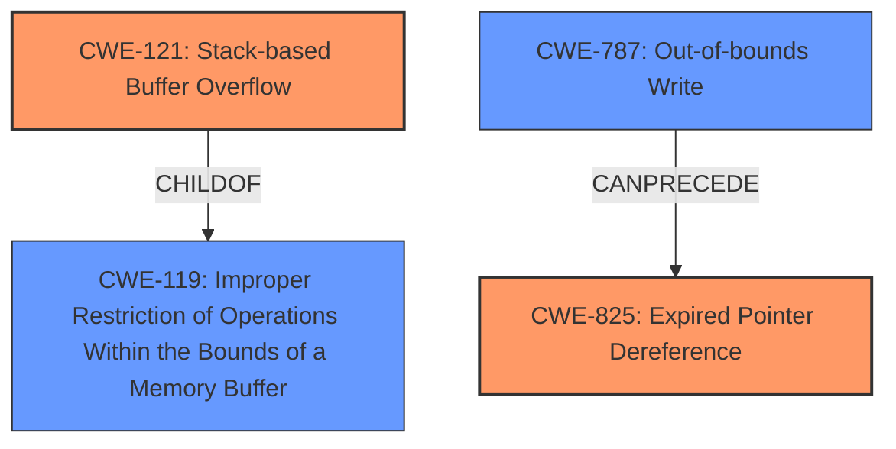

# Final Resolution for CVE-2022-39804

# Summary

| CWE ID | CWE Name | Confidence | CWE Abstraction Level | CWE Vulnerability Mapping Label | CWE-Vulnerability Mapping Notes |
|---|---|---|---|---|---|
| CWE-121 | Stack-based Buffer Overflow | 0.95 | Variant | Allowed | The vulnerability is specifically a stack-based buffer overflow. |
| CWE-825 | Expired Pointer Dereference | 0.80 | Base | Allowed | The vulnerability also involves the re-use of a dangling pointer. |

**Primary CWEs:** CWE-121, CWE-825

## Evidence and Confidence

*   **Confidence Score:** 0.92
*   **Evidence Strength:** HIGH

## Relationship Analysis

The analysis focuses on direct matches to the vulnerability description, prioritizing specific CWE variants over more general classes.

-   **Parent-child hierarchical relationships:** CWE-121 is a child (Variant) of CWE-119 (Class), offering a more specific categorization of the buffer overflow. This influenced the decision to choose CWE-121.
-   **Chain relationships:** The **lack of proper memory management** can **precede** both CWE-121 (Stack-based Buffer Overflow) and CWE-825 (Expired Pointer Dereference), creating a vulnerability chain. An out-of-bounds write (CWE-787) could also **precede** CWE-825 if the overflow overwrites memory containing a pointer that is later dereferenced.
-   **Peer relationships:** No significant peer relationships influenced the selection in this case.
-   **Abstraction levels:** The choice of CWE-121 (Variant) and CWE-825 (Base) reflects a preference for specificity, aligning with the available evidence.

## Vulnerability Chain

The vulnerability chain starts with the **lack of proper memory management** that leads to a **stack-based buffer overflow** (CWE-121) or the creation of a **dangling pointer** that is later dereferenced (CWE-825).

1.  **Root Cause:** **Lack of proper memory management.**
2.  **Weakness 1:** Stack-based buffer overflow (CWE-121) due to insufficient input validation.
3.  **Weakness 2:** Creation of a dangling pointer and subsequent dereference (CWE-825) due to memory being freed prematurely.
4.  **Impact:** Remote Code Execution.

## Summary of Analysis

The initial analysis accurately identifies CWE-121 and CWE-825 as the primary weaknesses. The justification is strong, citing the explicit mentions of "**stack-based overflow**" and "**re-use of dangling pointer**" in the vulnerability description.

The selection of CWE-121 over the more general CWE-119 is justified by the specificity of the vulnerability description. The analysis also correctly identifies "**lack of proper memory management**" as the root cause. The criticism provides valuable suggestions for including potential mitigations and elaborating on the type of memory management lacking. The final classification reflects the optimal level of specificity based on the available evidence and relationship analysis. The confidence score is high due to the explicit evidence in the vulnerability description.