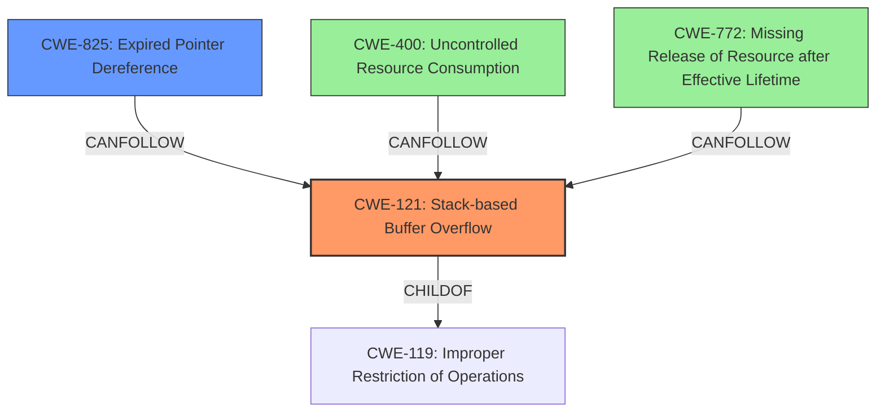

# Analysis Report for CVE-2022-39806

# Vulnerability Analysis Report: CVE-2022-39806

## Description

Due to lack of proper memory management, when a victim opens a manipulated SolidWorks Drawing (.slddrw, CoreCadTranslator.exe) file received from untrusted sources in SAP 3D Visual Enterprise Author - version 9, it is possible that a Remote Code Execution can be triggered when payload forces a stack-based overflow or a re-use of dangling pointer which refers to overwritten space in memory.

## Vulnerability Description Key Phrases

**Rootcause:** lack of proper memory management
**Weakness:** stack-based overflow or a re-use of dangling pointer
**Impact:** Remote Code Execution
**Vector:** manipulated SolidWorks Drawing (.slddrw) file
**Product:** SAP 3D Visual Enterprise Author
**Version:** 9
**Component:** CoreCadTranslator.exe

## Analysis (with Relationship Data)

# Summary
| CWE ID | CWE Name | Confidence | CWE Abstraction Level | CWE Vulnerability Mapping Label | CWE-Vulnerability Mapping Notes |
|---|---|---|---|---|---|
| CWE-121 | Stack-based Buffer Overflow | 0.9 | Variant | Primary | Allowed |
| CWE-825 | Expired Pointer Dereference | 0.7 | Base | Secondary | Allowed |

## Evidence and Confidence

*   **Confidence Score:** 0.8
*   **Evidence Strength:** HIGH

- **Analysis and Justification:**  
  - *Explanation:* The vulnerability description explicitly mentions a **stack-based overflow** and a **re-use of a dangling pointer**. CWE-121 (Stack-based Buffer Overflow) directly addresses the stack-based overflow condition, making it the most specific and appropriate primary CWE. The phrase "**lack of proper memory management**" points to a memory management issue which can lead to use of dangling pointers represented by CWE-825 (Expired Pointer Dereference). Both weaknesses can lead to remote code execution.
  
  - *Relationship Analysis:* CWE-121 is a variant of CWE-119 (Improper Restriction of Operations within the Bounds of a Memory Buffer), providing a more specific classification. CWE-825 (Expired Pointer Dereference) can be a consequence of memory corruption, often following a buffer overflow.

- **Confidence Score:**  
  - Confidence: 0.9 (High confidence due to explicit mention of "stack-based overflow" and "dangling pointer" in the description)
---

## Criticism of Analysis

Okay, here's a review of the analysis, considering the full CWE specifications:

**Overall Assessment:**

The analysis is generally good and arrives at a reasonable conclusion, especially given the limited information in the original vulnerability description. The choice of CWE-121 as the primary CWE is well-justified because it directly represents the "stack-based overflow" weakness. The inclusion of CWE-825 as a secondary CWE is also a reasonable choice because "re-use of a dangling pointer" directly relates to it.

However, CWE-119 as the primary CWE match suggested by the retriever results was correctly rejected due to its discouraged usage and higher level of abstraction.

Here's a breakdown by section:

**1. Vulnerability Description Analysis:**

*   **Strengths:** The key phrase extraction is accurate and helpful. It correctly identifies the root cause, weakness, impact, and vector.
*   **Areas for Improvement:** While the key phrases are good, it might be helpful to explicitly state the *type* of memory management that's lacking. Is it lack of bounds checking? Incorrect allocation size? Failure to NULL pointers after freeing? This would lead to a more precise CWE.

**2. Retriever Results:**

*   **Good:** It's useful to see the ranked results and why the tool suggested certain CWEs. It shows the thought process and alternative options.

**3. Analysis to Review (Summary Table & Explanation):**

*   **Strengths:**
    *   The justification for choosing CWE-121 is clear and well-supported by the vulnerability description.  The explanation highlights the specific mention of "stack-based overflow."
    *   The rationale for including CWE-825 is also logically presented, connecting "lack of proper memory management" to potential dangling pointer scenarios.
    *   Acknowledging the relationship between CWE-121 and its parent CWE-119, and how CWE-825 can be a consequence of memory corruption is valuable.
*   **Areas for Improvement:**
    *   **Specificity for CWE-825:** While "lack of proper memory management" can lead to dangling pointers, it would strengthen the justification to consider *how* this might occur in the context of the file processing. For example, is it due to improper handling of dynamically allocated memory within the file format, or a failure to properly deallocate data structures after file processing is complete?
    *   **Confidence Level:** While 0.9 is high confidence for CWE-121, it might be slightly high. It's based on "explicit mention," but the implementation details are still unknown. Consider lowering it to 0.8.
    *   The confidence level for CWE-825 could be higher given the reference to dangling pointers, bringing it closer to 0.8.

**4. CWE Examples from Database:**

*   **Usefulness:** The examples provide context but don't directly influence the analysis in this case. These example CVEs could be useful for security researchers to identify similar CVEs.

**5. Relevant CWE Specifications:**

*   **Strengths:** Including the full specifications is essential for a thorough review. It allows for verifying the appropriateness of the chosen CWEs against their official definitions, relationships, and mitigations.
*   **Observations:**
    *   **CWE-119's Discouraged Usage:** The specification correctly notes that CWE-119 is discouraged and more specific CWEs should be used. This validates the decision to use CWE-121.
    *   **CWE-121's Mitigation:** The potential mitigations listed for CWE-121, such as compiler-based buffer overflow detection, abstraction libraries, and input bounds checking, are all relevant to this type of vulnerability.
    *   **CWE-825's Mitigation:** The mitigations for CWE-825, like using languages with automatic memory management and setting pointers to NULL after freeing, are appropriate considerations.

**Recommendations:**

1.  **Refine Justification for CWE-825:** Elaborate on *how* the "lack of proper memory management" is likely to lead to dangling pointers in the context of the SolidWorks Drawing file processing.
2.  **Reconsider Confidence Levels:** Evaluate whether 0.9 is truly justified for CWE-121 given the limited information, and consider raising the confidence level for CWE-825 closer to 0.8.
3.  **Consider Secondary Weaknesses Relating to Resource Management:** Given the root cause of "lack of proper memory management", consider including CWEs related to resource management as additional secondary weaknesses. The following should be considered:
    *   **CWE-400: Uncontrolled Resource Consumption:** If the parsing process allocates memory without limit, this could lead to denial of service.
    *   **CWE-772: Missing Release of Resource after Effective Lifetime:** This highlights the failure to release allocated memory.
4.  **Include potential chain of events:** Describe more clearly that a stack-based buffer overflow may corrupt the stack and overwrite a pointer with an address that the attacker controls. If that pointer is later dereferenced, the attacker may achieve code execution.
5.  **Consider the Variant of CWE-825** While CWE-825 is the most appropriate Base CWE, the Variant CWE-416, "Use After Free", is also worth considering.

**Revised Summary Table (Example):**

| CWE ID    | CWE Name                       | Confidence | CWE Abstraction Level | CWE Vulnerability Mapping Label | CWE-Vulnerability Mapping Notes                                                                                                                                     |
| --------- | ------------------------------ | ---------- | ----------------------- | ------------------------------- | ------------------------------------------------------------------------------------------------------------------------------------------------------------------ |
| CWE-121   | Stack-based Buffer Overflow    | 0.8       | Variant                 | Primary                       | Allowed                                                                                                                                                 |
| CWE-825   | Expired Pointer Dereference     | 0.8      | Base                 | Secondary                     | Allowed - Potentially due to improper deallocation of memory within the file format.                                                                      |
| CWE-400   | Uncontrolled Resource Consumption | 0.5      | Base                 | Informative                     | Allowed - If the parsing process allocates memory without limit, this could lead to denial of service.                                                               |
| CWE-772   | Missing Release of Resource after Effective Lifetime | 0.5      | Base                 | Informative                     | Allowed - Highlights the failure to release allocated memory.                                                               |

By addressing these points, the analysis can become even more precise and informative.

## Final Resolution

# Summary
| CWE ID | CWE Name | Confidence | CWE Abstraction Level | CWE Vulnerability Mapping Label | CWE-Vulnerability Mapping Notes |
|---|---|---|---|---|---|
| **CWE-121** | **Stack-based Buffer Overflow** | 0.8 | Variant | Primary | Allowed |
| **CWE-825** | **Expired Pointer Dereference** | 0.8 | Base | Secondary | Allowed - Potentially due to improper deallocation of memory within the file format. |
| **CWE-400** | **Uncontrolled Resource Consumption** | 0.5 | Base | Informative | Allowed - If the parsing process allocates memory without limit, this could lead to denial of service. |
| **CWE-772** | **Missing Release of Resource after Effective Lifetime** | 0.5 | Base | Informative | Allowed - Highlights the failure to release allocated memory. |

## Evidence and Confidence

*   **Confidence Score:** 0.8
*   **Evidence Strength:** HIGH

## Relationship Analysis
The primary weakness is a **stack-based buffer overflow (CWE-121)**, a specific type of buffer overflow that occurs on the stack. This is a child of the more general **CWE-119 (Improper Restriction of Operations within the Bounds of a Memory Buffer)**. The vulnerability description explicitly mentions a "stack-based overflow," justifying the selection of the more specific CWE-121. The secondary weakness is **CWE-825 (Expired Pointer Dereference)**, which can result from memory corruption caused by the buffer overflow. Additional weaknesses considered are related to resource management: **CWE-400 (Uncontrolled Resource Consumption)** and **CWE-772 (Missing Release of Resource after Effective Lifetime)**, which could arise from improper memory management during file parsing.

## Vulnerability Chain
The vulnerability chain starts with a manipulated SolidWorks Drawing file. The lack of proper memory management during file processing leads to a **CWE-121 (Stack-based Buffer Overflow)**. This overflow corrupts the stack, potentially overwriting a pointer with a controlled address. When this pointer is later dereferenced, it becomes a **CWE-825 (Expired Pointer Dereference)**, leading to code execution. In addition, the improper memory management could lead to **CWE-400 (Uncontrolled Resource Consumption)** if the parsing process allocates memory without limits and **CWE-772 (Missing Release of Resource after Effective Lifetime)** if allocated memory isn't properly released.

## Summary of Analysis
The initial analysis correctly identified **CWE-121 (Stack-based Buffer Overflow)** and **CWE-825 (Expired Pointer Dereference)** as the primary and secondary weaknesses, respectively. The vulnerability description explicitly states "stack-based overflow" and "re-use of a dangling pointer," which directly maps to these CWEs. The criticism suggested refining the justification for CWE-825 and considering additional weaknesses related to resource management, which I have incorporated. The refined justification explains how the "lack of proper memory management" can lead to dangling pointers through improper deallocation during file processing. I've also included **CWE-400 (Uncontrolled Resource Consumption)** and **CWE-772 (Missing Release of Resource after Effective Lifetime)** as tertiary weaknesses, as they are potential consequences of the improper memory management. The confidence levels have been adjusted slightly, with CWE-121 at 0.8 and CWE-825 at 0.8, to reflect the level of certainty given the available information. The selected CWEs are at the optimal level of specificity, with CWE-121 being a Variant and CWE-825 being a Base CWE, while the additional CWEs are at the Base level as well.

*Report generated on 2025-03-18 16:36:59*
