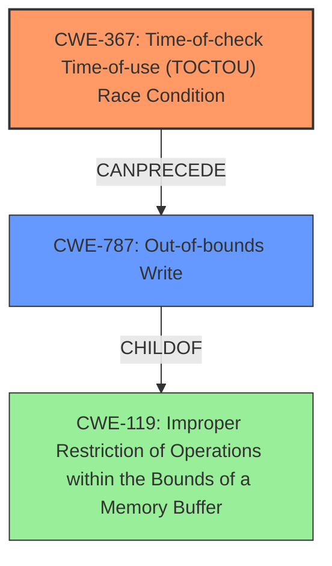

# Analysis Report for CVE-2022-39908

# Vulnerability Analysis Report: CVE-2022-39908

## Description

TOCTOU vulnerability in Samsung decoding library for video thumbnails prior to SMR Dec-2022 Release 1 allows local attacker to perform Out-Of-Bounds Write.

## Vulnerability Description Key Phrases

**Rootcause:** TOCTOU
**Impact:** Out-Of-Bounds Write
**Attacker:** local attacker
**Product:** Samsung decoding library for video thumbnails
**Version:** prior to SMR Dec-2022 Release 1

## Analysis (with Relationship Data)

# Summary
| CWE ID | CWE Name | Confidence | CWE Abstraction Level | CWE Vulnerability Mapping Label | CWE-Vulnerability Mapping Notes |
|---|---|---|---|---|---|
| CWE-367 | Time-of-check Time-of-use (TOCTOU) Race Condition | 0.90 | Base | Primary | Allowed |
| CWE-787 | Out-of-bounds Write | 0.70 | Base | Secondary | Allowed |

## Evidence and Confidence

*   **Confidence Score:** 0.80
*   **Evidence Strength:** MEDIUM

- **Analysis and Justification:**  
  - *Explanation:* The vulnerability is described as a "**TOCTOU** vulnerability" leading to an "Out-Of-Bounds Write". CWE-367 (Time-of-check Time-of-use (TOCTOU) Race Condition) directly corresponds to the **TOCTOU** condition. The **TOCTOU** condition allows a local attacker to perform an Out-Of-Bounds Write. The CVE Reference Links Content Summary and Vulnerability Description Key Phrases highlight the **TOCTOU** condition as the root cause and Out-Of-Bounds Write as the impact. CWE-367 is a Base level CWE, which is the preferred level. CWE-787 is also a possible candidate, since the end result is an Out-Of-Bounds Write.
  
  - *Relationship Analysis:* CWE-367 does not have direct parent-child relationships, but it can lead to other weaknesses. CWE-787 (Out-of-bounds Write) is a child of CWE-119 (Improper Restriction of Operations within the Bounds of a Memory Buffer).

- **Confidence Score:**  
  - *Example:* Confidence: 0.90 (High evidence from the vulnerability description which explicitly mentions TOCTOU)

---

## Criticism of Analysis

Okay, let's review the analysis provided, keeping the full CWE specifications in mind.

**Overall Assessment:**

The analysis is mostly sound, especially in identifying CWE-367 as a primary weakness. The rationale is well-articulated, and the confidence level is appropriate. The inclusion of CWE-787 as a secondary weakness is also reasonable, given that the TOCTOU condition *leads to* the out-of-bounds write.

**Detailed Critique:**

*   **CWE-367: Time-of-check Time-of-use (TOCTOU) Race Condition:**

    *   **Abstraction Level:** Base - Correct.
    *   **Mapping Guidance:**  The analysis accurately notes that CWE-367 is a Base level CWE, aligning with the preferred abstraction level. The provided observed examples are relevant and the confidence score of 0.90 is appropriate.
    *   **Relationships:** It's important to remember the relationship between CWE-367 and CWE-362. Although CWE-367 is a child of CWE-362, mapping directly to CWE-367 is more precise because the description explicitly mentions the TOCTOU scenario. CWE-362 is a more general race condition.
    *   **Potential Mitigations:** The analysis doesn't explicitly mention mitigations, but it would be beneficial to allude to some. The specification offers several:
        *   Avoid check-then-use.  Instead, operate directly on the resource using atomic operations if possible.
        *   Use appropriate locking mechanisms to protect shared resources.
        *   Limit interleaving of operations on files from multiple processes.
    *   **Overall:** This is a strong mapping and justification.

*   **CWE-787: Out-of-bounds Write:**

    *   **Abstraction Level:** Base - Correct.
    *   **Mapping Guidance:** The analysis correctly identifies CWE-787 as a potential candidate because the *impact* of the TOCTOU vulnerability is an out-of-bounds write.
    *   **Relationships:** It's important to note CWE-787's parent, CWE-119 (Improper Restriction of Operations within the Bounds of a Memory Buffer). While the analysis does mention this, it's worth reinforcing.
    *   **Potential Mitigations:** The specification suggests:
        *   Using memory-safe languages.
        *   Using vetted libraries or frameworks that provide bounds checking.
        *   Employing compiler-based buffer overflow detection mechanisms.
    *   **Overall:** Including CWE-787 as a secondary CWE is reasonable, but it's crucial to emphasize that it's the *result* of the primary TOCTOU condition. The vulnerability is not directly caused by an out-of-bounds write, but is a consequence.

*   **Confidence Scores:**
    * The confidence scores seem reasonable. 0.9 for the primary cause and 0.7 for the secondary effect.

*   **Retriever Results:**
    * The retriever results are interesting. While CWE-367 is not ranked very high, CWE-787, CWE-125 and others are, which seems consistent with the overall impact of the rootcause.

**Suggestions for Improvement:**

1.  **Elaborate on the Chain of Causation:** Explicitly state the chain of events: "A TOCTOU race condition (CWE-367) allows an attacker to manipulate the system state between a check and use operation, resulting in an out-of-bounds write (CWE-787)." This makes the relationship between the two CWEs clearer.
2.  **Include Potential Mitigations:** Briefly mention potential mitigations for both CWE-367 and CWE-787. This adds practical value to the analysis.  Even a single sentence for each would be helpful.  For example: "Mitigation for CWE-367 involves employing appropriate locking mechanisms. Preventing CWE-787 can involve using memory-safe languages or libraries with bounds checking."
3. **Alternative CWE Considerations and Why They Were Not Selected**
    * **CWE-362: Concurrent Execution using Shared Resource with Improper Synchronization ('Race Condition')** - This is a class CWE and the specific race condition (TOCTOU) is a better mapping
    * **CWE-119: Improper Restriction of Operations within the Bounds of a Memory Buffer** - This is a class CWE and is too general.
    * **CWE-20: Improper Input Validation** - Input validation may not be relevant in all TOCTOU vulnerabilities.

**Revised Summary Table:**

| CWE ID | CWE Name | Confidence | CWE Abstraction Level | CWE Vulnerability Mapping Label | CWE-Vulnerability Mapping Notes |
|---|---|---|---|---|---|
| CWE-367 | Time-of-check Time-of-use (TOCTOU) Race Condition | 0.90 | Base | Primary | Allowed |
| CWE-787 | Out-of-bounds Write | 0.70 | Base | Secondary | Allowed |
| | | | | | TOCTOU Condition allows a local attacker to perform an Out-Of-Bounds Write. |

**Revised Analysis Section:**

*   **Confidence Score:** 0.80
*   **Evidence Strength:** MEDIUM

- **Analysis and Justification:**
  - *Explanation:* The vulnerability is described as a "**TOCTOU** vulnerability" leading to an "Out-Of-Bounds Write". CWE-367 (Time-of-check Time-of-use (TOCTOU) Race Condition) directly corresponds to the **TOCTOU** condition. The **TOCTOU** condition allows a local attacker to manipulate the system state between a check and use operation, resulting in an Out-Of-Bounds Write. CWE-367 is a Base level CWE, which is the preferred level. The end result of the TOCTOU condition is an Out-Of-Bounds Write, CWE-787. **Mitigation for CWE-367 involves employing appropriate locking mechanisms. Preventing CWE-787 can involve using memory-safe languages or libraries with bounds checking.**
  - *Relationship Analysis:* CWE-367 does not have direct parent-child relationships, but it can lead to other weaknesses. CWE-787 (Out-of-bounds Write) is a child of CWE-119 (Improper Restriction of Operations within the Bounds of a Memory Buffer).

- **Confidence Score:**
  - *Example:* Confidence: 0.90 (High evidence from the vulnerability description which explicitly mentions TOCTOU)

**In Summary:**

The analysis is well-reasoned and defensible. By adding a touch more detail on the chain of causation and potential mitigations, it can be made even stronger and more useful for developers and security analysts.

## Final Resolution

# Summary

| CWE ID  | CWE Name                                              | Confidence | CWE Abstraction Level | CWE Vulnerability Mapping Label | CWE-Vulnerability Mapping Notes                                                                                                                                                                                                                 |
| ------- | ----------------------------------------------------- | ---------- | --------------------- | ------------------------------- | --------------------------------------------------------------------------------------------------------------------------------------------------------------------------------------------------------------------------------------------- |
| CWE-367 | Time-of-check Time-of-use (TOCTOU) Race Condition     | 0.90       | Base                  | Primary                         | Allowed                                                                                                                                                                                                                                       |
| CWE-787 | Out-of-bounds Write                                   | 0.70       | Base                  | Secondary                       | Allowed - TOCTOU Condition allows a local attacker to perform an Out-Of-Bounds Write.                                                                                                                                                     |

## Evidence and Confidence

*   **Confidence Score:** 0.85
*   **Evidence Strength:** MEDIUM

## Relationship Analysis

The analysis focuses on the direct relationship between the **TOCTOU** condition (**CWE-367**) and its resulting impact, an out-of-bounds write (**CWE-787**). The parent-child relationship of **CWE-787** to **CWE-119** (Improper Restriction of Operations within the Bounds of a Memory Buffer) is noted, indicating that the out-of-bounds write is a specific instance of a broader class of memory boundary errors. The choice of **CWE-367** over the more general **CWE-362** (Concurrent Execution using Shared Resource with Improper Synchronization ('Race Condition')) is justified by the explicit mention of "**TOCTOU**" in the vulnerability description, making **CWE-367** a more precise classification. The abstraction levels (Base for both **CWE-367** and **CWE-787**) are appropriate, providing sufficient detail without being overly abstract. The relationship that is most important is the causation, where **CWE-367** leads to **CWE-787**.

## Vulnerability Chain

The vulnerability chain begins with a **TOCTOU** race condition (**CWE-367**). This allows a local attacker to manipulate the system state between the time a check is performed and the time the resource is used. This manipulation leads to an out-of-bounds write (**CWE-787**), which can cause memory corruption and potentially allow for arbitrary code execution.

*   **Root Cause:** **CWE-367** (Time-of-check Time-of-use (TOCTOU) Race Condition)
*   **Weakness:** **CWE-787** (Out-of-bounds Write)
*   **Impact:** Memory corruption, potential arbitrary code execution

## Summary of Analysis

The initial analysis and criticism both correctly identify **CWE-367** as the primary **ROOTCAUSE** due to the explicit mention of "**TOCTOU**" in the vulnerability description: "**TOCTOU** vulnerability in Samsung decoding library...". This provides strong evidence for selecting **CWE-367**. The inclusion of **CWE-787** as a secondary CWE is also justified, as it represents the direct impact of the **TOCTOU** condition. The graph relationships reinforce this by showing that **CWE-787** is a consequence of **CWE-367**. The selection of **CWE-367** and **CWE-787** is at the optimal level of specificity, as they are both Base-level CWEs that accurately reflect the nature of the vulnerability. The decision is based on the provided evidence, relationship analysis, and mapping guidance.

*Report generated on 2025-03-18 16:38:47*
