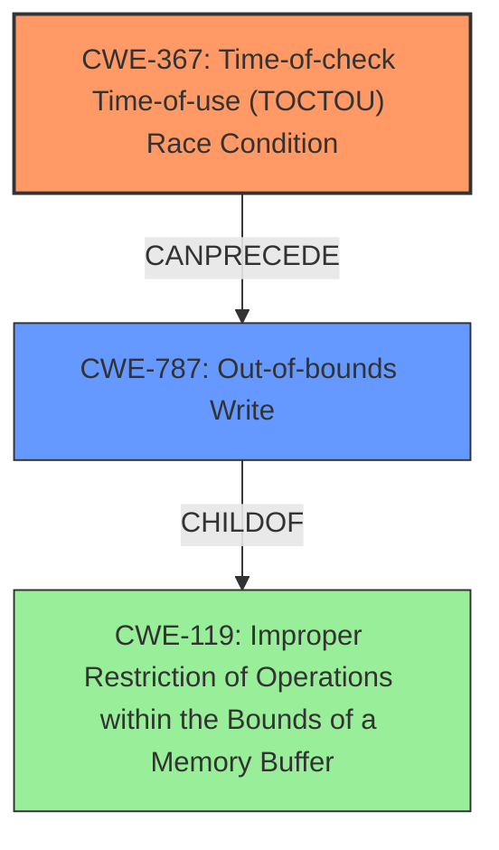

# Final Resolution for CVE-2022-39908

# Summary

| CWE ID  | CWE Name                                              | Confidence | CWE Abstraction Level | CWE Vulnerability Mapping Label | CWE-Vulnerability Mapping Notes                                                                                                                                                                                                                 |
| ------- | ----------------------------------------------------- | ---------- | --------------------- | ------------------------------- | --------------------------------------------------------------------------------------------------------------------------------------------------------------------------------------------------------------------------------------------- |
| CWE-367 | Time-of-check Time-of-use (TOCTOU) Race Condition     | 0.90       | Base                  | Primary                         | Allowed                                                                                                                                                                                                                                       |
| CWE-787 | Out-of-bounds Write                                   | 0.70       | Base                  | Secondary                       | Allowed - TOCTOU Condition allows a local attacker to perform an Out-Of-Bounds Write.                                                                                                                                                     |

## Evidence and Confidence

*   **Confidence Score:** 0.85
*   **Evidence Strength:** MEDIUM

## Relationship Analysis

The analysis focuses on the direct relationship between the **TOCTOU** condition (**CWE-367**) and its resulting impact, an out-of-bounds write (**CWE-787**). The parent-child relationship of **CWE-787** to **CWE-119** (Improper Restriction of Operations within the Bounds of a Memory Buffer) is noted, indicating that the out-of-bounds write is a specific instance of a broader class of memory boundary errors. The choice of **CWE-367** over the more general **CWE-362** (Concurrent Execution using Shared Resource with Improper Synchronization ('Race Condition')) is justified by the explicit mention of "**TOCTOU**" in the vulnerability description, making **CWE-367** a more precise classification. The abstraction levels (Base for both **CWE-367** and **CWE-787**) are appropriate, providing sufficient detail without being overly abstract. The relationship that is most important is the causation, where **CWE-367** leads to **CWE-787**.

## Vulnerability Chain

The vulnerability chain begins with a **TOCTOU** race condition (**CWE-367**). This allows a local attacker to manipulate the system state between the time a check is performed and the time the resource is used. This manipulation leads to an out-of-bounds write (**CWE-787**), which can cause memory corruption and potentially allow for arbitrary code execution.

*   **Root Cause:** **CWE-367** (Time-of-check Time-of-use (TOCTOU) Race Condition)
*   **Weakness:** **CWE-787** (Out-of-bounds Write)
*   **Impact:** Memory corruption, potential arbitrary code execution

## Summary of Analysis

The initial analysis and criticism both correctly identify **CWE-367** as the primary **ROOTCAUSE** due to the explicit mention of "**TOCTOU**" in the vulnerability description: "**TOCTOU** vulnerability in Samsung decoding library...". This provides strong evidence for selecting **CWE-367**. The inclusion of **CWE-787** as a secondary CWE is also justified, as it represents the direct impact of the **TOCTOU** condition. The graph relationships reinforce this by showing that **CWE-787** is a consequence of **CWE-367**. The selection of **CWE-367** and **CWE-787** is at the optimal level of specificity, as they are both Base-level CWEs that accurately reflect the nature of the vulnerability. The decision is based on the provided evidence, relationship analysis, and mapping guidance.