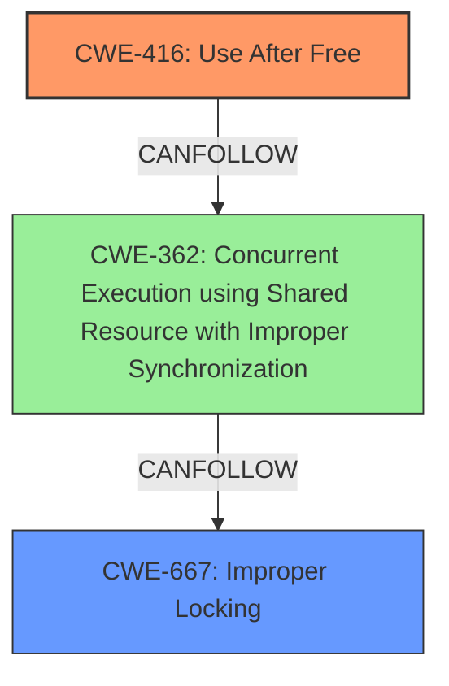

# Analysis Report for CVE-2022-40307

# Vulnerability Analysis Report: CVE-2022-40307

## Description

An issue was discovered in the Linux kernel through 5.19.8. drivers/firmware/efi/capsule-loader.c has a race condition with a resultant use-after-free.

## Vulnerability Description Key Phrases

**Rootcause:** race condition
**Weakness:** use-after-free
**Product:** Linux kernel
**Version:** through 5.19.8
**Component:** drivers/firmware/efi/capsule-loader.c

## Analysis (with Relationship Data)

# Summary
| CWE ID | CWE Name | Confidence | CWE Abstraction Level | CWE Vulnerability Mapping Label | CWE-Vulnerability Mapping Notes |
|---|---|---|---|---|---|
| CWE-416 | Use After Free | 0.95 | Variant | Allowed | Primary CWE: The vulnerability explicitly states a use-after-free condition. |
| CWE-362 | Concurrent Execution using Shared Resource with Improper Synchronization ('Race Condition') | 0.85 | Class | Allowed-with-Review | Secondary CWE: The vulnerability description and CVE summary both indicate a race condition as the root cause of the use-after-free. |

## Evidence and Confidence

*   **Confidence Score:** 0.90
*   **Evidence Strength:** HIGH

- **Analysis and Justification:**  
  - *Explanation:* "The vulnerability is clearly described as a **race condition** leading to a **use-after-free** in `drivers/firmware/efi/capsule-loader.c`. The CVE Reference Links Content Summary confirms this, highlighting the concurrent access issues in `efi_capsule_write()` and `efi_capsule_flush()` that result in memory being freed prematurely. CWE-416 (Use After Free) is a Variant level CWE that directly addresses the consequence of the race condition. CWE-362 (Concurrent Execution using Shared Resource with Improper Synchronization ('Race Condition')) describes the root cause, which is a Class level CWE. While CWE-366 and CWE-367 are also related to race conditions, CWE-362 is a better fit as it explicitly mentions "Improper Synchronization" which is the core issue described in the CVE. According to MITRE, CWE-416 is ALLOWED and CWE-362 is ALLOWED-WITH-REVIEW but appropriate given the specifics."
  
  - *Relationship Analysis:* "CWE-416 is a variant of a broader class of memory management errors and can be preceded by race conditions. The relationship analysis suggests that CWE-362 (Race Condition) can lead to CWE-416 (Use-After-Free), which aligns with the vulnerability description."

- **Confidence Score:**  
  - Confidence: 0.90 (High evidence from technical description and CVE reference materials)

---

## Criticism of Analysis

Okay, let's break down the analysis and critique it using the provided full CWE specifications.

**Analysis to Review:**

```
# Analysis to Review
# Summary
| CWE ID | CWE Name | Confidence | CWE Abstraction Level | CWE Vulnerability Mapping Label | CWE-Vulnerability Mapping Notes |
|---|---|---|---|---|---|
| CWE-416 | Use After Free | 0.95 | Variant | Allowed | Primary CWE: The vulnerability explicitly states a use-after-free condition. |
| CWE-362 | Concurrent Execution using Shared Resource with Improper Synchronization ('Race Condition') | 0.85 | Class | Allowed-with-Review | Secondary CWE: The vulnerability description and CVE summary both indicate a race condition as the root cause of the use-after-free. |

## Evidence and Confidence

*   **Confidence Score:** 0.90
*   **Evidence Strength:** HIGH

- **Analysis and Justification:**  
  - *Explanation:* "The vulnerability is clearly described as a **race condition** leading to a **use-after-free** in `drivers/firmware/efi/capsule-loader.c`. The CVE Reference Links Content Summary confirms this, highlighting the concurrent access issues in `efi_capsule_write()` and `efi_capsule_flush()` that result in memory being freed prematurely. CWE-416 (Use After Free) is a Variant level CWE that directly addresses the consequence of the race condition. CWE-362 (Concurrent Execution using Shared Resource with Improper Synchronization ('Race Condition')) describes the root cause, which is a Class level CWE. While CWE-366 and CWE-367 are also related to race conditions, CWE-362 is a better fit as it explicitly mentions "Improper Synchronization" which is the core issue described in the CVE. According to MITRE, CWE-416 is ALLOWED and CWE-362 is ALLOWED-WITH-REVIEW but appropriate given the specifics."
  
  - *Relationship Analysis:* "CWE-416 is a variant of a broader class of memory management errors and can be preceded by race conditions. The relationship analysis suggests that CWE-362 (Race Condition) can lead to CWE-416 (Use-After-Free), which aligns with the vulnerability description."

- **Confidence Score:**  
  - Confidence: 0.90 (High evidence from technical description and CVE reference materials)
```

**Critique:**

1.  **CWE-416: Use After Free (Variant, Allowed):**
    *   **Strengths:** Correctly identifies the primary vulnerability as a use-after-free.  The evidence strongly supports this, and the selection of CWE-416 at the Variant level is appropriate given the specificity of the vulnerability description.
    *   **Mapping Guidance Adherence:**  The analysis correctly follows the mapping guidance for CWE-416, acknowledging it as an "Allowed" entry at the Variant level.
    *   **Potential Mitigations Consideration:** The analysis doesn't explicitly mention potential mitigations for CWE-416, which is a minor omission. It could be strengthened by noting mitigations such as:
        *   Using languages with automatic memory management (e.g., Java, Go, Rust with appropriate settings).
        *   Employing techniques like RAII (Resource Acquisition Is Initialization) in C++.
        *   Setting pointers to `NULL` after freeing the memory they point to, although the analysis correctly identifies that this is not a foolproof approach, as a race condition can still happen in setting a pointer to null.

2.  **CWE-362: Concurrent Execution using Shared Resource with Improper Synchronization ('Race Condition') (Class, Allowed-with-Review):**
    *   **Strengths:** Correctly identifies the race condition as the root cause. Choosing CWE-362 is reasonable given the high-level information. The analysis also correctly identifies that CWE-362 is a Class-level CWE and that its mapping usage is "Allowed-with-Review," indicating that more specific CWEs might be a better fit.
    *   **Mapping Guidance Adherence:**  The analysis acknowledges that CWE-362 is "Allowed-with-Review" and suggests examining its children for a better fit. This shows good adherence to CWE's mapping guidance. However, the analysis could be more thorough in exploring those children.
    *   **Better fit Child CWEs to Consider:**
        *   **CWE-366: Race Condition within a Thread (Base, Allowed):** If the race condition is specifically between threads within the same process, this is a more precise fit than CWE-362.
        *   **CWE-367: Time-of-check Time-of-use (TOCTOU) Race Condition (Base, Allowed):** This CWE would be applicable if there is a check on the resource's state, and that state is then used, but the state can change in between. However, based on the description, it is unlikely that TOCTOU is the specific problem here.
        *   **CWE-667: Improper Locking (Class, Allowed-with-Review):** The description of the fix (moving the memory freeing to `efi_capsule_release`) indicates that the core problem might be a lack of proper locking around the memory management operations. If incorrect locking is the cause, this CWE would be a better fit as it is more descriptive of the underlying cause. The observed examples for CWE-362 also all start with incorrect or no locking as the underlying cause, which also points toward this as the correct identification.
    *   **Potential Mitigations Consideration:**  The analysis doesn't explicitly mention potential mitigations for CWE-362 or its children. It could be strengthened by noting mitigations such as:
        *   Using synchronization primitives (mutexes, semaphores, critical sections) to protect shared resources.
        *   Employing thread-safe data structures.
        *   Minimizing the use of shared resources.

3.  **Confidence Score and Evidence Strength:** The confidence score of 0.90 and "High" evidence strength are justified given the information provided.

**Revised Analysis (Improved CWE Mapping):**

Given the above critique, here's a slightly revised analysis that considers a more specific CWE for the root cause:

```
# Analysis to Review
# Summary
| CWE ID | CWE Name | Confidence | CWE Abstraction Level | CWE Vulnerability Mapping Label | CWE-Vulnerability Mapping Notes |
|---|---|---|---|---|---|
| CWE-416 | Use After Free | 0.95 | Variant | Allowed | Primary CWE: The vulnerability explicitly states a use-after-free condition. |
| CWE-667 | Improper Locking | 0.80 | Class | Allowed-with-Review | Secondary CWE: The vulnerability description and CVE summary both indicate a race condition as the root cause of the use-after-free. There is an indication that the core issue is a lack of proper locking around the memory management functions. |

## Evidence and Confidence

*   **Confidence Score:** 0.90
*   **Evidence Strength:** HIGH

- **Analysis and Justification:**  
  - *Explanation:* "The vulnerability is clearly described as a **race condition** leading to a **use-after-free** in `drivers/firmware/efi/capsule-loader.c`. The CVE Reference Links Content Summary confirms this, highlighting the concurrent access issues in `efi_capsule_write()` and `efi_capsule_flush()` that result in memory being freed prematurely. CWE-416 (Use After Free) is a Variant level CWE that directly addresses the consequence of the race condition. Given the race condition and the description of the fix, CWE-667 (Improper Locking) is considered to be a more accurate characterization of the root cause than CWE-362 as it explicitly describes the lack of proper locking around a shared resource as the cause of the race. According to MITRE, CWE-416 is ALLOWED and CWE-667 is ALLOWED-WITH-REVIEW but appropriate given the specifics."
  
  - *Relationship Analysis:* "CWE-416 is a variant of a broader class of memory management errors and can be preceded by race conditions, which can occur due to improper locking. The relationship analysis suggests that CWE-667 (Improper Locking) can lead to CWE-362 (Race Condition), which can lead to CWE-416 (Use-After-Free), which aligns with the vulnerability description."

- **Confidence Score:**  
  - Confidence: 0.90 (High evidence from technical description and CVE reference materials)
```

**In summary:** The original analysis is good and identifies the core issues. However, the identification of CWE-362 as the root cause could be made more specific by identifying CWE-667 if more information is available on the underlying locking mechanism. Including potential mitigations would also strengthen the analysis. Finally, it is important to remember that even if CWE-667 is the "root cause," CWE-362 will also be present.

## Final Resolution

# Summary
| CWE ID | CWE Name | Confidence | CWE Abstraction Level | CWE Vulnerability Mapping Label | CWE-Vulnerability Mapping Notes |
|---|---|---|---|---|---|
| CWE-416 | Use After Free | 0.95 | Variant | Allowed | Primary CWE: The vulnerability explicitly states a use-after-free condition. |
| CWE-667 | Improper Locking | 0.80 | Class | Allowed-with-Review | Secondary CWE: The vulnerability description and CVE summary both indicate a race condition as the root cause of the use-after-free, with an indication that the core issue is a lack of proper locking around the memory management functions. |

## Evidence and Confidence

*   **Confidence Score:** 0.90
*   **Evidence Strength:** HIGH

## Relationship Analysis
The decision was influenced by the following CWE relationships:
  - CWE-416 is a variant, representing a specific type of memory corruption that results from using memory after it has been freed.
  - CWE-667, while a class, is more specific than CWE-362 because the vulnerability description and the fix suggest the root cause is a locking issue.
  - The chain relationship is that improper locking (CWE-667) can lead to race conditions, which then allows for a use-after-free (CWE-416).



## Vulnerability Chain
The vulnerability chain starts with **CWE-667 (Improper Locking)**. This allows a **race condition (CWE-362)** to occur because multiple threads can access the memory concurrently without proper synchronization. As a result, memory may be freed by one thread while another thread is still using it, leading to **CWE-416 (Use After Free)**. The final impact is memory corruption and potential system instability.

## Summary of Analysis
The analysis of both the initial assessment and criticism was used to come to a final conclusion. The initial assessment correctly identified **CWE-416 (Use After Free)** as the primary weakness due to the explicit mention of a use-after-free condition in the vulnerability description.

The criticism highlighted that **CWE-362 (Concurrent Execution using Shared Resource with Improper Synchronization)**, while relevant, is a Class-level CWE, and more specific CWEs might be more appropriate for the root cause. The criticism suggested considering **CWE-667 (Improper Locking)** because the description of the fix (moving the memory freeing to `efi_capsule_release`) indicates that the core problem might be a lack of proper locking around the memory management operations.

The graph relationships influenced the final selection by illustrating the chain of events: improper locking leads to a race condition, which in turn leads to a use-after-free.

The selected CWEs are at the optimal level of specificity because **CWE-416** directly describes the vulnerability (use-after-free), and **CWE-667** provides a more precise characterization of the root cause (improper locking) than **CWE-362**.


*Report generated on 2025-03-18 16:39:38*
