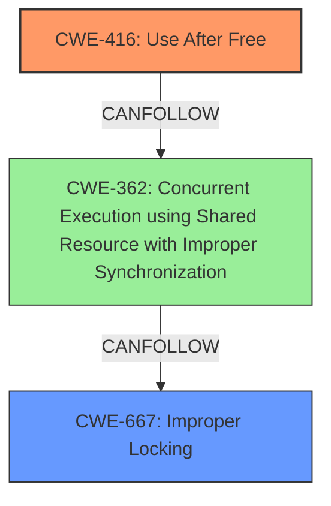

# Final Resolution for CVE-2022-40307

# Summary
| CWE ID | CWE Name | Confidence | CWE Abstraction Level | CWE Vulnerability Mapping Label | CWE-Vulnerability Mapping Notes |
|---|---|---|---|---|---|
| CWE-416 | Use After Free | 0.95 | Variant | Allowed | Primary CWE: The vulnerability explicitly states a use-after-free condition. |
| CWE-667 | Improper Locking | 0.80 | Class | Allowed-with-Review | Secondary CWE: The vulnerability description and CVE summary both indicate a race condition as the root cause of the use-after-free, with an indication that the core issue is a lack of proper locking around the memory management functions. |

## Evidence and Confidence

*   **Confidence Score:** 0.90
*   **Evidence Strength:** HIGH

## Relationship Analysis
The decision was influenced by the following CWE relationships:
  - CWE-416 is a variant, representing a specific type of memory corruption that results from using memory after it has been freed.
  - CWE-667, while a class, is more specific than CWE-362 because the vulnerability description and the fix suggest the root cause is a locking issue.
  - The chain relationship is that improper locking (CWE-667) can lead to race conditions, which then allows for a use-after-free (CWE-416).

## Vulnerability Chain
The vulnerability chain starts with **CWE-667 (Improper Locking)**. This allows a **race condition (CWE-362)** to occur because multiple threads can access the memory concurrently without proper synchronization. As a result, memory may be freed by one thread while another thread is still using it, leading to **CWE-416 (Use After Free)**. The final impact is memory corruption and potential system instability.

## Summary of Analysis
The analysis of both the initial assessment and criticism was used to come to a final conclusion. The initial assessment correctly identified **CWE-416 (Use After Free)** as the primary weakness due to the explicit mention of a use-after-free condition in the vulnerability description.

The criticism highlighted that **CWE-362 (Concurrent Execution using Shared Resource with Improper Synchronization)**, while relevant, is a Class-level CWE, and more specific CWEs might be more appropriate for the root cause. The criticism suggested considering **CWE-667 (Improper Locking)** because the description of the fix (moving the memory freeing to `efi_capsule_release`) indicates that the core problem might be a lack of proper locking around the memory management operations.

The graph relationships influenced the final selection by illustrating the chain of events: improper locking leads to a race condition, which in turn leads to a use-after-free.

The selected CWEs are at the optimal level of specificity because **CWE-416** directly describes the vulnerability (use-after-free), and **CWE-667** provides a more precise characterization of the root cause (improper locking) than **CWE-362**.