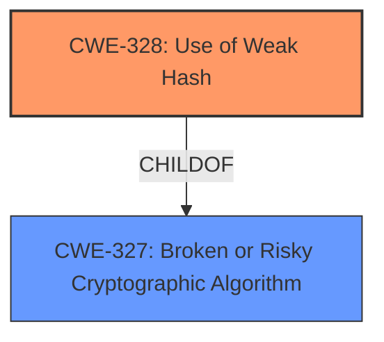

# Analysis Report for CVE-2022-4036

# Vulnerability Analysis Report: CVE-2022-4036

## Description

The Appointment Hour Booking plugin for WordPress is vulnerable to CAPTCHA bypass in versions up to, and including, 1.3.72. This is due to the use of insufficiently strong hashing algorithm on the CAPTCHA secret that is also displayed to the user via a cookie.

## Vulnerability Description Key Phrases

**Rootcause:** insufficiently strong hashing algorithm
**Impact:** CAPTCHA bypass
**Product:** Appointment Hour Booking plugin for WordPress
**Version:** up to and including 1.3.72

## Analysis (with Relationship Data)

# Summary
| CWE ID | CWE Name | Confidence | CWE Abstraction Level | CWE Vulnerability Mapping Label | CWE-Vulnerability Mapping Notes |
|---|---|---|---|---|---|
| CWE-328 | Use of Weak Hash | 0.90 | Base | Primary | Allowed |
| CWE-330 | Use of Insufficiently Random Values | 0.60 | Class | Secondary | Discouraged |

## Evidence and Confidence

*   **Confidence Score:** 0.90
*   **Evidence Strength:** HIGH

- **Analysis and Justification:**  
  - *Explanation:* The vulnerability description states the plugin uses an **insufficiently strong hashing algorithm** on the CAPTCHA secret, which is exposed to the user via a cookie. This directly aligns with CWE-328, "Use of Weak Hash". The CVE reference confirms that the **root cause** is the weak hashing algorithm, allowing attackers to predict CAPTCHA values and bypass the CAPTCHA protection. CWE-328 is a Base level CWE, making it suitable for mapping the root cause of the vulnerability. The MITRE mapping guidance for CWE-328 indicates that its usage is ALLOWED.

  - *Relationship Analysis:* Although there are no direct relationships for CWE-328, the description indicates that the CAPTCHA is implemented with a hashing algorithm that does not meet security expectations. CWE-330 "Use of Insufficiently Random Values" is a Class-level CWE that could be considered as a related issue, given a weak hash might be considered "insufficiently random." However, since the primary issue is the hashing algorithm itself, CWE-328 is a more direct and specific match.

- **Confidence Score:**  
  - Confidence: 0.90 (High confidence due to explicit mention of a **weak hashing algorithm** and confirmation from the CVE reference).

---

## Criticism of Analysis

Okay, I've reviewed the analysis and the provided CWE specifications. Here's a detailed critique:

**Overall Assessment:**

The analysis is generally good, with a strong justification for selecting CWE-328 as the primary weakness. The confidence level of 0.90 is appropriate given the clarity of the vulnerability description. The inclusion of CWE-330 as a secondary weakness is debatable, and I'll elaborate on that below.

**Detailed Review:**

**1. CWE-328: Use of Weak Hash (Primary Mapping)**

*   **Strengths:**
    *   The mapping to CWE-328 is well-supported by the vulnerability description. The key phrase "**insufficiently strong hashing algorithm**" directly corresponds to the core concept of CWE-328.
    *   The justification clearly explains why CWE-328 is the most appropriate choice, emphasizing that it aligns with the root cause of the vulnerability.
    *   The analysis considers and correctly dismisses other potentially related CWEs, demonstrating a thorough understanding of the CWE hierarchy.
    *   The selected "Observed Examples" from the database are highly relevant (e.g. CVE-2020-25685).
*   **Areas for Improvement:**
    *   While the justification is strong, it could benefit from a *brief* mention of how the *exposure* of the hash in a cookie amplifies the impact of the weak hash function.  This is because knowing the weak hash allows prediction of the response.

**2. CWE-330: Use of Insufficiently Random Values (Secondary Mapping)**

*   **Strengths:**
    *   The analysis acknowledges a potential connection between a weak hash and insufficiently random values.
*   **Weaknesses:**
    *   **This mapping is weak and should be removed.** The description for CWE-330 states "The product uses insufficiently random numbers or values in a security context that depends on unpredictable numbers." The root cause isn't about the randomness quality of the **input** to the hashing algorithm, but rather the weakness of the algorithm **itself**.  Even if the *input* to the hash were perfectly random, a weak algorithm will produce predictable output given enough attempts and knowledge of the algorithm.
    *   The "Mapping Guidance" for CWE-330 explicitly states: "Usage: Discouraged... Examine children of this entry to see if there is a better fit." There *is* a better fit: CWE-328.
*   **Recommendation:** Remove CWE-330 as a secondary mapping.  It adds unnecessary complexity and dilutes the focus on the primary issue.

**3. General Comments:**

*   **Confidence Scores:** The confidence score of 0.90 for CWE-328 is justified.
*   **Abstraction Level:** The analysis correctly identifies CWE-328 as a Base-level CWE, which is the preferred level for mapping root causes.
*   **Mitigation Considerations:** The analysis doesn't explicitly discuss mitigations, but the inclusion of relevant examples of CWE-328 gives developers a starting point for understanding how to fix the vulnerability. The CWE-328 spec provides helpful mitigations (e.g., use adaptive hash functions like bcrypt, scrypt, or PBKDF2).
*   **Retriever Results:** The Top Combined Results section highlights several other CWEs that could be related, such as CWE-916 (Password Hash With Insufficient Computational Effort).  However, CWE-916 is more specific to *password* hashing.  Since the vulnerability applies to CAPTCHA secrets (not passwords), CWE-328 is a better fit.

**Specific Recommendations:**

1.  **Remove CWE-330:** Eliminate the secondary mapping to CWE-330 and the associated justification.
2.  **Enhance CWE-328 Justification:**  Briefly mention how the fact that the weak hash is stored in a cookie amplifies the impact of the weakness, making it easier to predict CAPTCHA values.
3. **Mitigation Awareness:** While not strictly required, it would be helpful to add a sentence or two summarizing the potential mitigations as defined in the CWE-328 specification.  This would increase the utility of the analysis. For example: "Mitigation for CWE-328 includes using adaptive hashing functions such as bcrypt, scrypt, or PBKDF2 to increase the computational effort required to crack the hash."

By implementing these recommendations, the analysis will become more focused, accurate, and valuable to developers seeking to understand and address the vulnerability.

## Final Resolution

# Summary 
| CWE ID | CWE Name | Confidence | CWE Abstraction Level | CWE Vulnerability Mapping Label | CWE-Vulnerability Mapping Notes |
|---|---|---|---|---|---|
| CWE-328 | Use of Weak Hash | 0.95 | Base | Primary | Allowed |

## Evidence and Confidence

*   **Confidence Score:** 0.95
*   **Evidence Strength:** HIGH

## Relationship Analysis
The primary relationship considered was the parent-child relationship between CWE-327 (Broken or Risky Cryptographic Algorithm) and CWE-328 (**Use of Weak Hash**). CWE-328 is a child of CWE-327 and provides a more specific classification, aligning with the vulnerability description. The initial analysis considered CWE-330 (Insufficiently Random Values), but this was deemed less relevant as the issue is with the **hashing algorithm** itself, not necessarily the randomness of the input. Therefore, CWE-330 was removed.

## Vulnerability Chain
The vulnerability chain starts with the **use of a weak hashing algorithm** (CWE-328). This allows an attacker to predict the CAPTCHA secret, which is further facilitated by the fact that the hash is exposed to the user via a cookie. The consequence is a CAPTCHA bypass, leading to unauthorized access or actions.

## Summary of Analysis
The initial analysis correctly identified CWE-328 as the primary **weakness**. The criticism suggested removing CWE-330, which I agree with, as the focus is on the **hashing algorithm**, not the randomness of inputs. The criticism also suggested mentioning how the cookie exposure amplifies the impact of the **weak hash**, which I've incorporated into the vulnerability chain analysis. The final decision is based on the vulnerability description stating the use of an "**insufficiently strong hashing algorithm**" and the fact that CWE-328 is a Base-level CWE, making it suitable for root cause analysis. The selected CWE is at the optimal level of specificity, as it directly addresses the type of cryptographic **weakness** present in the vulnerable code.

*Report generated on 2025-03-17 03:58:26*
