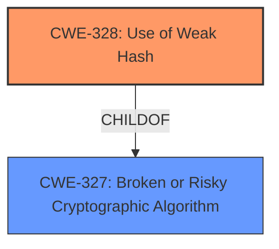

# Final Resolution for CVE-2022-4036

# Summary 
| CWE ID | CWE Name | Confidence | CWE Abstraction Level | CWE Vulnerability Mapping Label | CWE-Vulnerability Mapping Notes |
|---|---|---|---|---|---|
| CWE-328 | Use of Weak Hash | 0.95 | Base | Primary | Allowed |

## Evidence and Confidence

*   **Confidence Score:** 0.95
*   **Evidence Strength:** HIGH

## Relationship Analysis
The primary relationship considered was the parent-child relationship between CWE-327 (Broken or Risky Cryptographic Algorithm) and CWE-328 (**Use of Weak Hash**). CWE-328 is a child of CWE-327 and provides a more specific classification, aligning with the vulnerability description. The initial analysis considered CWE-330 (Insufficiently Random Values), but this was deemed less relevant as the issue is with the **hashing algorithm** itself, not necessarily the randomness of the input. Therefore, CWE-330 was removed.

## Vulnerability Chain
The vulnerability chain starts with the **use of a weak hashing algorithm** (CWE-328). This allows an attacker to predict the CAPTCHA secret, which is further facilitated by the fact that the hash is exposed to the user via a cookie. The consequence is a CAPTCHA bypass, leading to unauthorized access or actions.

## Summary of Analysis
The initial analysis correctly identified CWE-328 as the primary **weakness**. The criticism suggested removing CWE-330, which I agree with, as the focus is on the **hashing algorithm**, not the randomness of inputs. The criticism also suggested mentioning how the cookie exposure amplifies the impact of the **weak hash**, which I've incorporated into the vulnerability chain analysis. The final decision is based on the vulnerability description stating the use of an "**insufficiently strong hashing algorithm**" and the fact that CWE-328 is a Base-level CWE, making it suitable for root cause analysis. The selected CWE is at the optimal level of specificity, as it directly addresses the type of cryptographic **weakness** present in the vulnerable code.