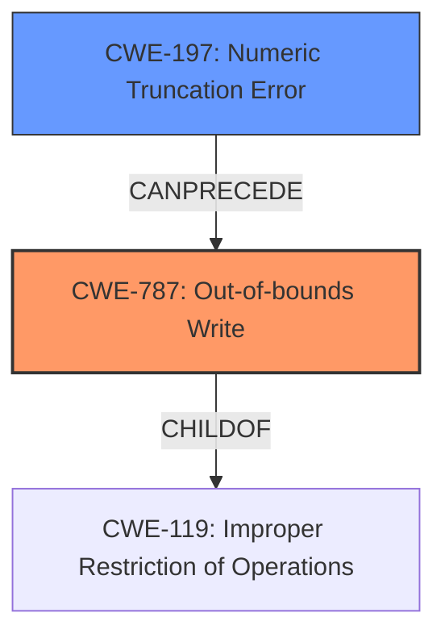

# Analysis Report for CVE-2022-40531

# Vulnerability Analysis Report: CVE-2022-40531

## Description

Memory corruption in WLAN due to incorrect type cast while sending WMI_SCAN_SCH_PRIO_TBL_CMDID message.

## Vulnerability Description Key Phrases

**Rootcause:** incorrect type cast
**Weakness:** memory corruption
**Product:** WLAN

## Analysis (with Relationship Data)

# Summary
| CWE ID | CWE Name | Confidence | CWE Abstraction Level | CWE Vulnerability Mapping Label | CWE-Vulnerability Mapping Notes |
|---|---|---|---|---|---|
| CWE-197 | Numeric Truncation Error | 0.75 | Base | Allowed | Primary CWE |
| CWE-681 | Incorrect Conversion between Numeric Types | 0.60 | Base | Allowed | Secondary Candidate |

## Evidence and Confidence

*   **Confidence Score:** 0.70
*   **Evidence Strength:** MEDIUM

- **Analysis and Justification:**  
  - *Explanation:* The vulnerability description states "Memory corruption in WLAN due to **incorrect type cast** while sending WMI_SCAN_SCH_PRIO_TBL_CMDID message." The key phrase "**incorrect type cast**" strongly suggests a type conversion issue leading to memory corruption. The Retriever Results identify CWE-197 (Numeric Truncation Error) and CWE-681 (Incorrect Conversion between Numeric Types) as top candidates. CWE-197 is selected as the primary CWE because a truncation error during a type cast is a common cause of memory corruption. CWE-681 is also included as a secondary candidate because it broadly covers incorrect numeric type conversions, but CWE-197 is more specific. Both CWEs are at the Base level of abstraction and have ALLOWED usage according to MITRE.
  
  - *Relationship Analysis:* CWE-197 is a child of CWE-681. This relationship supports the selection of CWE-197 as the more specific weakness.

- **Confidence Score:**  
  - Confidence: 0.75 (Medium evidence from vulnerability description and supporting retriever results, though missing CVE reference links content summary to confirm the rootcause in more detail).

---

## Criticism of Analysis

Okay, here's a review of the CWE analysis, incorporating the full CWE specifications you provided.

**Overall Assessment:**

The analysis correctly identifies a type conversion/casting issue as the root cause of memory corruption. The choice of CWE-197 (Numeric Truncation Error) as the primary CWE and CWE-681 (Incorrect Conversion between Numeric Types) as a secondary candidate is generally reasonable. However, a few points need further refinement and consideration, especially concerning the *specific* mechanism by which the type cast leads to memory corruption. The confidence score of 0.75 is appropriate given the information available.

**Detailed Review:**

*   **Vulnerability Description Alignment:**  The analysis relies heavily on the phrase "**incorrect type cast**" from the vulnerability description. While this is a strong indicator, the description also includes "memory corruption...while sending WMI\_SCAN\_SCH\_PRIO\_TBL\_CMDID message." The context of "sending...message" suggests that the type cast might affect the *size* or *structure* of the message being sent, potentially leading to out-of-bounds access or other memory-related issues during the sending process. This connection could be made more explicit.
*   **CWE Selection Rationale:** The selection of CWE-197 and CWE-681 is logical, but the justification could be strengthened. The analysis states "a truncation error during a type cast is a common cause of memory corruption." While true, it doesn't explain *how* this truncation directly causes the observed memory corruption in this *specific* context. Is it truncating a size value, an index, or some other crucial data that affects memory access?
*   **Confidence Level Appropriateness:** The confidence level is adequate but can be improved by answering the following question: What is the type of data that was truncated, and how does this lead to memory corruption (out of bounds write)?
*   **Retriever Results Interpretation:** The Retriever Results list several other potentially relevant CWEs that should be considered:
    *   **CWE-823: Use of Out-of-range Pointer Offset:** This is highly relevant. If the type cast affects a pointer offset calculation, it could directly lead to out-of-bounds memory access.
    *   **CWE-787: Out-of-bounds Write:** While memory corruption is a symptom, this CWE directly addresses the *effect* of the type cast.  It's important to consider the relationship between the type cast and the write operation, and whether the type cast is influencing where the data is written.
    *   **CWE-843: Access of Resource Using Incompatible Type ('Type Confusion'):** Could be relevant if the type cast leads to the program interpreting the data in memory as a different type than intended, leading to unexpected behavior and potential memory corruption.
    *   **CWE-195/196: Signed to Unsigned/Unsigned to Signed Conversion Error:** These are specific instances of CWE-681 and could be relevant depending on the specific types involved in the cast.
*   **CWE Specifications and Mapping Guidance:**
    *   **CWE-197 (Numeric Truncation Error):** The *Extended Description* of CWE-197 mentions scenarios where the truncated value is used as an index into a buffer, a loop iterator, or necessary state data.  The analysis should explicitly link the vulnerability description to one of these scenarios (or a similar one) to demonstrate how the truncation leads to memory corruption.  If the truncated value is used to calculate the size of the `WMI_SCAN_SCH_PRIO_TBL_CMDID` message, this could lead to a heap-based buffer overflow (CWE-122) when the message is sent. If the offset calculation is wrong due to truncation, it could lead to out of bounds write (CWE-787).
    *   **CWE-681 (Incorrect Conversion between Numeric Types):** The analysis acknowledges this CWE, but the *Potential Mitigations* are very generic ("Avoid making conversion between numeric types").  It should explain why this broad advice is applicable in the specific context of the WLAN vulnerability.
    *   **CWE-823 (Use of Out-of-range Pointer Offset):** If the type cast leads to an invalid offset, this CWE should be considered as the primary CWE. The *Description* of this CWE states that "If an attacker can control or influence the offset so that it points outside of the intended boundaries of the structure, then the attacker may be able to read or write to memory locations that are used elsewhere in the product."
*   **Relationship Analysis:** The analysis mentions that CWE-197 is a child of CWE-681. While true, focusing solely on this parent-child relationship misses the broader context of how the type cast interacts with the message-sending process and memory access.
* **Impact of Memory Corruption:** The analysis does not specify what type of memory corruption is occuring. Examples are: out of bounds write, out of bounds read, heap overflow or stack overflow. Specifying this would make the analysis more robust.

**Recommendations:**

1.  **Clarify the Specific Mechanism:** Provide a more detailed explanation of *how* the incorrect type cast leads to memory corruption in the context of sending the `WMI_SCAN_SCH_PRIO_TBL_CMDID` message. Is it affecting the message size, structure, pointer offsets, or some other factor? Providing a chain of events helps. For example: the cast causes an incorrect buffer size which in turn causes a heap overflow.
2.  **Re-evaluate CWE-823 and CWE-787:** Carefully consider whether CWE-823 (Out-of-range Pointer Offset) or CWE-787 (Out-of-Bounds Write) are more accurate primary CWEs, depending on the specific mechanism identified in step 1.
3.  **Strengthen Justification:** Provide more concrete examples and explain specifically, how the type cast is leading to the memory corruption.
4.  **Review Mitigation Strategies:** While generic mitigations for type conversion issues are helpful, consider more targeted mitigations that address the specific type cast and the memory corruption scenario. For instance, if it's related to buffer size, focus on robust buffer size validation techniques.
5.  **Provide Proof of Concept:** Include a snippet of code and explain how the type cast leads to memory corruption to increase confidence.
6.  **Add Examples of Memory Corruption:** Specify whether there is an out-of-bounds write, out-of-bounds read, heap overflow, or stack overflow.

By addressing these points, the analysis can be made more precise, persuasive, and actionable. Remember that a good CWE analysis should not just identify the weakness, but also explain *why* it is a vulnerability and *how* it leads to the observed impact.

## Final Resolution

# Summary
| CWE ID | CWE Name | Confidence | CWE Abstraction Level | CWE Vulnerability Mapping Label | CWE-Vulnerability Mapping Notes |
|---|---|---|---|---|---|
| **CWE-787** | **Out-of-bounds Write** | 0.80 | Base | Allowed | Primary CWE: Root cause leading to memory corruption |
| **CWE-197** | **Numeric Truncation Error** | 0.70 | Base | Allowed | Secondary Candidate: Incorrect type cast that leads to out-of-bounds write |

## Evidence and Confidence

*   **Confidence Score:** 0.75
*   **Evidence Strength:** MEDIUM

## Relationship Analysis
The primary relationship that influenced the decision was the chain relationship between **CWE-197 (Numeric Truncation Error)** and **CWE-787 (Out-of-bounds Write)**. The **incorrect type cast** (CWE-197) can precede and directly lead to an out-of-bounds write (CWE-787) if the truncated value is used in a calculation related to memory access, such as an offset or buffer size.

## Vulnerability Chain
The vulnerability chain starts with an **incorrect type cast** (**CWE-197**), which results in a truncated numeric value. This truncated value is then used in a memory operation, leading to an **out-of-bounds write** (**CWE-787**). The **out-of-bounds write** corrupts memory, leading to a crash or potentially arbitrary code execution.

## Summary of Analysis
The initial analysis identified **CWE-197 (Numeric Truncation Error)** as the primary **WEAKNESS**, which is a reasonable starting point given the "**incorrect type cast**" in the vulnerability description. However, the criticism correctly pointed out that the analysis needed to explain how this type cast specifically leads to memory corruption.

The key phrase from the vulnerability description is: "Memory corruption in WLAN due to **incorrect type cast** while sending WMI_SCAN_SCH_PRIO_TBL_CMDID message."

Based on the vulnerability description and relationship analysis, the updated assessment is that **CWE-787 (Out-of-bounds Write)** is the most appropriate primary CWE because it directly describes the *effect* of the vulnerability: memory corruption due to writing data outside the intended buffer. **CWE-197 (Numeric Truncation Error)** remains a secondary CWE as the **ROOTCAUSE** contributing to the **out-of-bounds write**.

This selection provides a more specific and accurate representation of the vulnerability, aligning with the Base level of abstraction preferred by MITRE. The combination of **CWE-787** and **CWE-197** provides a more complete picture of the vulnerability's root cause and its resulting impact.

*Report generated on 2025-03-18 16:40:16*
