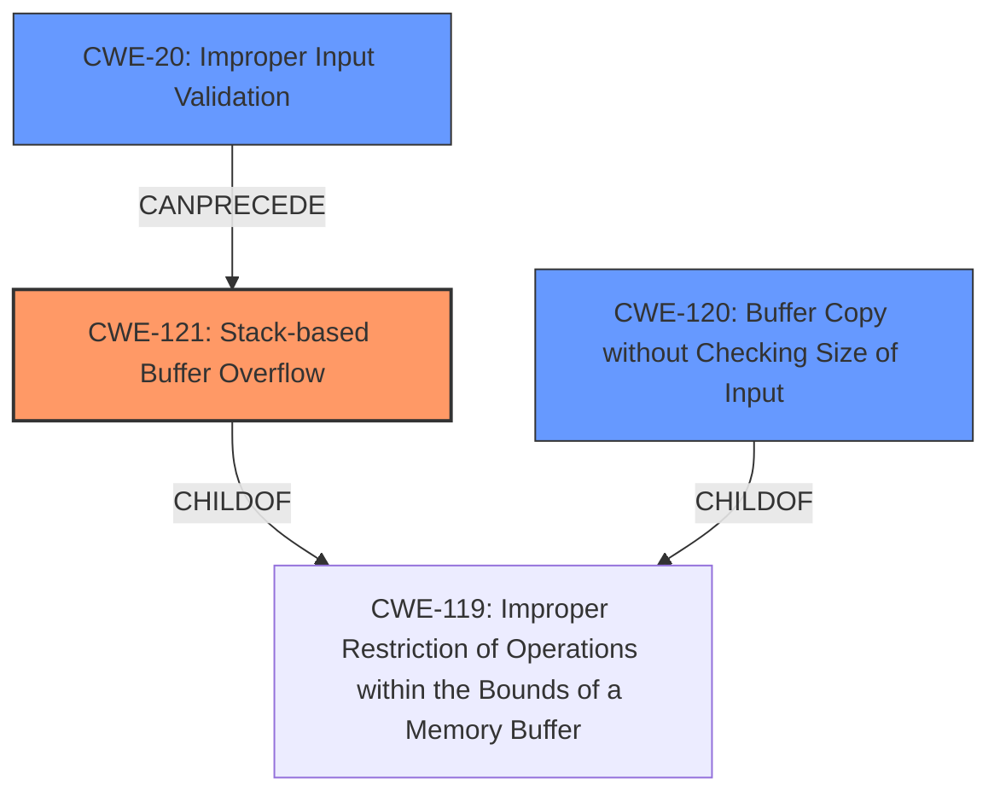

# Final Resolution for CVE-2022-40985

# Summary
| CWE ID  | CWE Name  | Confidence | CWE Abstraction Level | CWE Vulnerability Mapping Label | CWE-Vulnerability Mapping Notes |
|--------------|-------------------------------------------------------------------------|------------|-----------------------|------------------------------------|---------------------------------------------------------------------------------------------|
| CWE-121 | Stack-based Buffer Overflow | 0.95 | Variant | Allowed | Primary CWE |
| CWE-20  | Improper Input Validation | 0.75 | Class | Discouraged | Secondary Candidate |
| CWE-120 | Buffer Copy without Checking Size of Input ('Classic Buffer Overflow') | 0.60 | Base | Allowed-with-Review | Secondary Candidate |

## Evidence and Confidence

*   **Confidence Score:** 0.90
*   **Evidence Strength:** HIGH

## Relationship Analysis
The primary weakness is a stack-based buffer overflow (**CWE-121**), which is a variant of the more general **CWE-119**. The overflow occurs because the input isn't validated (**CWE-20**) before being copied into a stack buffer, often using functions like `sprintf` that don't perform bounds checking. **CWE-120** represents the classic buffer overflow scenario, but **CWE-121** is more specific because the buffer is on the stack. **CWE-20** can precede **CWE-121** as the lack of input validation leads to the overflow.

## Vulnerability Chain
The vulnerability chain starts with **CWE-20** (Improper Input Validation), where the application fails to validate the size of the input. This leads to **CWE-121** (Stack-based Buffer Overflow) when the overly large, unvalidated input is copied into a fixed-size stack buffer using a function like `sprintf`. This out-of-bounds write overwrites adjacent stack memory, potentially leading to arbitrary code execution. **CWE-120** is a more generalized version of a buffer overflow.

## Summary of Analysis
The initial analysis correctly identified **CWE-121** as the primary **WEAKNESS**. The criticism pointed out the potential for a vulnerability chain starting with **CWE-20**, which is a valid observation. The vulnerability description states, "A specially-crafted network packet can lead to arbitrary command execution...This buffer overflow is in the function that manages the (ddns1|ddns2) hostname WORD command template." This implies that the size of the `WORD` parameter isn't validated, causing the **STACK-BASED BUFFER OVERFLOW**. Therefore, adding **CWE-20** to the chain is appropriate because the lack of input validation is a key contributing factor. I am also including **CWE-120** because it is closely related and mentioned in the initial analysis.

*   **CWE-121** is the most specific **ROOTCAUSE** because the vulnerability is explicitly described as a "stack-based buffer overflow."
*   **CWE-20** is added because the vulnerability occurs due to the lack of input validation on the size of the `WORD` parameter. While **CWE-20** is a Class-level CWE and is generally discouraged, in this case it accurately reflects a contributing factor to the vulnerability.
*   **CWE-120** is included because it is a more general form of buffer overflow.
I am including **CWE-120** with a lower confidence because it is related to the vulnerability, and was mentioned in the original analysis.
*   The graph relationships influenced my selection by highlighting the chain from input validation to buffer overflow.
*   The selected CWEs are at the optimal level of specificity because **CWE-121** accurately describes the type of buffer overflow, and **CWE-20** accounts for the lack of input validation as the **ROOTCAUSE**.