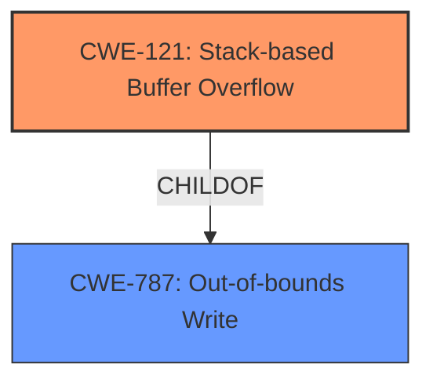

# Final Resolution for CVE-2022-40986

# Summary
| CWE ID | CWE Name | Confidence | CWE Abstraction Level | CWE Vulnerability Mapping Label | CWE-Vulnerability Mapping Notes |
|---|---|---|---|---|---|
| CWE-121 | Stack-based Buffer Overflow | 0.95 | Variant | Primary | Allowed |
| CWE-787 | Out-of-bounds Write | 0.60 | Base | Secondary | Allowed |

## Evidence and Confidence

*   **Confidence Score:** 0.93
*   **Evidence Strength:** HIGH

## Relationship Analysis
The primary weakness is CWE-121 **(Stack-based Buffer Overflow)**, which is a variant of the more general CWE-787 **(Out-of-bounds Write)**. This hierarchical relationship influenced the decision to choose CWE-121 as the primary classification due to its specificity regarding the location of the buffer on the stack. CWE-787 is chosen as a secondary weakness because it describes the fundamental issue of writing beyond the allocated buffer's boundaries. There is no direct relationship to chain vulnerabilities. The abstraction levels (Variant for CWE-121 and Base for CWE-787) are appropriate as they provide different levels of detail.

## Vulnerability Chain
The vulnerability chain starts with the **ROOTCAUSE** being the lack of input validation for the `WORD` parameter (`argv[1]`) in the `(ddns1|ddns2) mx WORD` command. This leads to CWE-121 **(Stack-based Buffer Overflow)** due to the use of `sprintf` to copy the unvalidated input into a fixed-size stack buffer (`buff_0x200`) without proper bounds checking. The **WEAKNESS** of writing beyond the allocated buffer's boundaries, which is CWE-787 **(Out-of-bounds Write)**, results in arbitrary command execution as an attacker can overwrite adjacent stack memory, potentially including return addresses or other critical data.

## Summary of Analysis
The initial analysis correctly identified CWE-121 as the primary issue. The criticism suggested replacing CWE-120 with CWE-787, which is a more accurate secondary CWE. The final determination reflects this change. The evidence provided in the vulnerability description, specifically the mention of a "stack-based buffer overflow" and the use of `sprintf` without size checks, strongly supports the choice of CWE-121.

The decision to use CWE-121 as the primary CWE is based on the explicit mention of "stack-based buffer overflow" in the vulnerability description. The CVE details confirm the stack allocation of `buff_0x200` and the usage of `sprintf` without bounds checking. The relationships between CWEs, particularly the parent-child relationship between CWE-787 and CWE-121, and the evidence provided influenced the classification.

The selected CWEs are at the optimal level of specificity. CWE-121 is specific to the stack, while CWE-787 captures the broader issue of out-of-bounds writes.