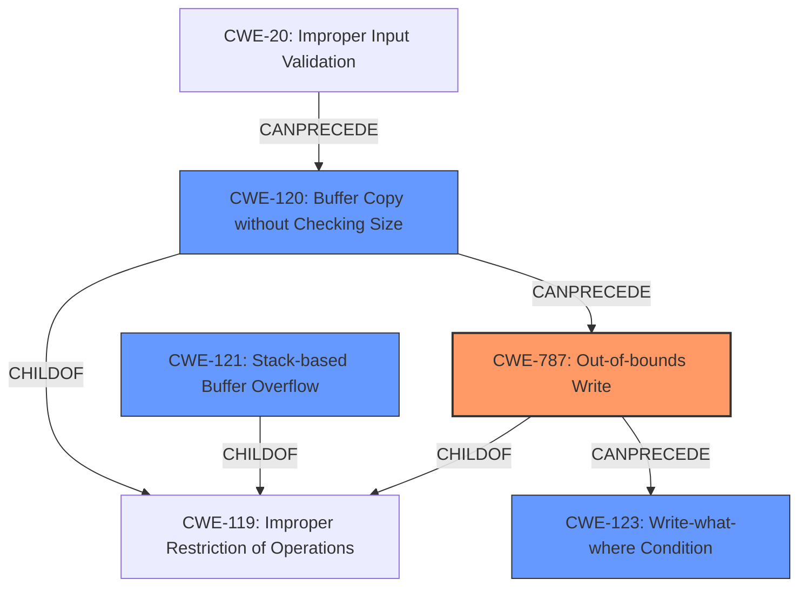

# Analysis Report for CVE-2022-40987

# Vulnerability Analysis Report: CVE-2022-40987

## Description

Several stack-based buffer overflow vulnerabilities exist in the DetranCLI command parsing functionality of Siretta QUARTZ-GOLD G5.0.1.5-210720-141020. A specially-crafted network packet can lead to arbitrary command execution. An attacker can send a sequence of requests to trigger these vulnerabilities.This buffer overflow is in the function that manages the (ddns1|ddns2) username WORD password CODE command template.

## Vulnerability Description Key Phrases

**Rootcause:** stack-based buffer overflow
**Impact:** arbitrary command execution
**Vector:** specially-crafted network packet
**Attacker:** attacker
**Product:** Siretta QUARTZ-GOLD
**Version:** G5.0.1.5-210720-141020
**Component:** DetranCLI command parsing functionality

## Analysis (with Relationship Data)

# Summary
| CWE ID | CWE Name | Confidence | CWE Abstraction Level | CWE Vulnerability Mapping Label | CWE-Vulnerability Mapping Notes |
|---|---|---|---|---|---|
| CWE-120 | Buffer Copy without Checking Size of Input ('Classic Buffer Overflow') | 0.95 | Base | Allowed-with-Review | Primary CWE |
| CWE-121 | Stack-based Buffer Overflow | 0.75 | Variant | Allowed | Secondary Candidate |

## Evidence and Confidence

*   **Confidence Score:** 0.90
*   **Evidence Strength:** HIGH

- **Analysis and Justification:**  
  - *Explanation:* The vulnerability is a **stack-based buffer overflow** in the DetranCLI command parsing functionality. The **root cause** is the lack of input size validation before copying command parameters into a stack buffer using `sprintf`. This aligns with CWE-120 [Buffer Copy without Checking Size of Input ('Classic Buffer Overflow')] because the input buffer is copied to an output buffer without checking if the input size exceeds the output buffer size, leading to a buffer overflow. The CVE Reference Links Content Summary explicitly mentions that "the size of command parameters is not checked against the size of the stack buffer before being passed to sprintf, leading to stack-based buffer overflows." While CWE-119 [Improper Restriction of Operations within the Bounds of a Memory Buffer] is a broader category, CWE-120 is more specific and accurately describes the **buffer copy** without size checking. CWE-120's mapping guidance indicates ALLOWED-WITH-REVIEW because of potential misuse, but in this case, the conditions are met: "Buffer Copy" operation, "no Checking [the] Size of Input", and writing past the end of the buffer. The additional detail about `sprintf` being used is also relevant as it provides information about how the buffer copy occurs.

  - *Relationship Analysis:* CWE-120 [Buffer Copy without Checking Size of Input ('Classic Buffer Overflow')] is a child of CWE-119 [Improper Restriction of Operations within the Bounds of a Memory Buffer], but it provides a more specific description of the vulnerability. CWE-120 can precede CWE-123 [Write-what-where Condition] because a buffer overflow can lead to arbitrary memory writes.

- **Confidence Score:**  
  - Confidence: 0.95 (High confidence based on the vulnerability description, key phrases, and CVE reference links content summary)

---

- **Analysis and Justification:**
    - *Explanation:* Since the **buffer overflow** occurs specifically on the stack, CWE-121 [Stack-based Buffer Overflow] is also relevant. The vulnerability description explicitly states, "Several **stack-based buffer overflow** vulnerabilities exist...". While CWE-120 describes the **root cause** (lack of size checking during buffer copy), CWE-121 specifies the location of the buffer (stack). CWE-121 is a variant of a **buffer overflow** and is therefore more specific than the general CWE-119.

  - *Relationship Analysis:* CWE-121 [Stack-based Buffer Overflow] is a child of CWE-119 [Improper Restriction of Operations within the Bounds of a Memory Buffer] and a more specific case of CWE-120 [Buffer Copy without Checking Size of Input ('Classic Buffer Overflow')] where the buffer is allocated on the stack.

- **Confidence Score:**
  - *Example:* Confidence: 0.75 (Medium confidence because it describes the location of the overflow but not the **root cause**)

---

## Criticism of Analysis

Okay, I've reviewed the provided analysis and the full CWE specifications. Here's a breakdown of my critique:

**Overall Assessment:**

The analysis is generally sound, particularly in identifying CWE-120 and CWE-121. The reasoning and justification are well-articulated. The confidence levels are appropriate. However, there's room for improvement in considering chained weaknesses and more accurately reflecting the full impact of the vulnerability.

**Detailed Critique:**

**1. CWE-120: Buffer Copy without Checking Size of Input ('Classic Buffer Overflow')**

*   **Assessment:** The selection of CWE-120 as the primary CWE is correct and well-justified. The analysis accurately identifies the root cause: the absence of input size validation before copying data into a fixed-size buffer. The use of `sprintf` without length checks directly exemplifies this.
*   **Mapping Guidance Adherence:** The analysis correctly acknowledges the "Allowed-with-Review" usage of CWE-120 and addresses the potential for misuse by explicitly stating that "Buffer Copy" operation, "no Checking [the] Size of Input", and writing past the end of the buffer are all met.
*   **Potential Mitigations:** The analysis could optionally mention specific mitigations like using `snprintf` instead of `sprintf`, which directly addresses the size-checking issue.
*   **Observed Examples:** Mentioning CVE-2000-1094 could help solidify the mapping due to the similar root cause.

**2. CWE-121: Stack-based Buffer Overflow**

*   **Assessment:** Correctly identifies the location of the buffer overflow on the stack. It's a valid and helpful addition as a secondary CWE.
*   **Relationship Analysis:** The relationship to CWE-120 is accurately described (CWE-121 is a specific *type* of CWE-120).
*   **Confidence:** The confidence level of 0.75 is reasonable, as CWE-120 captures the core problem. While CWE-121 provides additional specificity, it is not as essential for understanding the vulnerability's fundamental nature.

**3. Consideration of Other CWEs and Relationships**

*   **CWE-787: Out-of-bounds Write:** This CWE could be a stronger candidate than CWE-120.  CWE-787 describes "The product writes data past the end, or before the beginning, of the intended buffer."  The core action of the exploit is writing outside the buffer.  The lack of size checking is a *cause* of the out-of-bounds write, but the write itself is the vulnerability.
*   **CWE-123: Write-what-where Condition:** Given the impact of arbitrary command execution, CWE-123 might be considered. If the attacker can control the content being written and the location (even indirectly), then a "write-what-where" condition exists. The "CVE Reference Links Content Summary" indicates the potential for full control of the device, which strongly hints at a "write-what-where" condition. *However, this is contingent on the level of control the attacker has over the memory location being written to.* If the attacker only controls the content, and not the location, it's *not* a "write-what-where." This CWE is generally used when exploitation allows arbitrary writes to arbitrary memory locations.
*   **CWE-20: Improper Input Validation:** The vulnerability stems from the *lack* of input validation. While CWE-20 is broad and discouraged, it is a *contributing factor*. *However*, since the analysis correctly identified more specific CWEs (CWE-120, CWE-121), CWE-20 is not needed, according to its own mapping guidance. If the code had some input validation but it was insufficient, a child of CWE-20 such as CWE-1284 could be considered.
*   **CWE-131: Incorrect Calculation of Buffer Size:** Though not directly applicable here (as the buffer size itself isn't miscalculated, but rather the input size isn't checked against it), it's in the retriever results and worth explicitly excluding in your analysis explanation, with a reason (lack of input size checking).
*   **CWE-170: Improper Null Termination:** If the buffer overflow results in a string that's not properly null-terminated, then CWE-170 could be a contributing factor. However, without more detail about the exploitation scenario, it's hard to say.
*   **CWE-78: Improper Neutralization of Special Elements used in an OS Command ('OS Command Injection'):** This is in the top CWE list but is likely not the root cause. If successful command execution *requires* further injection of special elements, then this would be relevant.
*    **Chaining:** Consider the chain *CWE-20 (Improper Input Validation) -> CWE-120 (Buffer Copy without Checking Size of Input) -> CWE-787 (Out-of-bounds Write) -> CWE-123 (Write-what-where Condition)*. The description indicates how to achieve arbitrary command execution, indicating a *high* degree of control once the initial vulnerability is triggered.

**4. Retriever Results:**

The retriever results offer helpful suggestions. The analysis should briefly address why some of the higher-ranked CWEs are *not* selected. This helps demonstrate a thorough understanding of the vulnerability.

**5. Potential Mitigations (General)**

*   The analysis could benefit from briefly mentioning specific mitigations that could have prevented the vulnerability in the context of the `sprintf` call and the DetranCLI command parsing functionality. Examples:
    *   Using `snprintf` or similar safe string functions with explicit size limits.
    *   Implementing robust input validation to limit the length of command parameters before they are passed to `sprintf`.
    *   Using a language or library with built-in buffer overflow protection.

**Revised Summary Table:**

| CWE ID  | CWE Name                                                              | Confidence | CWE Abstraction Level | CWE Vulnerability Mapping Label | CWE-Vulnerability Mapping Notes                                                                                               |
| :------ | :--------------------------------------------------------------------- | :--------- | :---------------------- | :-------------------------------- | :---------------------------------------------------------------------------------------------------------------------------- |
| CWE-787 | Out-of-bounds Write | 0.95 | Base | Allowed | Primary CWE                                                                               |
| CWE-120 | Buffer Copy without Checking Size of Input ('Classic Buffer Overflow') | 0.85       | Base                    | Allowed-with-Review                   | Secondary CWE, contributing cause of CWE-787                                                                                |
| CWE-121 | Stack-based Buffer Overflow                                          | 0.75       | Variant                  | Allowed                             | Secondary CWE, specifies location of buffer.                                                                                |
| CWE-123 | Write-what-where Condition | 0.60 | Base | Allowed | Contingent on level of attacker control |

**Revised Recommendations:**

1.  **Strengthen the Primary CWE Justification:** Argue the case for CWE-787. It captures the core action.
2.  **Address Other CWEs:** Briefly explain why CWE-20 and CWE-131 are *not* the primary causes in this case.
3.  **Enhance Mitigations:** Include specific mitigations related to `sprintf` and input validation.
4.  **Conditional recommendation for CWE-123 :** If the attacker controls what and where is written, then add CWE-123 to the summary
5.  **Chain Reasoning:** Add chain information for CWE-20->CWE-120->CWE-787->CWE-123

By incorporating these suggestions, the analysis will be more comprehensive, better aligned with CWE's mapping guidance, and provide more practical insights for remediation.

## Final Resolution

# Summary
| CWE ID | CWE Name | Confidence | CWE Abstraction Level | CWE Vulnerability Mapping Label | CWE-Vulnerability Mapping Notes |
|---|---|---|---|---|---|
| **CWE-787** | **Out-of-bounds Write** | 0.95 | Base | Allowed | Primary CWE |
| **CWE-120** | **Buffer Copy without Checking Size of Input ('Classic Buffer Overflow')** | 0.85 | Base | Allowed-with-Review | Secondary CWE, contributing cause of **CWE-787** |
| **CWE-121** | **Stack-based Buffer Overflow** | 0.75 | Variant | Allowed | Secondary CWE, specifies location of buffer. |
| **CWE-123** | **Write-what-where Condition** | 0.60 | Base | Allowed | Contingent on level of attacker control |

## Evidence and Confidence

*   **Confidence Score:** 0.90
*   **Evidence Strength:** HIGH

## Relationship Analysis
The decision to prioritize **CWE-787** was influenced by its direct representation of the vulnerability's core action: writing data beyond buffer boundaries. While **CWE-120** describes the cause (lack of size checking), **CWE-787** captures the *effect*. **CWE-121** specifies the location of the overflow (stack), adding context. The potential inclusion of **CWE-123** hinges on the level of attacker control over the written content and location, indicating a potential for arbitrary code execution. The vulnerability chain progresses from improper input validation (**CWE-20**) leading to unchecked buffer copy (**CWE-120**), resulting in an out-of-bounds write (**CWE-787**), potentially culminating in a write-what-where condition (**CWE-123**).

## Vulnerability Chain
The vulnerability chain starts with a lack of input validation (**CWE-20**, though not explicitly included due to more specific CWEs being available). This leads to **CWE-120**, where data is copied without proper size checks. The result is **CWE-787**, an out-of-bounds write. If the attacker has sufficient control over the data being written and the memory location, this could lead to **CWE-123**, enabling arbitrary command execution.

The sequence is as follows:
1.  Lack of Input Validation (Implicit, contributes to **CWE-120**)
2.  **CWE-120**: Buffer Copy without Checking Size
3.  **CWE-787**: Out-of-bounds Write
4.  **CWE-123** (Conditional): Write-what-where Condition (if attacker controls write location)

## Summary of Analysis
The initial analysis correctly identified **CWE-120** and **CWE-121**, but the criticism raised a valid point about **CWE-787** being a more direct representation of the vulnerability. The final decision reflects this by prioritizing **CWE-787** as the primary **WEAKNESS**, as it describes the action of writing outside the buffer's boundaries. The evidence, "the size of command parameters is not checked against the size of the stack buffer before being passed to sprintf, leading to **stack-based buffer overflows**," supports both **CWE-120** and **CWE-121**, but the core issue is the out-of-bounds write. **CWE-120** is retained as a secondary CWE because it explains the cause of the **ROOTCAUSE**, and **CWE-121** specifies the overflow location. The inclusion of **CWE-123** is conditional, depending on the attacker's level of control. The selection of these CWEs provides the optimal level of specificity, describing both the **ROOTCAUSE** and the resulting **WEAKNESS**. **CWE-20** and **CWE-131** are not included because more specific CWEs are available and applicable. The mitigations, such as using `snprintf` instead of `sprintf` and implementing robust input validation, directly address the identified weaknesses.

*Report generated on 2025-03-18 16:43:42*
