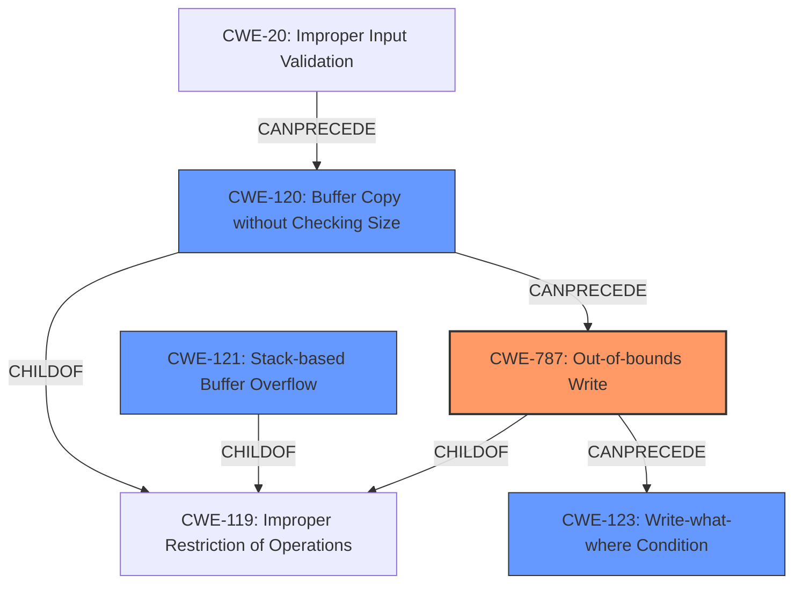

# Final Resolution for CVE-2022-40987

# Summary
| CWE ID | CWE Name | Confidence | CWE Abstraction Level | CWE Vulnerability Mapping Label | CWE-Vulnerability Mapping Notes |
|---|---|---|---|---|---|
| **CWE-787** | **Out-of-bounds Write** | 0.95 | Base | Allowed | Primary CWE |
| **CWE-120** | **Buffer Copy without Checking Size of Input ('Classic Buffer Overflow')** | 0.85 | Base | Allowed-with-Review | Secondary CWE, contributing cause of **CWE-787** |
| **CWE-121** | **Stack-based Buffer Overflow** | 0.75 | Variant | Allowed | Secondary CWE, specifies location of buffer. |
| **CWE-123** | **Write-what-where Condition** | 0.60 | Base | Allowed | Contingent on level of attacker control |

## Evidence and Confidence

*   **Confidence Score:** 0.90
*   **Evidence Strength:** HIGH

## Relationship Analysis
The decision to prioritize **CWE-787** was influenced by its direct representation of the vulnerability's core action: writing data beyond buffer boundaries. While **CWE-120** describes the cause (lack of size checking), **CWE-787** captures the *effect*. **CWE-121** specifies the location of the overflow (stack), adding context. The potential inclusion of **CWE-123** hinges on the level of attacker control over the written content and location, indicating a potential for arbitrary code execution. The vulnerability chain progresses from improper input validation (**CWE-20**) leading to unchecked buffer copy (**CWE-120**), resulting in an out-of-bounds write (**CWE-787**), potentially culminating in a write-what-where condition (**CWE-123**).

## Vulnerability Chain
The vulnerability chain starts with a lack of input validation (**CWE-20**, though not explicitly included due to more specific CWEs being available). This leads to **CWE-120**, where data is copied without proper size checks. The result is **CWE-787**, an out-of-bounds write. If the attacker has sufficient control over the data being written and the memory location, this could lead to **CWE-123**, enabling arbitrary command execution.

The sequence is as follows:
1.  Lack of Input Validation (Implicit, contributes to **CWE-120**)
2.  **CWE-120**: Buffer Copy without Checking Size
3.  **CWE-787**: Out-of-bounds Write
4.  **CWE-123** (Conditional): Write-what-where Condition (if attacker controls write location)

## Summary of Analysis
The initial analysis correctly identified **CWE-120** and **CWE-121**, but the criticism raised a valid point about **CWE-787** being a more direct representation of the vulnerability. The final decision reflects this by prioritizing **CWE-787** as the primary **WEAKNESS**, as it describes the action of writing outside the buffer's boundaries. The evidence, "the size of command parameters is not checked against the size of the stack buffer before being passed to sprintf, leading to **stack-based buffer overflows**," supports both **CWE-120** and **CWE-121**, but the core issue is the out-of-bounds write. **CWE-120** is retained as a secondary CWE because it explains the cause of the **ROOTCAUSE**, and **CWE-121** specifies the overflow location. The inclusion of **CWE-123** is conditional, depending on the attacker's level of control. The selection of these CWEs provides the optimal level of specificity, describing both the **ROOTCAUSE** and the resulting **WEAKNESS**. **CWE-20** and **CWE-131** are not included because more specific CWEs are available and applicable. The mitigations, such as using `snprintf` instead of `sprintf` and implementing robust input validation, directly address the identified weaknesses.