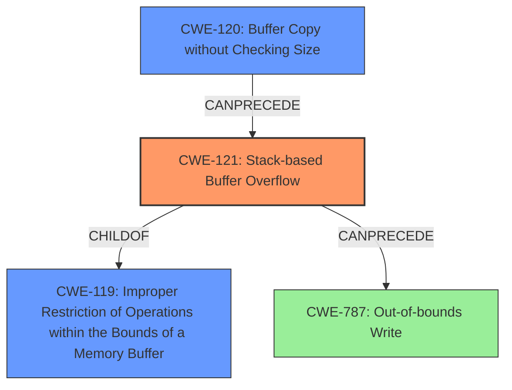

# Analysis Report for CVE-2022-40989

# Vulnerability Analysis Report: CVE-2022-40989

## Description

Several stack-based buffer overflow vulnerabilities exist in the DetranCLI command parsing functionality of Siretta QUARTZ-GOLD G5.0.1.5-210720-141020. A specially-crafted network packet can lead to arbitrary command execution. An attacker can send a sequence of requests to trigger these vulnerabilities.This buffer overflow is in the function that manages the bandwidth WORD dlrate dlceil ulrate ulceil priority (highest|high|normal|low|lowest) command template.

## Vulnerability Description Key Phrases

**Rootcause:** stack-based buffer overflow
**Impact:** arbitrary command execution
**Product:** Siretta QUARTZ-GOLD
**Version:** G5.0.1.5-210720-141020
**Component:** DetranCLI command parsing functionality

## Analysis (with Relationship Data)

# Summary
| CWE ID | CWE Name | Confidence | CWE Abstraction Level | CWE Vulnerability Mapping Label | CWE-Vulnerability Mapping Notes |
|---|---|---|---|---|---|
| CWE-121 | Stack-based Buffer Overflow | 0.95 | Variant | Allowed | Primary CWE. The vulnerability is a stack-based buffer overflow. |
| CWE-120 | Buffer Copy without Checking Size of Input ('Classic Buffer Overflow') | 0.75 | Base | Allowed-with-Review | Secondary CWE. While the primary issue is a stack-based overflow, the underlying cause is copying data without checking the size. |
| CWE-787 | Out-of-bounds Write | 0.60 | Base | Allowed | Secondary CWE. This is a general out-of-bounds write, but CWE-121 and CWE-120 are more specific. |

## Evidence and Confidence

*   **Confidence Score:** 0.90
*   **Evidence Strength:** HIGH

- **Analysis and Justification:**  
  - *Explanation:* "The vulnerability is explicitly described as a **stack-based buffer overflow**. The CVE reference details the use of `sprintf` without proper bounds checking, which is a classic cause of buffer overflows. The overflow occurs in a stack buffer, making CWE-121 (Stack-based Buffer Overflow) the most specific and appropriate choice. CWE-120 (Buffer Copy without Checking Size of Input) is also relevant as the root cause involves copying data without size validation. The `sprintf` function copies the input parameters into a stack buffer `buff_0x80` without validating their sizes, leading to a buffer overflow. The use of `sprintf` without bounds checking directly relates to the buffer copy weakness."
  
  - *Relationship Analysis:* "CWE-121 is a variant of CWE-119 (Improper Restriction of Operations within the Bounds of a Memory Buffer). CWE-120 is related as it highlights the lack of input size validation during the buffer copy operation. CWE-787 (Out-of-bounds Write) is a broader category that encompasses buffer overflows but lacks the specificity of stack-based overflows. The retriever results also suggests CWE-121 as a candidate with a high score, further supporting this classification."

- **Confidence Score:**  
  - *Example:* Confidence: 0.95 (High confidence due to the clear description of a stack-based buffer overflow and detailed CVE reference information)

## Criticism of Analysis

Okay, I've reviewed the provided analysis in light of the full CWE specifications. Here's a breakdown of my critique:

**Overall Assessment:**

The analysis is generally good and arrives at a reasonable conclusion. The primary CWE mapping to CWE-121 (Stack-based Buffer Overflow) is accurate and well-supported by the evidence. The inclusion of CWE-120 (Buffer Copy without Checking Size of Input) as a secondary CWE is also appropriate as it highlights the root cause. The reasoning is well-articulated and demonstrates a good understanding of buffer overflow vulnerabilities.

**Detailed Critique:**

1.  **Primary CWE: CWE-121 (Stack-based Buffer Overflow)**

    *   **Correctness:** The selection of CWE-121 is correct. The vulnerability description explicitly states "stack-based buffer overflow," and the provided code snippet confirms that the buffer `buff_0x80` is allocated on the stack.

    *   **Justification:** The analysis provides strong justification, emphasizing the stack allocation and the use of `sprintf` without bounds checking.

    *   **Mapping Guidance:** The analysis follows the mapping guidance for CWE-121, which states that it is "Allowed" and is a "preferred level of abstraction for mapping to the root causes of vulnerabilities."

    *   **Potential Mitigations:** The analysis could be strengthened by mentioning specific mitigations related to stack-based buffer overflows, drawn from the CWE specification:

        *   **Environment Hardening:** Compilers flags like `/GS` (Microsoft Visual Studio), `FORTIFY_SOURCE` (GCC), StackGuard, and ProPolice. These features add stack canaries, which can detect buffer overflows at runtime.
        *   **Use of Safe String Handling Functions:** Avoid `sprintf` and similar functions. Instead, use safer alternatives like `snprintf` (which takes a size argument) or libraries like `Strsafe.h` or `SafeStr`.
        *   **Input Validation:** While mentioned generally, the analysis should stress the importance of *strict* input validation to prevent overly long strings from even reaching the `sprintf` call.

2.  **Secondary CWE: CWE-120 (Buffer Copy without Checking Size of Input)**

    *   **Correctness:**  CWE-120 is a relevant secondary CWE. It correctly identifies the core issue: the lack of input size validation when copying data into the buffer. The `sprintf` function is directly copying the arguments without any checks.

    *   **Justification:** The justification is sound. The analysis correctly links the use of `sprintf` without bounds checking to CWE-120.

    *   **Mapping Guidance:** The analysis correctly identifies that CWE-120 is "Allowed-with-Review". This guidance cautions against using it as a generic "buffer overflow" CWE. However, in this case, it's appropriate because the *specific operation* causing the overflow is a buffer copy (through `sprintf`) *without checking the size of the input*.

    *   **Potential Mitigations:** The analysis could benefit from explicitly mentioning the most relevant mitigations from the CWE specification:
        *   **Use of Safer Functions:** Replace `sprintf` with `snprintf`.
        *   **Libraries or Frameworks:** Use libraries designed for safe string handling (e.g., `Strsafe.h`, `SafeStr`).

3.  **Secondary CWE: CWE-787 (Out-of-bounds Write)**

    *   **Correctness:** CWE-787 is a valid, *but less specific*, CWE. It's true that the vulnerability involves writing outside the bounds of the buffer.

    *   **Justification:** The analysis acknowledges that it's a broader category and less specific than CWE-121 and CWE-120, which is a good observation.

    *   **Mapping Guidance:** The analysis's usage is consistent with the "Allowed" mapping guidance for CWE-787. However, the guidance also implicitly suggests that if more specific CWEs exist, they should be preferred.

    *   **Potential Mitigations:** The mitigations for CWE-787 are also relevant, but they are less targeted than those for CWE-121 and CWE-120. The analysis correctly prioritizes the more specific CWEs.

4.  **Retriever Results:**

    *   The retriever results highlight some other potential CWEs, such as:
        *   **CWE-190 (Integer Overflow or Wraparound):**  This is plausible, as calculations involving buffer sizes could potentially lead to integer overflows.  However, without more detail, this is less likely than CWE-120/121 as the root cause.
        *   **CWE-131 (Incorrect Calculation of Buffer Size):** This is *less* relevant in this specific case. The problem isn't that the code *calculated* the buffer size incorrectly. It's that the code *didn't check the input size at all* before copying it into a fixed-size buffer.  If the buffer size was somehow calculated incorrectly then this CWE would be more important.
        *   **CWE-1284 (Improper Validation of Specified Quantity in Input):** This is related to input validation, but more closely tied to cases where the program *expects* a specific quantity (e.g., a length) and fails to validate it. In this case, the program doesn't really expect a specific length; it simply fails to limit the length of the input. This is not as relevant.
    *   The analysis correctly prioritizes CWE-121/120 over these alternatives, based on the specific details of the vulnerability.

**Suggestions for Improvement:**

*   **Enhance Mitigation Details:**  Expand the discussion of mitigations to include more specific techniques and technologies (e.g., compiler flags, safe string handling libraries) directly from the CWE specifications.
*   **Input Validation Focus:** Emphasize that strict input validation is *crucial* to prevent these kinds of buffer overflows. It's not just a general security practice; it's a *direct* countermeasure for this vulnerability.
*   **Acknowledge Potential Chains:** Briefly mention that in some cases, integer handling issues (like CWE-190) could potentially *lead to* a buffer overflow, but that in this case, it's the lack of input size checking that is the primary cause.
*   **Explain Limited Scope of Certain Mitigations:** When discussing mitigations like address space layout randomization (ASLR), acknowledge that they are effective, but not a complete solution for preventing exploitation.

**Conclusion:**

Overall, the analysis is accurate and well-reasoned. By incorporating the suggestions above, the analysis can be further strengthened and provide a more comprehensive understanding of the vulnerability and its mitigations.

## Final Resolution

# Summary
| CWE ID | CWE Name | Confidence | CWE Abstraction Level | CWE Vulnerability Mapping Label | CWE-Vulnerability Mapping Notes |
|---|---|---|---|---|---|
| CWE-121 | Stack-based Buffer Overflow | 0.95 | Variant | Allowed | Primary CWE. The vulnerability is a stack-based buffer overflow. |
| CWE-120 | Buffer Copy without Checking Size of Input ('Classic Buffer Overflow') | 0.85 | Base | Allowed-with-Review | Secondary CWE. The underlying cause is copying data without checking the size using `sprintf`. |

## Evidence and Confidence

*   **Confidence Score:** 0.93
*   **Evidence Strength:** HIGH

## Relationship Analysis
The primary relationship influencing the decision is the parent-child relationship between CWE-119 (**CWE-119: Improper Restriction of Operations within the Bounds of a Memory Buffer**) and CWE-121. CWE-121 is a variant of CWE-119, making it a more specific classification for a stack-based buffer overflow. CWE-120 highlights the method by which the buffer overflow occurs, through a buffer copy without checking size. There are also "CanPrecede" relationships involving buffer overflows that lead to out-of-bounds writes (CWE-787), but the details of the description lend themselves more towards the buffer copy without checking size.

## Vulnerability Chain
The vulnerability chain starts with the use of `sprintf` without bounds checking (CWE-120). This leads to a **stack-based buffer overflow** (CWE-121), where data is written beyond the allocated buffer on the stack. The consequence is arbitrary command execution, as stated in the vulnerability description.

## Summary of Analysis
The initial analysis correctly identified CWE-121 as the primary weakness, given the explicit description of a **stack-based buffer overflow**. The use of `sprintf` without bounds checking confirms that the vulnerability is caused by a buffer copy without checking the size, justifying the inclusion of CWE-120 as a secondary CWE.

The vulnerability description clearly states: "Several **stack-based buffer overflow** vulnerabilities exist... This buffer overflow is in the function that manages the bandwidth... command template." This statement provides strong evidence for selecting CWE-121.

The relationship analysis further supports this decision, as CWE-121 is a variant of CWE-119, providing a more specific classification. CWE-120 is related as it highlights the lack of input size validation during the buffer copy operation with `sprintf`.

The selected CWEs are at the optimal level of specificity, as CWE-121 accurately describes the type of buffer overflow and CWE-120 identifies the root cause—copying data without proper size validation.

*Report generated on 2025-03-18 16:45:52*
