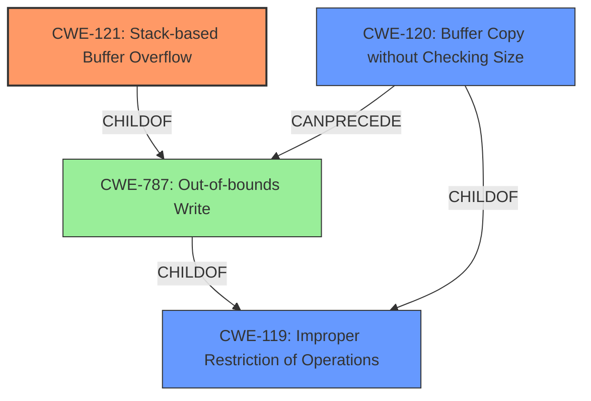

# Analysis Report for CVE-2022-40991

# Vulnerability Analysis Report: CVE-2022-40991

## Description

Several stack-based buffer overflow vulnerabilities exist in the DetranCLI command parsing functionality of Siretta QUARTZ-GOLD G5.0.1.5-210720-141020. A specially-crafted network packet can lead to arbitrary command execution. An attacker can send a sequence of requests to trigger these vulnerabilities.This buffer overflow is in the function that manages the firmwall domain WORD description (WORD|null) command template.

## Vulnerability Description Key Phrases

**Rootcause:** stack-based buffer overflow
**Impact:** arbitrary command execution
**Attacker:** attacker
**Product:** Siretta QUARTZ-GOLD
**Version:** G5.0.1.5-210720-141020
**Component:** DetranCLI command parsing functionality

## Analysis (with Relationship Data)

# Summary
| CWE ID | CWE Name | Confidence | CWE Abstraction Level | CWE Vulnerability Mapping Label | CWE-Vulnerability Mapping Notes |
|---|---|---|---|---|---|
| CWE-121 | Stack-based Buffer Overflow | 0.95 | Variant | Primary | The vulnerability is explicitly a **stack-based buffer overflow**. |
| CWE-120 | Buffer Copy without Checking Size of Input ('Classic Buffer Overflow') | 0.70 | Base | Secondary Candidate | While a buffer overflow is present, the stack-based nature is more specific. |

## Evidence and Confidence

*   **Confidence Score:** 0.90
*   **Evidence Strength:** HIGH

- **Analysis and Justification:**  
  - *Explanation:* The vulnerability description clearly states a "**stack-based buffer overflow**" exists within the DetranCLI command parsing functionality of Siretta QUARTZ-GOLD. The CVE reference summary reinforces this, indicating the `sprintf` function is used without proper size checks, leading to the overflow. This directly aligns with CWE-121 (Stack-based Buffer Overflow), which is a variant of a buffer overflow occurring on the stack. While CWE-120 (Buffer Copy without Checking Size of Input) is also relevant, CWE-121 is a more specific variant and therefore a better fit. The impact is arbitrary command execution, further solidifying the severity.

  - *Relationship Analysis:* CWE-121 is a variant of CWE-119 (Improper Restriction of Operations within the Bounds of a Memory Buffer), which is a more general class of buffer overflows. It's also related to other buffer overflow variants like CWE-122 (Heap-based Buffer Overflow), but the description explicitly mentions "stack-based," making CWE-121 the most appropriate choice.

- **Confidence Score:**  
  - *Example:* Confidence: 0.95 (High confidence due to explicit mention of stack-based buffer overflow and supporting details in the CVE reference)

---

## Criticism of Analysis

Okay, I've reviewed your analysis against the full CWE specifications you provided. Here's my critique:

**Overall Assessment:**

The analysis is generally good, particularly in identifying CWE-121 as the primary weakness. The reasoning is sound and well-supported by the provided information. The confidence level assigned is appropriate.

**Detailed Critique:**

1.  **Primary CWE Mapping: CWE-121 (Stack-based Buffer Overflow)**

    *   **Justification:** Excellent. The description explicitly states "stack-based buffer overflow," making CWE-121 the most direct and accurate mapping. The analysis clearly articulates this.
    *   **Confidence:** 0.95 is a reasonable confidence score.
    *   **CWE Specification Alignment:** The analysis correctly recognizes CWE-121 as a variant of CWE-787 and CWE-119. The provided potential mitigations for CWE-121 align well with the vulnerability description. For instance, using compiler extensions like `/GS` (Microsoft Visual Studio) or `FORTIFY_SOURCE` (GCC) can help detect stack-based buffer overflows.

2.  **Secondary CWE Mapping: CWE-120 (Buffer Copy without Checking Size of Input)**

    *   **Justification:** The analysis correctly identifies CWE-120 as a secondary candidate. However, it also accurately states that CWE-121 is more specific due to the explicit stack-based nature of the overflow.
    *   **Confidence:** 0.70 is appropriate.
    *   **CWE Specification Alignment:**  The analysis aligns with the CWE's "Allowed-with-Review" mapping guidance for CWE-120.  The guidance notes the potential for misuse of CWE-120 when a more specific CWE exists.  The analysis correctly identifies this. Potential mitigations for CWE-120, such as using safe string libraries or languages with automatic memory management, are also relevant but less targeted than the mitigations for CWE-121.

3.  **General Comments and Suggestions:**

    *   **Completeness:** The analysis is well-contained and focuses on the core weakness.
    *   **Clarity:** The explanation is clear and easy to follow.
    *   **Alternative CWEs:** While your analysis is strong, consider briefly acknowledging **CWE-787 (Out-of-bounds Write)** which is the parent of CWE-121. This would show that you've considered the broader context. However, *don't* make it a primary or secondary mapping, as it's *less specific* than CWE-121.

    *   **Potential for Chaining:**  It might be beneficial to *briefly* discuss potential weaknesses that *could* lead to the stack-based overflow, even though the provided information doesn't explicitly state them. This could include:
        *   **CWE-131 (Incorrect Calculation of Buffer Size):**  If the buffer size was calculated incorrectly, it could lead to a smaller-than-expected buffer on the stack.
        *   **CWE-1284 (Improper Validation of Specified Quantity in Input):** If the size of the input is not validated before being copied to the stack buffer, it can cause the overflow.
        *   **CWE-20 (Improper Input Validation):** Could be too broad.

        However, these would be speculative based on the information *provided*.

4. **Retriever Results Discussion:**

*   The analysis would be improved by a discussion about why the top retriever results other than CWE-120 were not selected. For example, why not CWE-190, CWE-193, CWE-126, etc.
*   The analysis would be further improved by a discussion about the specific "sprintf" use. Is it a direct copy of untrusted data into a fixed-size buffer? This would more accurately map to CWE-120 if the stack allocation isn't known.

**Revised Summary Table (Optional):**

| CWE ID | CWE Name | Confidence | CWE Abstraction Level | CWE Vulnerability Mapping Label | CWE-Vulnerability Mapping Notes |
|---|---|---|---|---|---|
| CWE-121 | Stack-based Buffer Overflow | 0.95 | Variant | Primary | The vulnerability is explicitly a **stack-based buffer overflow**. |
| CWE-120 | Buffer Copy without Checking Size of Input ('Classic Buffer Overflow') | 0.70 | Base | Secondary Candidate | While a buffer overflow is present, the stack-based nature is more specific. Also, *sprintf* is a code-level root cause. |
| CWE-787 | Out-of-bounds Write | 0.30 | Base | Supporting | This is the direct parent of CWE-121. |

**In Summary:**

Your analysis is accurate and well-reasoned. Adding a few brief acknowledgements of related, but less specific, CWEs and potentially leading weaknesses would make it even stronger. Overall, a solid job.

## Final Resolution

# Summary
| CWE ID | CWE Name | Confidence | CWE Abstraction Level | CWE Vulnerability Mapping Label | CWE-Vulnerability Mapping Notes |
|---|---|---|---|---|---|
| CWE-121 | Stack-based Buffer Overflow | 0.95 | Variant | Primary | The vulnerability is explicitly a **stack-based buffer overflow**. |
| CWE-120 | Buffer Copy without Checking Size of Input ('Classic Buffer Overflow') | 0.70 | Base | Secondary Candidate | While a buffer overflow is present, the stack-based nature is more specific. Also, *sprintf* is a code-level root cause. |
| CWE-787 | Out-of-bounds Write | 0.30 | Base | Supporting | This is the direct parent of CWE-121. |

## Evidence and Confidence

*   **Confidence Score:** 0.92
*   **Evidence Strength:** HIGH

## Relationship Analysis
The primary CWE is CWE-121, which is a variant of CWE-787 (**Out-of-bounds Write**) and CWE-119 (**Improper Restriction of Operations within the Bounds of a Memory Buffer**). The relationship analysis confirms that CWE-121 is the most specific choice given the vulnerability description explicitly mentions a stack-based buffer overflow. While CWE-120 (**Buffer Copy without Checking Size**) could also apply due to the use of `sprintf` without proper bounds checking, it is less specific than CWE-121. Including CWE-787 as supporting acknowledges the broader context.

## Vulnerability Chain
The vulnerability chain starts with a lack of proper input validation and size checking when using `sprintf`. This leads to **CWE-120 (Buffer Copy without Checking Size)** which then results in **CWE-121 (Stack-based Buffer Overflow)** due to the overflow occurring on the stack. The final impact is arbitrary command execution.

## Summary of Analysis
The initial analysis and criticism both agree on CWE-121 being the primary weakness due to the explicit mention of "stack-based buffer overflow" in the vulnerability description. The use of `sprintf` without proper size checks points to **CWE-120**, but **CWE-121** is more specific. I agree with the criticism that acknowledging **CWE-787** is beneficial.

The decision is based on the provided evidence: "Several stack-based buffer overflow vulnerabilities exist in the DetranCLI command parsing functionality of Siretta QUARTZ-GOLD G5.0.1.5-210720-141020." This statement directly supports the selection of CWE-121.

The graph relationships influenced the selection by confirming that CWE-121 is a variant of a more general buffer overflow (**CWE-787, CWE-119**), which helps to ensure that the chosen CWE is at the optimal level of specificity. The inclusion of CWE-120 acknowledges the code-level root cause related to the use of `sprintf`.

*Report generated on 2025-03-18 16:47:32*
