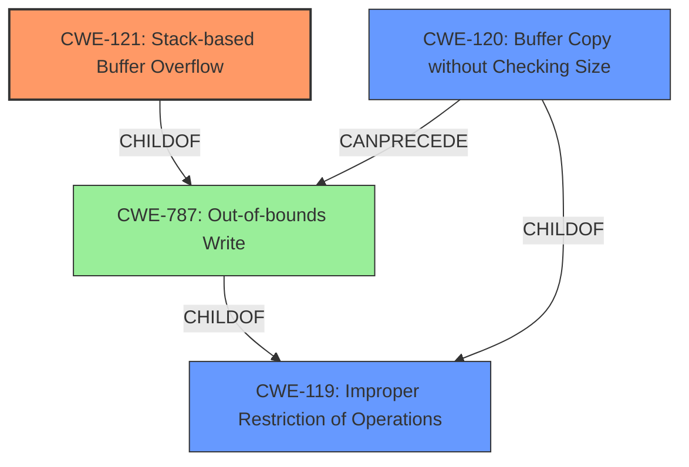

# Final Resolution for CVE-2022-40991

# Summary
| CWE ID | CWE Name | Confidence | CWE Abstraction Level | CWE Vulnerability Mapping Label | CWE-Vulnerability Mapping Notes |
|---|---|---|---|---|---|
| CWE-121 | Stack-based Buffer Overflow | 0.95 | Variant | Primary | The vulnerability is explicitly a **stack-based buffer overflow**. |
| CWE-120 | Buffer Copy without Checking Size of Input ('Classic Buffer Overflow') | 0.70 | Base | Secondary Candidate | While a buffer overflow is present, the stack-based nature is more specific. Also, *sprintf* is a code-level root cause. |
| CWE-787 | Out-of-bounds Write | 0.30 | Base | Supporting | This is the direct parent of CWE-121. |

## Evidence and Confidence

*   **Confidence Score:** 0.92
*   **Evidence Strength:** HIGH

## Relationship Analysis
The primary CWE is CWE-121, which is a variant of CWE-787 (**Out-of-bounds Write**) and CWE-119 (**Improper Restriction of Operations within the Bounds of a Memory Buffer**). The relationship analysis confirms that CWE-121 is the most specific choice given the vulnerability description explicitly mentions a stack-based buffer overflow. While CWE-120 (**Buffer Copy without Checking Size**) could also apply due to the use of `sprintf` without proper bounds checking, it is less specific than CWE-121. Including CWE-787 as supporting acknowledges the broader context.

## Vulnerability Chain
The vulnerability chain starts with a lack of proper input validation and size checking when using `sprintf`. This leads to **CWE-120 (Buffer Copy without Checking Size)** which then results in **CWE-121 (Stack-based Buffer Overflow)** due to the overflow occurring on the stack. The final impact is arbitrary command execution.

## Summary of Analysis
The initial analysis and criticism both agree on CWE-121 being the primary weakness due to the explicit mention of "stack-based buffer overflow" in the vulnerability description. The use of `sprintf` without proper size checks points to **CWE-120**, but **CWE-121** is more specific. I agree with the criticism that acknowledging **CWE-787** is beneficial.

The decision is based on the provided evidence: "Several stack-based buffer overflow vulnerabilities exist in the DetranCLI command parsing functionality of Siretta QUARTZ-GOLD G5.0.1.5-210720-141020." This statement directly supports the selection of CWE-121.

The graph relationships influenced the selection by confirming that CWE-121 is a variant of a more general buffer overflow (**CWE-787, CWE-119**), which helps to ensure that the chosen CWE is at the optimal level of specificity. The inclusion of CWE-120 acknowledges the code-level root cause related to the use of `sprintf`.